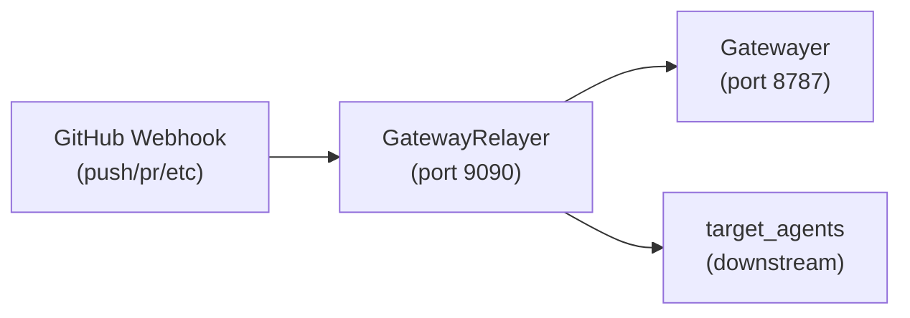
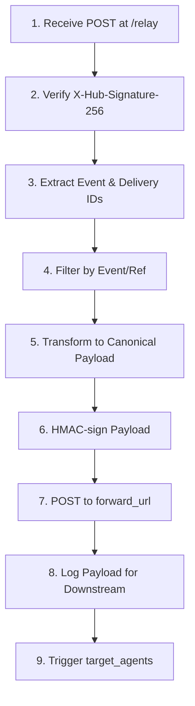

# GatewayRelayer Agent - Detailed Source Code Summary

## Project Overview

The GatewayRelayer is a long-running deterministic ingress relay agent that bridges third-party webhook providers (primarily GitHub) into the Tlamatini ecosystem. It receives webhook events, validates provider signatures, transforms payloads into a canonical format, HMAC-signs them, and forwards them to a Gatewayer HTTP endpoint.

---

## File Structure

| File | Type | Lines | Purpose |
|------|------|-------|---------|
| config.yaml | Configuration | 49 | Agent settings and connection definitions |
| gateway_relayer.py | Python Script | 586 | Main agent implementation |

---

## Configuration (config.yaml)

### Core Settings

```yaml
# Connection fields (auto-populated via canvas connections)
target_agents: []

# --- Listener ---
listen_host: "127.0.0.1"
listen_port: 9090
listen_path: "/relay"

# --- Upstream provider ---
provider_mode: "github"
provider_secret: ""            # GitHub webhook secret for X-Hub-Signature-256
allowed_events:
  - "push"
  - "pull_request"
  - "workflow_run"
  - "release"
allowed_refs: []               # e.g. ["refs/heads/main"] — empty = all refs
respond_ping_ok: true          # answer GitHub ping events without forwarding

# --- Forwarding to Gatewayer ---
forward_url: "http://127.0.0.1:8787/gatewayer"
forward_hmac_secret: ""        # Gatewayer's HMAC secret
forward_signature_header: "X-Tlamatini-Signature"
forward_timestamp_header: "X-Tlamatini-Timestamp"
forward_content_type: "application/json"
```


---

## Main Script (gateway_relayer.py)

### Imports and Initialization

The script imports standard library modules for HTTP serving, cryptography, threading, and signal handling:

- hashlib, hmac - For signature verification and generation
- http.server - HTTPServer, BaseHTTPRequestHandler
- ssl - TLS support
- threading, signal - Concurrency and shutdown handling
- urllib - HTTP forwarding
- yaml - Configuration loading

### Environment Setup

```python
# FIX: Disable Intel Fortran runtime Ctrl+C handler
os.environ['FOR_DISABLE_CONSOLE_CTRL_HANDLER'] = '1'

# Reanimation detection: AGENT_REANIMATED=1 means resume from pause
_IS_REANIMATED = os.environ.get('AGENT_REANIMATED') == '1'
```


---

## Key Components

### 1. PID Management

| Function | Purpose |
|----------|---------|
| write_pid_file() | Writes current process PID to agent.pid |
| remove_pid_file() | Removes PID file with retry logic (5 attempts, 0.1s delay) |

### 2. GitHub Signature Verification

```python
def verify_github_signature(secret: str, body: bytes, signature_header: str) -> bool:
    """Verify X-Hub-Signature-256 from GitHub."""
    if not secret:
        return True  # no secret configured
    # ... HMAC-SHA256 verification
```


### 3. Payload Transformation

```python
def transform_payload(event_type: str, delivery_id: str, upstream_body: dict) -> bytes:
    """Build the canonical payload that Gatewayer expects."""
    canonical = {
        "event_type": event_type,
        "session_id": delivery_id,
    }
    canonical.update(upstream_body)
    return json.dumps(canonical, ensure_ascii=False).encode("utf-8")
```


### 4. Payload Logging (Downstream Agent Support)

```python
def _log_relay_payload(event_type: str, delivery_id: str, upstream_body: dict):
    """Log relayed event payload in two formats for downstream consumption."""
```


Output Formats:
1. Flat key-value lines (MESSAGE_<KEY>: <VALUE>) — For Forker pattern matching
2. Structured block (INI_RELAY_EVENT<<<...>>>END_RELAY_EVENT) — For Parametrizer/Summarizer

### 5. Forwarding to Gatewayer

```python
def forward_to_gatewayer(payload: bytes, config: dict, correlation_id: str) -> dict:
    """POST the signed payload to the configured Gatewayer endpoint."""
```


Extracts configuration for:
- forward_url - Target endpoint
- forward_hmac_secret - Signing secret
- forward_signature_header / forward_timestamp_header - Custom headers

### 6. RelayHandler Class

Extends BaseHTTPRequestHandler:

| Method | Purpose |
|--------|---------|
| log_message(format, *args) | Custom logging for HTTP requests |
| _send_json(status, body) | Send JSON HTTP responses |

Request Processing Flow:
1. Validate upstream signature (X-Hub-Signature-256)
2. Extract event metadata (X-GitHub-Event, X-GitHub-Delivery)
3. Handle ping events (if respond_ping_ok)
4. Filter by allowed_events and allowed_refs
5. Transform payload to canonical format
6. Forward to Gatewayer
7. Trigger downstream target_agents on success

### 7. Agent Management Functions

| Function | Purpose |
|----------|---------|
| get_python_command() | Returns Python executable path (handles frozen mode) |
| get_user_python_home() | Gets PYTHON_HOME from environment/Windows registry |
| get_agent_env() | Builds environment dict for agent execution |
| get_agent_directory(agent_name) | Returns agent directory path |
| get_agent_script_path(agent_name) | Returns agent script path (handles numbered instances) |
| is_agent_running(agent_name) | Checks if agent is running via PID file and psutil |

### 8. Main Execution Flow

```python
def main():
    # 1. Load configuration
    config = load_config()
    
    # 2. Setup logging
    logging.info("GATEWAY_RELAYER AGENT STARTED")
    
    # 3. Graceful shutdown handlers
    signal.signal(signal.SIGINT, _signal_handler)
    signal.signal(signal.SIGTERM, _signal_handler)
    
    # 4. Start HTTP server
    server = HTTPServer((host, port), RelayHandler)
    
    # 5. Optional TLS
    if config.get("use_tls", False):
        # Load cert/key and wrap socket
    
    # 6. Serve forever
    server.serve_forever()
```


---

## Shared State

```python
_relay_config: Dict = {}
_relay_log_cfg: dict = {}
_relay_forward_count: int = 0
_forward_count_lock = threading.Lock()
shutdown_event = threading.Event()
```


---

## Event Processing Pipeline







---

## Key Design Patterns

1. Deterministic Processing - No LLM calls; pure rule-based event handling
2. HMAC Security - Dual signature verification (incoming) and signing (outgoing)
3. Graceful Shutdown - Signal handlers with shutdown_event
4. PID Tracking - Process lifecycle management via agent.pid
5. Downstream Agent Triggering - Automatic cascade to target_agents after successful forward
6. Reanimation Support - Resume from pause via AGENT_REANIMATED environment variable

