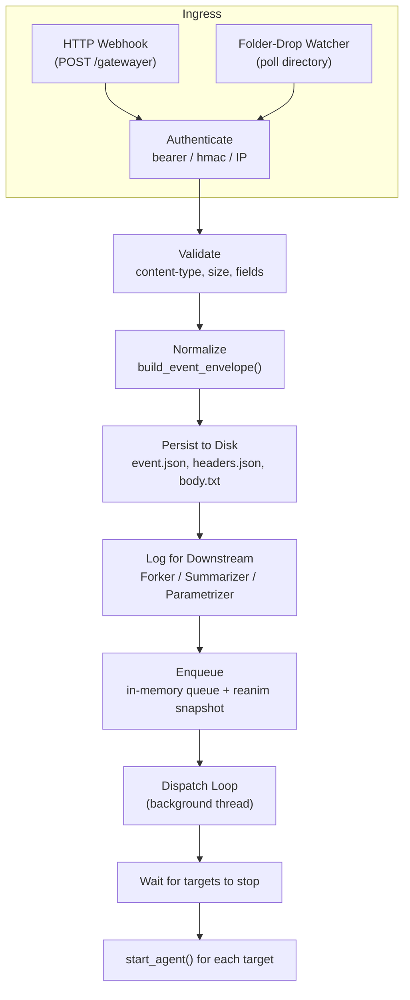

# Gatewayer Agent — Deep-Dive Explanation & Usage Samples

## 1. What Is It?

**Gatewayer** is an *inbound gateway agent* — the front door of the [Tlamatini](file:///c:/Tlamatini) multi-agent system. Its single job is:

> **Receive external events → Authenticate → Validate → Normalize → Persist → Queue → Dispatch to downstream agents.**

Think of it as a lightweight, self-contained *webhook receiver + folder watcher* that acts as a pipeline between the outside world and your internal Tlamatini agent pool. It is **not** a web framework — it is a purpose-built ingress microservice designed to run as a long-lived background process.

---

## 2. High-Level Architecture



### Thread Model

| Thread | Purpose |
|--------|---------|
| **Main** | Loads config, starts other threads, blocks on `shutdown_event.wait()` |
| **HTTP Server** | `HTTPServer.serve_forever()` — handles inbound webhooks |
| **Folder Watcher** | Polls a directory for new `*.json` files (optional) |
| **Dispatch Loop** | Drains the in-memory `event_queue` and launches downstream agents |

All threads are **daemon threads** except main. A `SIGINT` / `SIGTERM` sets the shared `shutdown_event`, causing a graceful cascade shutdown.

---

## 3. Subsystem-by-Subsystem Breakdown

### 3.1 Initialization (lines 1–54)

```
Script starts → set CWD to script dir → configure logging (file + console)
```

- If the environment variable `AGENT_REANIMATED=1` is set, the log file is **appended to** (crash-recovery resume). Otherwise it is **truncated** (fresh start).
- The log file is named after the containing directory: e.g. `gatewayer.log`.

### 3.2 Config Loading — [config.yaml](file:///c:/Tlamatini/applications/gatewayer/config.yaml)

`load_config()` reads the YAML and exits hard if it's missing or unparseable. Every downstream function receives the full config dict.

Key config sections:

| Section | Controls |
|---------|----------|
| `http` | Host, port, TLS, path |
| `folder_watch` | Watch directory, pattern, poll interval |
| `auth` | Bearer token, HMAC secret, IP allowlist |
| `payload` | Accepted content-types, max size, required fields, field mappings |
| `queue` | Max pending, overflow policy, dedup settings |
| `storage` | Output directory, what files to write, retention days |
| `response` | HTTP status codes and content-type for replies |
| `logging_behavior` | Custom log-marker words (e.g. `GATEWAY_EVENT_ACCEPTED`) |
| `target_agents` | List of downstream agent names to launch after dispatch |
| `runtime` | Idle sleep, graceful shutdown timeout |

### 3.3 Authentication — [authenticate_request()](file:///c:/Tlamatini/applications/gatewayer/gatewayer.py#L309-L355)

Three modes, configured via `auth.mode`:

| Mode | How it works |
|------|-------------|
| `none` | Always passes (still checks IP allowlist if configured) |
| `bearer` | Reads `Authorization: Bearer <token>` header and compares against `auth.bearer_token` |
| `hmac` | Reads `X-Tlamatini-Signature` + `X-Tlamatini-Timestamp` headers, computes `HMAC-SHA256(secret, timestamp + body)`, checks clock skew |

> [!TIP]
> When `auth.bearer_token` is empty (the default), bearer mode is effectively **open** — any request passes.

### 3.4 Validation — [validate_request()](file:///c:/Tlamatini/applications/gatewayer/gatewayer.py#L469-L493)

Three checks in order:

1. **Content-Type** — must match one of `payload.accepted_content_types`
2. **Body size** — must not exceed `payload.max_body_bytes` (default 1 MB)
3. **Required fields** — if `payload.required_fields` is set, the JSON body must contain all listed keys

Returns an error string on failure, `None` on success.

### 3.5 Normalization — [build_event_envelope()](file:///c:/Tlamatini/applications/gatewayer/gatewayer.py#L362-L412)

Every accepted request (HTTP or file-drop) is transformed into a **canonical event envelope**:

```json
{
  "event_id": "a1b2c3d4...",
  "received_at": "2026-04-13T19:55:00+00:00",
  "event_type": "order.placed",
  "session_id": "user-12345",
  "correlation_id": "req-abc-789",
  "body_hash": "sha256hex...",
  "content_type": "application/json",
  "method": "POST",
  "path": "/gatewayer",
  "query_params": {},
  "headers": { "...": "..." },
  "body": { "...parsed JSON or raw text..." },
  "raw_body": "...original text..."
}
```

Key behaviors:
- `event_type` and `session_id` are **extracted from the JSON body** using configurable field names.
- `correlation_id` is pulled from the `X-Correlation-ID` header.
- A SHA-256 hash of the raw body is computed for dedup and integrity.

### 3.6 Deduplication — [compute_dedup_key() / is_duplicate()](file:///c:/Tlamatini/applications/gatewayer/gatewayer.py#L500-L519)

When `queue.dedup_enabled: true`:

1. A dedup key is built by hashing the configured `dedup_key_fields` (default: `event_type + session_id + body_hash`).
2. If the same key was already seen within `dedup_window_sec` (default 30s), the event is **silently accepted** (returns 202 with `"status": "duplicate"`) but **not re-queued**.
3. Expired entries are pruned each time.
4. The dedup state is persisted to `reanim_dedup.json` for crash recovery.

### 3.7 Persistence — [persist_event()](file:///c:/Tlamatini/applications/gatewayer/gatewayer.py#L526-L557)

Each event creates a directory `gateway_events/<event_id>/` containing:

| File | Content |
|------|---------|
| `event.json` | Full canonical envelope |
| `request_body.txt` | Raw body text |
| `headers.json` | Request headers |


A `latest_event.json` symlink-style file is overwritten in the output root.

### 3.8 Payload Logging — [_log_event_payload()](file:///c:/Tlamatini/applications/gatewayer/gatewayer.py#L419-L462)

Writes **two log formats** designed for consumption by downstream Tlamatini agents:

1. **Flat key-value lines** — e.g. `MESSAGE_TYPE: TELEGRAM`, `SESSION_ID: user-123`
   - Purpose: Forker agent uses regex pattern-matching on these.

2. **Structured block** — wrapped in `INI_SECTION_GATEWAYER<<< ... >>>END_SECTION_GATEWAYER` delimiters
   - Purpose: Summarizer feeds it to an LLM; Parametrizer parses individual fields.

### 3.9 Event Queue & Overflow

- In-memory `queue.Queue` with configurable max (`queue.max_pending_events: 100`).
- Overflow policy: `reject_new` → returns HTTP 500 when full.
- Queue state is snapshotted to `reanim_queue.json` after every enqueue/dequeue for crash recovery.

### 3.10 Dispatch Loop — [dispatch_loop()](file:///c:/Tlamatini/applications/gatewayer/gatewayer.py#L803-L841)

Runs in a background thread:

1. Pops an event from the queue (blocks with timeout).
2. Writes a `dispatch.json` timestamp record to the event's directory.
3. **Waits for all target agents to finish** (polls their PID files via `psutil`).
4. Launches each target agent as a subprocess via `start_agent()`.

> [!IMPORTANT]
> Dispatch is **serial** — it waits for all target agents to stop before starting the next event's dispatch cycle. This is a deliberate concurrency guard.

### 3.11 Folder-Drop Watcher — [folder_watch_loop()](file:///c:/Tlamatini/applications/gatewayer/gatewayer.py#L698-L796)

An alternative ingress mode that polls a filesystem directory:

1. Lists files matching `file_pattern` (default `*.json`).
2. Reads each file, builds an envelope (with `method: "FILE_DROP"`).
3. Persists, logs, and enqueues — same pipeline as HTTP.
4. Moves processed files to a `processed/` subdirectory (or deletes them).

### 3.12 Agent Management (lines 73–223)

Utility functions for launching and monitoring downstream agents within the Tlamatini pool:

| Function | Purpose |
|----------|---------|
| `get_pool_path()` | Discovers the agent pool directory relative to the script |
| `get_agent_script_path()` | Resolves `<agent_name>/<agent_name>.py` |
| `is_agent_running()` | Checks PID file + `psutil` process existence |
| `start_agent()` | `subprocess.Popen` with proper env and `CREATE_NO_WINDOW` on Windows |
| `wait_for_agents_to_stop()` | Polls until all named agents are no longer running |

### 3.13 Crash Recovery (Reanimation)

If the process crashes and restarts with `AGENT_REANIMATED=1`:

- **Queue** → restored from `reanim_queue.json`
- **Dedup state** → restored from `reanim_dedup.json`
- **Log file** → appended to (not truncated)

### 3.14 Old-Event Cleanup — [cleanup_old_events()](file:///c:/Tlamatini/applications/gatewayer/gatewayer.py#L848-L867)

Runs once at startup. Deletes event directories older than `storage.keep_days` (default 7).

---

## 4. Complete Request Lifecycle (HTTP)

```
┌──────────┐
│  Client   │── POST /gatewayer ──►┌───────────────────┐
└──────────┘                       │ GatewayerHandler   │
                                   │  1. Read body      │
                                   │  2. Authenticate   │──► 401 if fail
                                   │  3. Validate       │──► 500 if fail
                                   │  4. Build envelope │
                                   │  5. Dedup check    │──► 202 "duplicate"
                                   │  6. Persist to disk│
                                   │  7. Log payload    │
                                   │  8. Enqueue        │──► 500 if queue full
                                   │  9. Return 202     │
                                   └────────┬──────────┘
                                            │
                                   ┌────────▼──────────┐
                                   │  Dispatch Loop     │
                                   │  (background)      │
                                   │  10. Wait targets  │
                                   │  11. start_agent() │
                                   └───────────────────┘
```

---

## 5. Usage Sample 1: HTTP Webhook (curl + Python)

### Scenario
You want to receive order-placed events from an e-commerce system.

### Step 1 — Configure `config.yaml`

```yaml
target_agents: ["order_processor"]

http:
  enabled: true
  host: "127.0.0.1"
  port: 8787
  path: "/gatewayer"

auth:
  mode: "bearer"
  bearer_token: "my-secret-token-123"

payload:
  accepted_content_types: ["application/json"]
  required_fields: ["event_type", "order_id"]
  event_type_field: "event_type"
  session_id_field: "customer_id"

queue:
  dedup_enabled: true
  dedup_key_fields: ["event_type", "body_hash"]
  dedup_window_sec: 60
```

### Step 2 — Start the agent

```bash
python gatewayer.py
```

Output:
```
2026-04-13 14:00:01 - INFO - GATEWAYER AGENT STARTED
2026-04-13 14:00:01 - INFO - Listen mode: http_webhook
2026-04-13 14:00:01 - INFO - HTTP webhook listening on 127.0.0.1:8787/gatewayer
```

### Step 3a — Send a webhook via `curl`

```bash
curl -X POST http://127.0.0.1:8787/gatewayer \
  -H "Content-Type: application/json" \
  -H "Authorization: Bearer my-secret-token-123" \
  -H "X-Correlation-ID: req-abc-789" \
  -d '{
    "event_type": "order.placed",
    "order_id": "ORD-2026-001",
    "customer_id": "cust-42",
    "total": 149.99,
    "items": ["widget-A", "widget-B"]
  }'
```

Response:
```json
{"status": "accepted", "event_id": "a1b2c3d4e5f6789..."}
```

### Step 3b — Same thing via Python `requests`

```python
import requests

resp = requests.post(
    "http://127.0.0.1:8787/gatewayer",
    headers={
        "Authorization": "Bearer my-secret-token-123",
        "X-Correlation-ID": "req-abc-789",
    },
    json={
        "event_type": "order.placed",
        "order_id": "ORD-2026-001",
        "customer_id": "cust-42",
        "total": 149.99,
        "items": ["widget-A", "widget-B"],
    },
)

print(resp.status_code)  # 202
print(resp.json())       # {"status": "accepted", "event_id": "..."}
```

### What Happens Inside

1. **Auth** — `Authorization: Bearer my-secret-token-123` matches `auth.bearer_token` ✅
2. **Validation** — Content-Type is `application/json` ✅, body has `event_type` and `order_id` ✅
3. **Envelope** — A canonical event with `event_type="order.placed"`, `session_id="cust-42"`, `correlation_id="req-abc-789"` is built.
4. **Dedup** — SHA-256 of the body is checked against the last 60 seconds.
5. **Persist** — Written to `gateway_events/<event_id>/event.json`, `request_body.txt`, `headers.json`.
6. **Log** — Forker sees `MESSAGE_EVENT_TYPE: order.placed`, `MESSAGE_ORDER_ID: ORD-2026-001`, etc.
7. **Dispatch** — The dispatch loop waits for `order_processor` to finish any previous work, then launches it.

### Resulting File Structure

```
gateway_events/
├── a1b2c3d4e5f6789.../
│   ├── event.json         # Full envelope
│   ├── request_body.txt   # Raw JSON body
│   ├── headers.json       # All request headers
│   └── dispatch.json      # {"dispatched_at": "..."}
└── latest_event.json      # Copy of the most recent envelope
```

---

## 6. Usage Sample 2: Folder-Drop Mode

### Scenario
An external system drops JSON files into a shared folder. Gatewayer picks them up and dispatches to a `report_generator` agent.

### Step 1 — Configure `config.yaml`

```yaml
target_agents: ["report_generator"]

listen_mode: "folder_watch"

http:
  enabled: false          # Disable HTTP for this mode

folder_watch:
  enabled: true
  watch_path: "C:/shared/incoming_reports"
  file_pattern: "*.json"
  poll_interval: 5        # Check every 5 seconds
  archive_processed: true
  processed_dir: "done"

auth:
  mode: "none"            # No auth needed for local files

payload:
  event_type_field: "report_type"
  session_id_field: "report_id"
```

### Step 2 — Start the agent

```bash
python gatewayer.py
```

Output:
```
2026-04-13 14:05:00 - INFO - GATEWAYER AGENT STARTED
2026-04-13 14:05:00 - INFO - Listen mode: folder_watch
2026-04-13 14:05:00 - INFO - Folder-drop watcher started
```

### Step 3 — Drop a file

Create `C:/shared/incoming_reports/monthly_sales.json`:

```json
{
  "report_type": "monthly_sales",
  "report_id": "RPT-2026-04",
  "period": "2026-04",
  "data": {
    "total_revenue": 1250000,
    "total_orders": 8432,
    "top_product": "widget-A"
  }
}
```

### What Happens Inside

1. The **folder watcher** detects `monthly_sales.json` on its next poll cycle (≤5 seconds).
2. Reads the file, parses JSON, builds an envelope with `method: "FILE_DROP"`.
3. Extracts `event_type="monthly_sales"`, `session_id="RPT-2026-04"` from the body.
4. Persists to `gateway_events/<event_id>/`.
5. Logs payload for downstream agents.
6. Enqueues the event.
7. **Moves** the file to `C:/shared/incoming_reports/done/monthly_sales.json`.
8. The dispatch loop launches `report_generator`.

### Log Output

```
2026-04-13 14:05:05 - INFO - GATEWAY_EVENT_ACCEPTED file=monthly_sales.json event_id=f8e9d0c1...
2026-04-13 14:05:05 - INFO - MESSAGE_REPORT_TYPE: monthly_sales
2026-04-13 14:05:05 - INFO - MESSAGE_REPORT_ID: RPT-2026-04
2026-04-13 14:05:05 - INFO - INI_SECTION_GATEWAYER<<<
event_id: f8e9d0c1...
event_type: monthly_sales
session_id: RPT-2026-04
...
>>>END_SECTION_GATEWAYER
2026-04-13 14:05:05 - INFO - GATEWAY_EVENT_QUEUED event_id=f8e9d0c1...
2026-04-13 14:05:05 - INFO - GATEWAY_EVENT_DISPATCHED event_id=f8e9d0c1... targets=['report_generator']
```

---

## 7. Quick Reference: Key Config-to-Behavior Map

| Config Key | Default | Effect |
|------------|---------|--------|
| `auth.mode` | `"bearer"` | `none` / `bearer` / `hmac` |
| `auth.bearer_token` | `""` (empty = open) | Token value for Bearer auth |
| `payload.max_body_bytes` | `1048576` (1 MB) | Rejects payloads larger than this |
| `payload.required_fields` | `[]` | JSON body must include all listed keys |
| `queue.dedup_enabled` | `true` | Skip duplicate events within window |
| `queue.dedup_window_sec` | `30` | Dedup time window |
| `queue.max_pending_events` | `100` | Queue capacity before overflow |
| `storage.keep_days` | `7` | Auto-delete events older than N days |
| `target_agents` | `[]` | Downstream agents to launch on dispatch |
