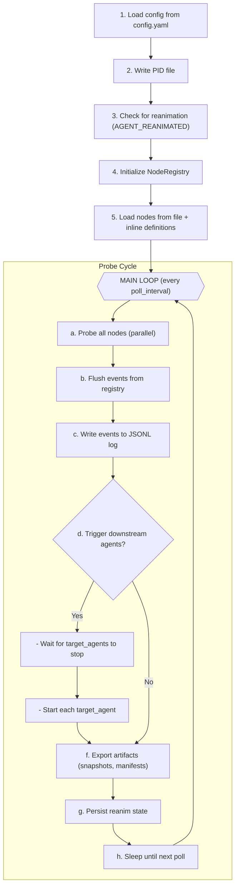
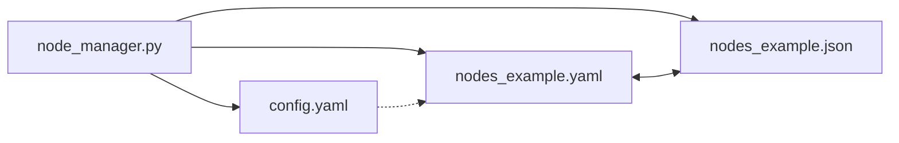

## Overview

This project is a NodeManager Agent — a long-running infrastructure registry and node supervision agent that maintains a live registry of local/remote nodes, probes health, detects capability changes, persists state, exports manifests, and triggers downstream agents on configured node events.

---

## Project Structure

| File | Type | Lines | Purpose |
|------|------|-------|---------|
| node_manager.py | Service Layer | 951 | Main agent implementation |
| config.yaml | Configuration | 82 | Agent configuration settings |
| nodes_example.yaml | Build/Deploy | 149 | YAML node inventory example |
| nodes_example.json | Other | 80 | JSON node inventory example |

---

## Core Components

### 1. Node State Machine

The agent maintains node states with these constants:


| State | Description |
|-------|-------------|
| `STATE_ONLINE` | Node is reachable and healthy |
| `STATE_OFFLINE` | Node unreachable after threshold failures |
| `STATE_DEGRADED` | Node partially reachable |
| `STATE_UNKNOWN` | Initial/undetermined state |


State Transitions trigger events:
- EVENT_NODE_ONLINE
- EVENT_NODE_OFFLINE
- EVENT_NODE_DEGRADED
- EVENT_NODE_CAPABILITIES_CHANGED

---

### 2. NodeRegistry Class (node_manager.py)

The central class that manages the live registry:

| Method | Description |
|--------|-------------|
| __init__(config) | Initializes registry, sets up storage paths, creates directories |
| load_reanim() | Loads persisted registry state from reanim_registry.json |
| probe_node(node_id) | Runs configured probes against a single node, returns new state |
| flush_events() | Returns and clears pending events list |
| write_events_log(events) | Appends events to JSONL events log |
| export_snapshot() | Exports full registry snapshot as JSON |
| export_selected_nodes() | Exports filtered nodes based on selection criteria |
| export_per_node_files() | Writes individual per-node manifest files |
| cleanup_old_events() | Removes events older than keep_days |

Storage Structure:

```text
node_registry/
├── nodes_snapshot.json      # Full registry snapshot
├── selected_nodes.json      # Filtered node manifest
├── node_events.jsonl        # Event log (JSONL format)
└── nodes/                   # Per-node manifest files
    ├── local-dev.json
    ├── web-server-01.json
    └── ...
```


---

### 3. Probing Functions (node_manager.py)

| Function | Purpose | Parameters |
|----------|---------|------------|
| probe_ping(host, timeout_sec) | Non-destructive ICMP ping probe | host, timeout (default 5s) |
| probe_tcp(host, port, timeout_sec) | TCP connectivity check | host, port, timeout |
| probe_ssh(host, port, timeout_sec) | SSH reachability via TCP connect | host, port (default 22), timeout |
| probe_winrm(host, timeout_sec) | WinRM check on ports 5985/5986 | host, timeout |
| probe_http(host, paths, timeout_sec) | HTTP GET on each path | host, paths list, timeout |

Platform-aware ping implementation:
- Windows: -n count, -w timeout flags
- Linux/Unix: -c count, -W timeout flags

---

### 4. Configuration (config.yaml)

#### Inventory Section
```yaml
inventory:
  nodes_file: ""              # Path to nodes YAML/JSON file
  merge_with_inline_nodes: true
  inline_nodes: []            # Nodes defined inline
  default_transport: "ssh"
```

#### Discovery Section
```yaml
discovery:
  enabled: false
  resolve_dns: true
  hostnames: []
  cidrs: []
  allowed_ports: [22, 5985, 5986]
  tcp_timeout_sec: 3
```

#### Heartbeat Section
```yaml
heartbeat:
  poll_interval: 30           # Seconds between probe cycles
  timeout_sec: 5              # Probe timeout
  offline_after_failures: 3   # Failures before marking offline
  debounce_sec: 20            # Event debounce period
  max_parallel_probes: 10     # Concurrent probe limit
```

#### Probes Section
```yaml
probes:
  ping_enabled: true
  tcp_connect_enabled: true
  ssh_probe_enabled: true
  winrm_probe_enabled: true
  http_probe_enabled: false
  http_paths: ["/"]
  collect_banners: true
  command_probe_enabled: false
  linux_command: "uname -a"
  windows_command: "hostname"
```

#### Capabilities Section
```yaml
capabilities:
  detect_os: true
  detect_python: true
  detect_git: true
  detect_docker: true
  detect_kubectl: false
  detect_gpu: false
  cache_ttl_sec: 300          # Capability cache duration
```

#### Selection Section
```yaml
selection:
  export_selected_nodes: true
  require_online: true
  include_tags: []
  exclude_tags: []
  include_roles: []
  os_types: []
  transports: []
```


---

### 5. Node Definition Format

YAML Example (`nodes_example.yaml`):
```yaml
- id: "web-server-01"
  host: "192.168.1.10"
  port: 22
  transport: "ssh"
  tags:
    - "production"
    - "web-tier"
  roles:
    - "webserver"
    - "load-balancer"
```

JSON Example (`nodes_example.json`):
```json
{
  "id": "web-server-01",
  "host": "192.168.1.10",
  "port": 22,
  "transport": "ssh",
  "tags": ["production", "web-tier"],
  "roles": ["webserver", "load-balancer"]
}
```


Field Definitions:
| Field | Required | Default | Description |
|-------|----------|---------|-------------|
| id | Optional | host value | Unique identifier |
| host | Required | — | Hostname or IP address |
| port | Optional | 22 (ssh) / 5985 (winrm) | TCP port for probes |
| transport | Optional | "ssh" | Protocol: ssh or winrm |
| tags | Optional | [] | Freeform labels for filtering |
| roles | Optional | [] | Functional roles for filtering |

---

### 6. Helper Functions (node_manager.py)

Environment & Path Helpers:
| Function | Purpose |
|----------|---------|
| get_python_command() | Returns Python executable path (checks PYTHON_HOME, bundled, system) |
| get_user_python_home() | Reads PYTHON_HOME from Windows registry (USER environment) |
| get_agent_env() | Builds environment dict for child processes |
| get_pool_path() | Returns pool directory path for deployed agents |
| get_agent_directory(agent_name) | Returns agent directory path |
| get_agent_script_path(agent_name) | Returns agent script path |

Agent Management:
| Function | Purpose |
|----------|---------|
| is_agent_running(agent_name) | Checks if agent process is running |
| wait_for_agents_to_stop(agent_names) | Blocks until all agents stop (logs every 10s) |
| start_agent(agent_name) | Starts an agent subprocess |
| write_pid_file() | Writes current process PID file |
| remove_pid_file() | Removes PID file on shutdown |

---

### 7. Main Execution Flow (node_manager.py)





---

### 8. Capability Detection

For local node (where agent runs):
- OS Detection: Uses sys.platform to determine os and os_family (windows/linux)
- Python Detection: Extracts version from sys.version
- Git Detection: Runs git --version subprocess
- Docker Detection: Runs docker --version subprocess
- kubectl Detection: Runs kubectl version (disabled by default)
- GPU Detection: Runs nvidia-smi (disabled by default)

Capabilities are cached with TTL (cache_ttl_sec: 300).

---

### 9. Event-Driven Triggering

When node state changes occur, the agent can trigger downstream agents:

```yaml
triggers:
  enabled: true
  trigger_events:
    - NODE_ONLINE
    - NODE_OFFLINE
    - NODE_DEGRADED
    - NODE_CAPABILITIES_CHANGED
```


Trigger Flow:
1. Event detected during probe cycle
2. should_trigger() checks if event type is in allowed list
3. If triggered, wait for all target_agents to stop
4. Start each target agent in sequence

---

### 10. Reanimation Support

The agent supports pause/resume via reanimation:

- Detection: AGENT_REANIMATED=1 environment variable
- State File: reanim_registry.json persists registry state
- Purpose: Resume monitoring without losing node state after pause

---

## Key Design Patterns

1. Thread-Safe Registry: Uses threading.Lock() for concurrent access to self.nodes dictionary
2. Probe Aggregation: Multiple probe types combined to determine overall node state
3. Failure Thresholding: Requires offline_after_failures consecutive failures before marking offline
4. Event Debouncing: debounce_sec prevents rapid state-flapping events
5. Parallel Probing: max_parallel_probes limits concurrent network operations
6. Graceful Degradation: Continues operation even if individual probes fail

---

## File Dependencies





---

## Summary

The NodeManager Agent is a robust infrastructure monitoring system that:
- Maintains a live registry of nodes with health states
- Performs multi-protocol probing (ping, TCP, SSH, WinRM, HTTP)
- Auto-detects node capabilities (OS, Python, Git, Docker, GPU)
- Persists state across restarts via reanimation
- Exports multiple artifact formats (snapshot, selected nodes, per-node files)
- Triggers downstream agents on configurable events
- Supports both YAML and JSON node inventory formats

