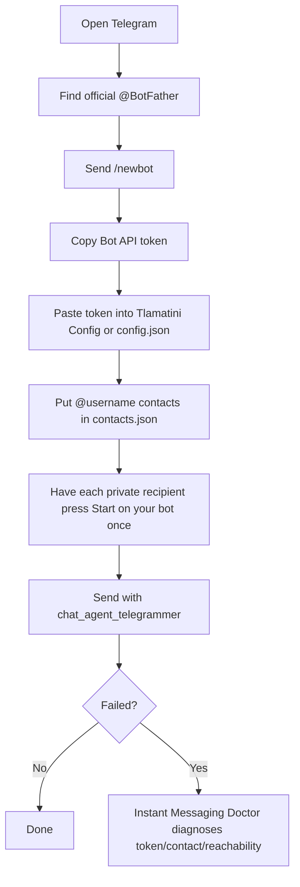
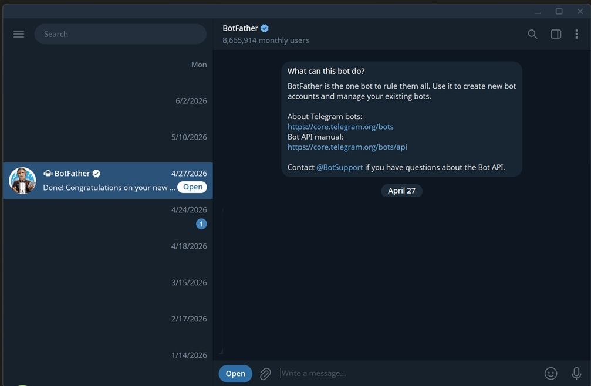
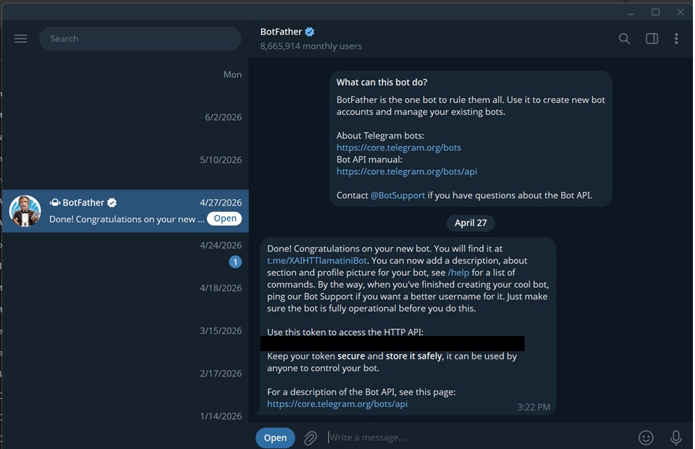
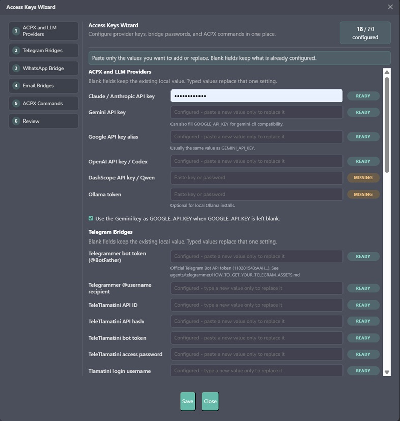

<!--
═══════════════════════════════════════════════════════════════════
  ✦  T L A M A T I N I  ✦   —   "one who knows"
  Created by  Angela López Mendoza   ·   @angelahack1
  Developer · Architect · Creator of Tlamatini
  Tlamatini Author Banner — do not remove (Angela's name is kept in every build)
═══════════════════════════════════════════════════════════════════
-->
# Telegrammer Setup: Send A Telegram Message From Tlamatini

This guide is for absolute beginners. Do one numbered step, then the next. No guessing, no third-party services, no numeric contact-book requirement.

Telegrammer uses official Telegram surfaces only:

- **Bot API** with a token from **@BotFather**. This is the normal setup.
- **Official Telegram user session** with `api_id` / `api_hash` only when you need a real logged-in Telegram account to send to private `@username` users who have not started your bot.

Your contact entry can stay readable:

```json
{ "name": "Angela", "telegram": "@angela_user" }
```

Any numeric Bot API route is private cache data for Telegrammer. Do not put it in `contacts.json`.

## The simplest path — just ask Tlamatini to send (one-time setup window)

You do **not** run any login command by hand. The **very first time** you ask Tlamatini to send a Telegram to a person (`@username`), Telegrammer opens a small **one-time setup window** by itself:

1. A window appears asking for your **phone number** — type it with the country code (e.g. `+525551234567`) and press Enter.
2. It asks for the **code** Telegram just sent you (a message from “Telegram” inside the app) — type it and press Enter. (If you set a Telegram 2-step password, it asks for that too.)
3. **Close the window. Your message is sent.**

That window logs in **your own Telegram account** so Telegrammer can find people by `@username` — a Telegram *bot* is not allowed to do that, only a real account can. It does **not** create, change, or delete your bot.

After that one time, every future “send a Telegram to …” goes straight through with **no window**, for the entire life of this installation — even years later. The window comes back **only** if you delete `C:\Tlamatini` and reinstall (a fresh install has no saved login), and then just once more.

If you close the window **without finishing**, nothing is sent and Tlamatini tells you the setup was *interrupted*; the next time you ask it to send, the window simply appears again.

> For this window to work, your **bot token** plus **`api_id` / `api_hash`** must be set (Steps 1–6 below, or the Access Keys wizard). In a keyed build they are already baked in, so a brand-new install just shows the window on your first send.

## What You Need

| Thing | Required? | Where it comes from | Where it goes in Tlamatini |
|---|---:|---|---|
| Bot token | Yes | @BotFather | `telegram_bot_token` or `telegram.bot_token` |
| Contact `@username` | Yes, for person-by-name sends | Telegram profile username | `contacts.json` |
| User session credentials | Optional | <https://my.telegram.org/apps> | `telegram_api_id`, `telegram_api_hash`, `telegram_session_name` or `telegram_session_string` |

## The Happy Path



## Step 1: Find The Real BotFather

Open Telegram on your phone or Telegram Desktop.



1. Click the **Search** box.
2. Type `BotFather`.
3. Click **@BotFather** with the blue verification check.
4. Click **Start**.

Direct link if Telegram is installed: <https://telegram.me/BotFather>

## Step 2: Create The Bot And Copy The Token



1. Send this exact message to BotFather:

   ```text
   /newbot
   ```

2. BotFather asks for a **name**. Type anything human, for example:

   ```text
   My Tlamatini Bot
   ```

3. BotFather asks for a **username**. It must be unique and end in `bot`, for example:

   ```text
   MyTlamatini2026_bot
   ```

4. BotFather replies with a token under the sentence **Use this token to access the HTTP API**.
5. Copy that token.

Token shape:

```text
123456789:AAH-your-secret-token-here
```

Important: the token is a password. Do not post it in screenshots, public docs, GitHub issues, chat logs, or tickets. If it leaks, open BotFather and revoke it.

## Does The Telegram Token Expire?

No normal expiry. The BotFather token is already long-lived. You do **not** need a separate "permanent token" process like WhatsApp.

The token stops working only if one of these happens:

- you revoke/regenerate it in BotFather,
- you delete the bot,
- Telegram disables the bot/account for policy reasons,
- you copied it wrong or left spaces around it in Tlamatini.

If you need to rotate it:

1. Open **@BotFather**.
2. Send:

   ```text
   /mybots
   ```

3. Pick your bot.
4. Open **API Token**.
5. Use **Revoke current token** / **Generate new token**.
6. Paste the new token into Tlamatini.
7. Restart Tlamatini.

## Step 3: Make A Private `@username` Reachable

Telegram Bot API cannot cold-message a private person just because you know `@username`. The private person must open your bot once and press **Start**. That is Telegram's platform rule, not a Tlamatini bug.


For every private person you want to message with Bot API mode:

1. Send them your bot link, for example:

   ```text
   https://t.me/MyTlamatini2026_bot
   ```

2. Ask them to click **Start** and send any tiny message like `hi`.
3. Optional proof: open this in a browser, replacing `<TOKEN>` with your bot token:

   ```text
   https://api.telegram.org/bot<TOKEN>/getUpdates
   ```

4. If you see `"ok": true` and an update from that person, Telegrammer can learn the official route and keep the numeric chat id privately in its cache.

## Step 4: Put The Token And Contacts In Tlamatini



Use **one** of these token methods.

Method A: Tlamatini UI

1. Open Tlamatini.
2. Open **Config**.
3. Go to **URLs / API Keys**.
4. Paste the BotFather token into **Telegrammer bot token (@BotFather)**.
5. Save and restart Tlamatini.

Method B: `config.json`

Set this value in `Tlamatini/agent/config.json`:

```json
{
  "telegram_bot_token": "123456789:AAH-your-secret-token-here",
  "telegram_provider": "botapi"
}
```

Now add people to `contacts.json` next to `config.json`:

```json
{
  "contacts": [
    {
      "name": "Angela",
      "aliases": ["Angie", "Angela phone"],
      "telegram": "@angela_user"
    },
    {
      "name": "Backup Operator",
      "aliases": ["Backup"],
      "telegram": "@backup_operator"
    },
    {
      "name": "Family Group",
      "telegram": "@my_family_alerts"
    }
  ]
}
```

Rules:

- Keep Telegram people as `@username`.
- Do not put Bot API numeric ids in `contacts.json`.
- For a private person, they must press **Start** on your bot once, or you must configure the optional user-session setup below.
- Groups/channels can use their public `@handle` if the bot is allowed to post there.

## Step 5: Send A Test Message

In Tlamatini chat with Multi-Turn enabled:

```text
Tlamatini, send a Telegram to Angela saying this is a Telegrammer test.
```

Direct tool shape:

```text
chat_agent_telegrammer(contact_name='Angela' and message='this is a Telegrammer test')
```

Send to several people by calling Telegrammer once per contact:

```text
chat_agent_telegrammer(contact_name='Angela' and message='test 1')
chat_agent_telegrammer(contact_name='Backup Operator' and message='test 2')
chat_agent_telegrammer(contact_name='Family Group' and message='test 3')
```

## Step 6: Run The Doctor Before A Critical Send

Use this before an important send, or read the automatic `auto_doctor` result if Telegrammer fails:

```text
chat_agent_instant_messaging_doctor(platform='telegram' and contact_name='Angela' and message='test' and retry_send=false)
```

The useful fields are:

| Field | Meaning |
|---|---|
| `status` | Overall result: ready, warning, blocked, skipped |
| `telegram_status` | Telegram-specific readiness |
| `contact_status` | Whether `contacts.json` resolved the person |
| `actions_required` | The next concrete repair step |

## Optional: Official User Session For Private Cold `@username`

Use this only if you must send from a real Telegram account to private `@username` users who have not pressed **Start** on your bot.

1. Go to <https://my.telegram.org/apps>.
2. Log in with your Telegram phone number.
3. Create an app.
4. Copy:

   ```text
   api_id
   api_hash
   ```

5. Put these in Tlamatini Config or `config.json`:

   ```json
   {
     "telegram_provider": "userapi",
     "telegram_api_id": "1234567",
     "telegram_api_hash": "your-api-hash",
     "telegram_session_name": "tlamatini_telegram_user"
   }
   ```

6. The first user-session login may ask for the Telegram login code. After the session exists, Tlamatini reuses it.

Use Bot API mode first unless you specifically need private cold `@username` sends.

## Troubleshooting

| Symptom | What it means | Fix |
|---|---|---|
| BotFather token missing | Telegrammer has no credential | Paste `telegram_bot_token` and restart Tlamatini |
| `getMe` fails | Token is wrong, revoked, or copied with spaces | Copy the token again from BotFather |
| `@username` does not resolve | Bot cannot reach that private user yet | Ask the user to press Start on the bot, then retry |
| Bot sends to group but not person | Group route is public/admin-enabled; private user has not started bot | Have the person press Start or use official user-session mode |
| Contact not found | Name in prompt does not match `contacts.json` | Add `name` or `aliases` |
| Message still fails | Need exact diagnosis | Run `chat_agent_instant_messaging_doctor(platform='telegram'...)` |

## References

- Official Telegram BotFather tutorial: <https://core.telegram.org/bots/tutorial>
- Official Telegram Bot API: <https://core.telegram.org/bots/api>
- Official BotFather link: <https://telegram.me/BotFather>
- Official Telegram app credentials page: <https://my.telegram.org/apps>
