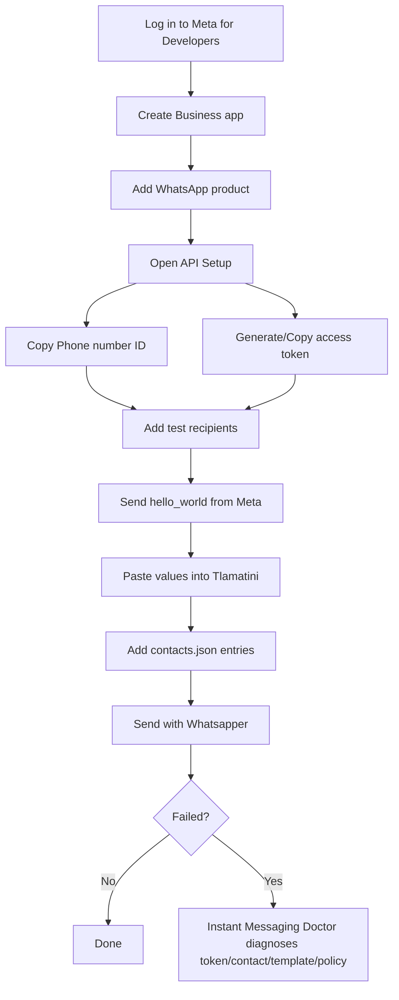
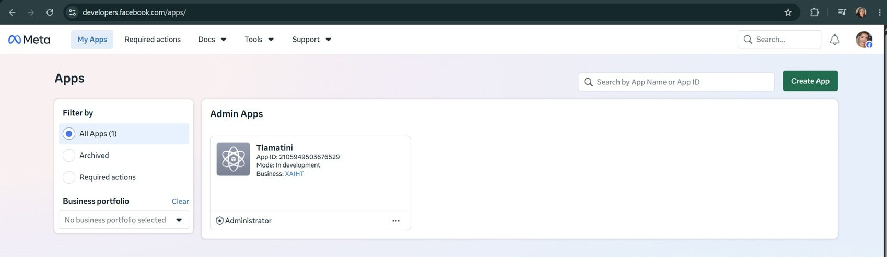
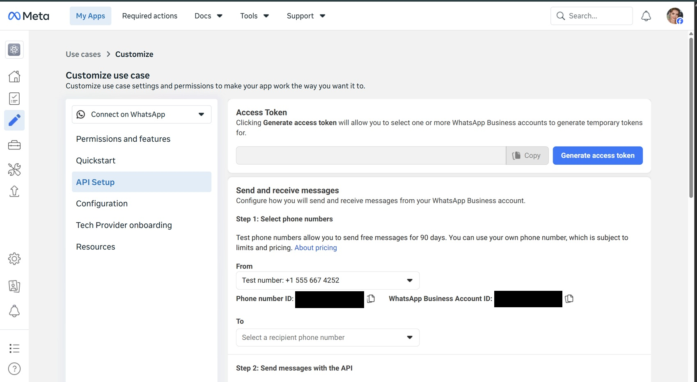
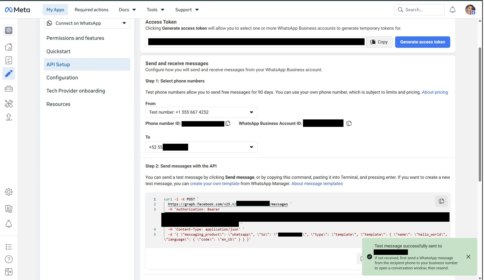
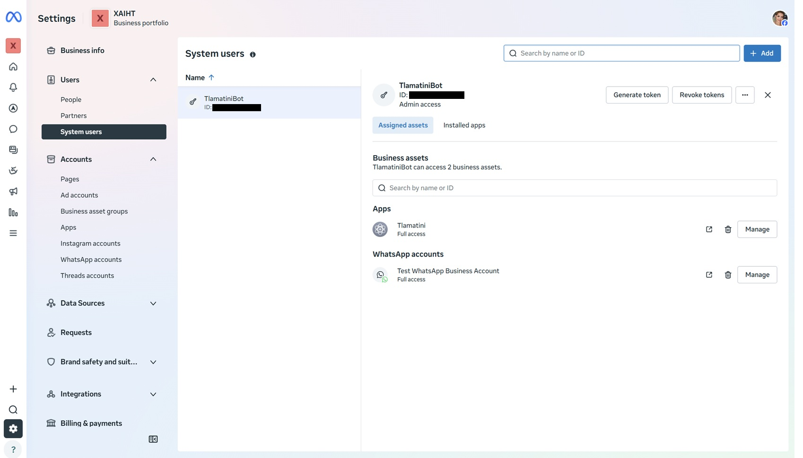
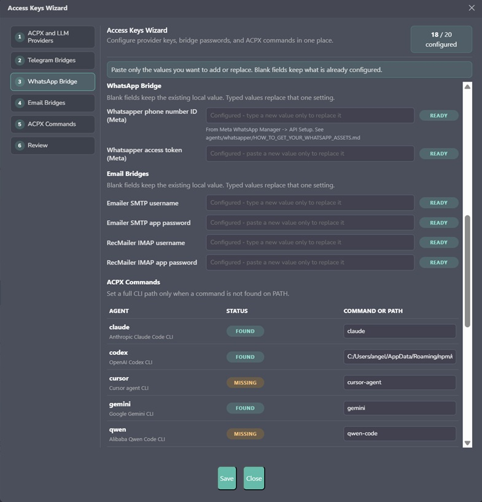

# Whatsapper Setup: Send A WhatsApp Message From Tlamatini

This guide is for absolute beginners. Do one numbered step, then the next. The **default** path (`provider=cloud`) uses **Meta's official WhatsApp Cloud API only** — no Twilio, no TextMeBot, no unofficial relay.

There is also an **optional personal mode** (`provider=web`) that sends from **your OWN number** with no templates and no System User. It is UNOFFICIAL (it drives WhatsApp Web) and has trade-offs — see **Option B** below. Pick whichever you prefer; everything from Step 1 onward is the official cloud setup.

## What You Need

| Thing | Required? | Where it comes from | Where it goes in Tlamatini |
|---|---:|---|---|
| Phone number ID | Yes | Meta app -> WhatsApp -> API Setup | `whatsapp_phone_number_id` or `whatsapp.phone_number_id` |
| Access token | Yes | Meta app temporary token, then Business Settings permanent token | `whatsapp_access_token` or `whatsapp.access_token` |
| Recipient phone number | Yes | The person's real WhatsApp number | `contacts.json` |
| Approved template | Required for cold sends | WhatsApp Manager / Meta test `hello_world` | `template` |

Important: **Phone number ID is not your mobile phone number**. It is a Meta ID for the WhatsApp Business sending number.

## The Happy Path



## Read This Before You Fight Meta

WhatsApp has a hard platform rule:

- If the person messaged your WhatsApp Business number in the last **24 hours**, you can send normal free-form text.
- If the person has **not** messaged your number recently, you must send an **approved message template**.
- Meta's built-in test template is usually `hello_world`.

So for a first cold test, use a template.

## Option B: Send From YOUR OWN Number (personal, unofficial)

If you don't want the business setup (templates, System User, verification), Whatsapper can send from **your own personal WhatsApp number** instead, by automating WhatsApp Web — the same thing you do at <https://web.whatsapp.com>.

How to use it:

1. In `config.yaml` set `provider: "web"` (or just tell Tlamatini *"send it as me"* / *"from my own WhatsApp"* in chat — that maps to web).
2. The FIRST send opens a real browser window showing the WhatsApp **QR code**. On your phone open **WhatsApp → Linked devices → Link a device** and scan it.
3. After that one scan the login is remembered (in a private profile folder), so later sends go straight through — no QR again, exactly like WhatsApp Web/Desktop.

What you get / give up:

| | Personal mode (`provider=web`) | Official mode (`provider=cloud`) |
|---|---|---|
| Sends from | **Your own number** | The business number |
| Templates / System User | **Not needed** | Required for cold sends |
| 24-hour-window rule | None | Applies |
| Meta-approved? | **No** — unofficial, automates WhatsApp Web | Yes |
| Risk | Meta can **ban your number** for automation; breaks if WhatsApp changes its web app | Stable, supported |
| Setup | One QR scan | The whole official flow below |

Use personal mode for your own messages to your own contacts. If a number must never be put at risk, use the official cloud path. The rest of this guide covers the official setup.

## Step 1: Create The Meta App And Add WhatsApp



1. Open <https://developers.facebook.com/>.
2. Click **Log In** and log in with your normal Facebook account.
3. If Meta asks you to register as a developer, accept the terms and finish the short setup.
4. Go to **My Apps**.
5. Click **Create App**.
6. When asked what the app should do, choose the WhatsApp/business path Meta shows. If Meta shows the older flow, choose **Other** -> **Business**.
7. Give the app a name, for example:

   ```text
   Tlamatini WhatsApp
   ```

8. Choose or create a Business portfolio if Meta asks.
9. In the app dashboard, find **WhatsApp** and click **Set up**.

Meta creates a test WhatsApp sending number for you. That test number is enough to send a first test message.

## Step 2: Open API Setup And Copy The Two Values



1. In the app left menu, open **WhatsApp**.
2. Open **API Setup**.
3. Find **Access token**.
4. Click **Generate access token** if the field is empty.
5. Click **Copy**. Save the token somewhere private for a moment.
6. Find **Step 1: Select phone numbers**.
7. Under **From**, copy **Phone number ID**.

You now have the two values Tlamatini needs:

```text
whatsapp_phone_number_id = 123456789012345
whatsapp_access_token    = EAAG...secret...
```

The token is a password. Do not paste it in screenshots, public docs, GitHub issues, or chat logs.

## Step 3: Add Every Test Recipient And Send `hello_world`

The Meta test number can only message recipients you add and verify. Add every number you want to test.



1. Still on **API Setup**, find **To**.
2. Click **Manage phone number list**.
3. Add the first phone number with country code.
4. WhatsApp sends that phone a verification code.
5. Enter the code in Meta.
6. Repeat this for each test recipient.
7. On **Step 2: Send messages with the API**, choose/use the `hello_world` template.
8. Click **Send message**.
9. Check the phone. A WhatsApp message should arrive.

If Meta cannot send `hello_world` from its own screen, Tlamatini cannot fix that yet. Fix the Meta setup first.

## Step 4: Make The Token Permanent

Start here if you already made Meta's `hello_world` test arrive and you want to stop using the temporary token.

The API Setup token can expire. For daily Tlamatini use, create a **System User** token with expiration **Never**.



1. Open <https://business.facebook.com/settings>.
2. If Meta shows **Select business**, click the business portfolio that owns the WhatsApp app. Example: **XAIHT**.
3. If you land on a normal Business Manager page, click the **gear icon** / **Business settings**.
4. In the left menu, open **Users**.
5. Click **System users**.
6. Click **Add**.
7. Name it exactly:

   ```text
   TlamatiniBot
   ```

   Do **not** use spaces. Meta may reject names like `Tlamatini Whatsapper` as invalid.

8. Choose role **Admin**.
9. Click **Create system user**.
10. Click **Assign assets**.
11. Assign your **Tlamatini** app:

   - select the app,
   - enable **Full control** / **Manage app**.

12. Assign your **WhatsApp account**:

   - open/select **WhatsApp accounts**,
   - select the WhatsApp account,
   - enable **Full control** / **Manage WhatsApp account**.

13. Click **Save changes**.
14. Click **Generate token**.
15. If Meta asks for an app, choose **Tlamatini**.
16. If Meta asks for token expiration, choose **Never**.
17. Select exactly these permissions:

   ```text
   whatsapp_business_messaging
   whatsapp_business_management
   ```

18. Click **Generate token**.
19. Copy it immediately. Do not paste it into chat. Meta may show it only once.
20. Replace the old temporary `whatsapp_access_token` in Tlamatini with this new permanent token.
21. Restart Tlamatini.
22. Test again:

   ```text
   Tlamatini, send a WhatsApp to Angela using template hello_world with template_language en_US.
   ```

Use this permanent token in Tlamatini instead of the short-lived token.

## Step 5: Put The Two Values And Contacts In Tlamatini



Use **one** of these credential methods.

Method A: Tlamatini UI

1. Open Tlamatini.
2. Open **Config**.
3. Go to **URLs / API Keys**.
4. Paste **Phone number ID** into the Whatsapper phone-number-id field.
5. Paste **Access token** into the Whatsapper access-token field.
6. Save and restart Tlamatini.

Method B: `config.json`

Set these values in `Tlamatini/agent/config.json`:

```json
{
  "whatsapp_phone_number_id": "123456789012345",
  "whatsapp_access_token": "EAAG...permanent-token...",
  "whatsapp_graph_base": "https://graph.facebook.com",
  "whatsapp_api_version": "v20.0"
}
```

Now add each recipient to `contacts.json` next to `config.json`:

```json
{
  "contacts": [
    {
      "name": "Angela",
      "aliases": ["Angie", "Angela phone"],
      "whatsapp": "+52 55 0000 0001"
    },
    {
      "name": "Backup Operator",
      "aliases": ["Backup"],
      "whatsapp": "+52 55 0000 0002"
    },
    {
      "name": "Manager",
      "aliases": ["Boss"],
      "whatsapp": "+52 55 0000 0003"
    }
  ]
}
```

Rules:

- Use the real country code.
- Spaces and `+` are fine; Whatsapper normalizes the number before calling Meta.
- With Meta's test number, each recipient must be in the API Setup recipient list.
- In production, use your real WhatsApp Business number and approved templates for cold sends.

## Step 6: Send A Test Message From Tlamatini

Cold first test with Meta's built-in template:

```text
Tlamatini, send a WhatsApp to Angela using template hello_world with template_language en_US.
```

Direct tool shape:

```text
chat_agent_whatsapper(contact_name='Angela' and template='hello_world' and template_language='en_US')
```

Warm free-text send, only inside the 24-hour window after that person messaged your business number:

```text
chat_agent_whatsapper(contact_name='Angela' and message='This is a Whatsapper warm-window test.')
```

Send to several numbers by calling Whatsapper once per contact:

```text
chat_agent_whatsapper(contact_name='Angela' and template='hello_world' and template_language='en_US')
chat_agent_whatsapper(contact_name='Backup Operator' and template='hello_world' and template_language='en_US')
chat_agent_whatsapper(contact_name='Manager' and template='hello_world' and template_language='en_US')
```

## Step 7: Run The Doctor Before A Critical Send

Use this before a critical send, or read the automatic `auto_doctor` result if Whatsapper fails:

```text
chat_agent_instant_messaging_doctor(platform='whatsapp' and contact_name='Angela' and template='hello_world' and template_language='en_US' and retry_send=false)
```

The useful fields are:

| Field | Meaning |
|---|---|
| `status` | Overall result: ready, warning, blocked, skipped |
| `whatsapp_status` | WhatsApp-specific readiness |
| `contact_status` | Whether `contacts.json` resolved the person |
| `repair_status` | Whether operator action is needed |
| `actions_required` | The next concrete repair step |

## Production With Several Real Numbers

The test setup is for verified test recipients. For real-world sending to several different people:

1. Add or migrate a real WhatsApp Business sending number in Meta.
2. Complete any Meta business verification Meta asks for.
3. Add a payment method if Meta requires it for production.
4. Create approved templates for cold business-initiated messages.
5. Put every recipient in `contacts.json`.
6. Use one Whatsapper run per recipient, or build a Tlamatini flow that iterates contacts through Parametrizer.

Production cold-send shape:

```text
chat_agent_whatsapper(contact_name='Angela' and template='my_approved_template' and template_language='en_US' and template_params='["Angela"]')
```

## Troubleshooting

| Symptom | What it means | Fix |
|---|---|---|
| `phone_number_id` missing | Tlamatini has no sending-number ID | Copy Phone number ID from API Setup and restart Tlamatini |
| HTTP 401 / code 190 | Token expired, revoked, or belongs to the wrong app/business | Generate a permanent System User token |
| `recipient not in allowed list` | Test number can only send to verified test recipients | Add that phone in API Setup -> Manage phone number list |
| Message accepted by Meta but phone receives nothing | Often wrong recipient, test-recipient limit, template/language mismatch, or WhatsApp delivery delay | Verify phone in API Setup, use `hello_world`, check number country code |
| Free text fails outside 24 hours | WhatsApp policy blocks cold free-form text | Use an approved template |
| Template error | Template name/language/parameters do not match an approved template | Check WhatsApp Manager -> Message templates |
| Contact not found | Name in prompt does not match `contacts.json` | Add `name` or `aliases` |
| Still confusing | Need exact diagnosis | Run `chat_agent_instant_messaging_doctor(platform='whatsapp'...)` |

## References

- WhatsApp Business Developer Hub: <https://whatsappbusiness.com/developers/developer-hub/>
- Meta WhatsApp get-started guide: <https://developers.facebook.com/documentation/business-messaging/whatsapp/get-started>
- Meta message endpoint reference: <https://developers.facebook.com/documentation/business-messaging/whatsapp/reference/whatsapp-business-phone-number/message-api>
- Meta template overview: <https://developers.facebook.com/documentation/business-messaging/whatsapp/templates/overview>
- Meta webhooks overview: <https://developers.facebook.com/documentation/business-messaging/whatsapp/webhooks/overview/>
- WhatsApp Business messaging policy: <https://whatsappbusiness.com/policy/>
