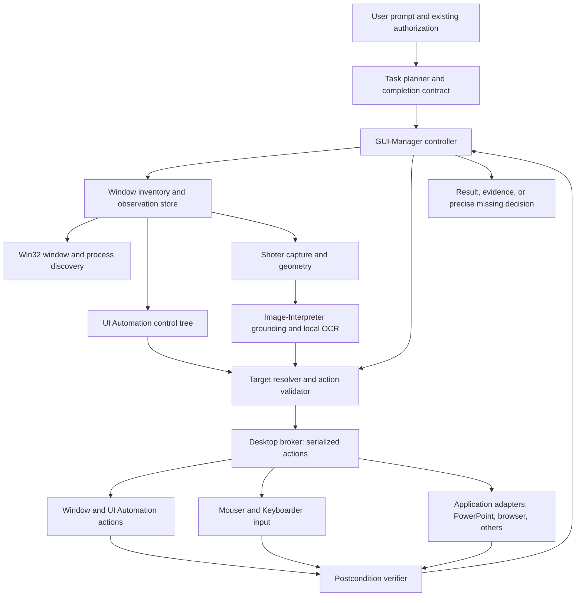

**GUI-Manager — design proposal for Tlamatini**

Prepared from source inspection on 2026-09-15. Baseline reviewed: `14647ab4e80c115cb721fefbbc588001f3ab0620`. This document specifies a future agent; no GUI-Manager runtime, database migration, or canvas node is implemented by this change. The subsequently authorized improvements to Mouser, Keyboarder, and Shoter are distinguished below from that future work.

**Decision.** Build a new agent with display name **GUI-Manager**, internal type `gui_manager`, and wrapped tool `chat_agent_gui_manager`. Keep Mouser and Keyboarder as focused input components. Reliable application control needs one owner of the task, target identity, observations, actions, and completion criteria. Distributing that responsibility among independent mouse, keyboard, and screenshot invocations leaves gaps between actions that better prompts alone cannot close.

The essential change is semantic control: “invoke the Save button in this dialog and verify the document is saved.” Pointer coordinates become a fallback representation of a verified target. GUI-Manager should combine Windows window discovery, UI Automation, application adapters, and visual interpretation, choosing the least ambiguous available route for each operation.

This is a design for broad Windows application coverage. Secure desktops, privilege boundaries, inaccessible custom controls, and applications that reject synthetic input prevent a defensible promise of universal control. Unsupported cases must produce a precise result, rather than guessed clicks or false success.

**What the repository actually contains.**

I interpreted “value analyzer” as **Video-Analyzer** and “shorter” as **Shoter**. There is also an **Analyzer**, but its implementation runs static-analysis/security tools; it does not inspect desktop images. I inspected the requested input and observation agents, plus Image-Interpreter and Windower because they materially change the appropriate architecture.

| Component | Baseline implementation | Consequence for GUI control |
|---|---|---|
| Mouser | PyAutoGUI movement, click, drag, scroll, window anchors, and reference-image matching | Has input primitives, but no accessibility control model, explicit screenshot coordinate transform, or application postcondition |
| Keyboarder | Parses quoted literals and chords; writes through PyAutoGUI into current focus | Cannot ensure the intended application or field receives input; no checked Unicode input path or structured action result |
| Shoter | Pillow capture; already defaults to **all screens**, despite the older catalog saying primary display | Saves pixels and a path, but baseline output omits desktop origin and image-to-screen geometry |
| Video-Analyzer | Extracts recorded frames, applies a deterministic motion gate, calls two visual interpreters, merges verdicts | Useful architecture for evidence and uncertainty; a physical-motion gate is unsuitable for deciding whether a GUI click/save succeeded |
| Image-Interpreter | Two image interpreters plus a text-only merger; returns a prose report | More relevant than Video-Analyzer for a still desktop image, but lacks validated control boxes, snapshot identities, and an action contract |
| Windower | Win32 lifecycle operations and title-based listing | Valuable existing foundation for finding, focusing, arranging, and closing windows; needs richer discovery and outcome verification |

Baseline evidence is in [Mouser](C:/Development/XAIHT/Tlamatini/Tlamatini/agent/agents/mouser/mouser.py), [Keyboarder](C:/Development/XAIHT/Tlamatini/Tlamatini/agent/agents/keyboarder/keyboarder.py), [Shoter](C:/Development/XAIHT/Tlamatini/Tlamatini/agent/agents/shoter/shoter.py), [Video-Analyzer](C:/Development/XAIHT/Tlamatini/Tlamatini/agent/agents/video_analyzer/video_analyzer.py), [Image-Interpreter](C:/Development/XAIHT/Tlamatini/Tlamatini/agent/agents/image_interpreter/image_interpreter.py), [Windower](C:/Development/XAIHT/Tlamatini/Tlamatini/agent/agents/windower/windower.py), and [Analyzer](C:/Development/XAIHT/Tlamatini/Tlamatini/agent/agents/analyzer/analyzer.py). Mouser, Keyboarder, and Shoter now include the follow-up implementation described later in this document; the baseline observations above refer to their pre-change behavior.

**Specific findings behind the decision.**

1. Baseline Mouser's `issue_click_after_reaching_target` returns no success value. Several callers derive `clicked` solely from whether a button was configured, even if the helper skipped the click or caught an exception. A downstream agent can therefore receive false evidence.
2. `click_at_window` originally chooses the first title match, treats activation failure as nonfatal, and computes hardcoded frame anchors. “Top right” is not the same as “the close button,” and the window center need not be an editing control.
3. `locateCenterOnScreen` originally supplies no explicit virtual-desktop origin, target-window restriction, or ambiguity policy. Changing a similarity threshold is not equivalent to correcting template scale or DPI.
4. Keyboarder's original loop does not bind a window, disables PyAutoGUI's fail-safe, logs literal input, catches individual shortcut errors while continuing, and can exit successfully after missing its input backend. A sequence can cross a focus change and continue into a different application.
5. Shoter already captures all displays, but a screenshot pixel `(x,y)` does not identify a physical desktop point without the capture origin, dimensions, and any resize/crop transform. Monitors left of the primary screen make this particularly visible.
6. Windower's `enum_windows` filters out hidden, untitled, and zero-size windows before matching. Its normal operations select an index, defaulting back to zero for an invalid index. `close_window` posts `WM_CLOSE`; `dispatch` reports success without waiting for destruction or handling a save dialog. `bring_to_front` can return true without checking the final foreground handle.
7. The fast `window_present` helper in [tools.py](C:/Development/XAIHT/Tlamatini/Tlamatini/agent/tools.py) is useful for title matching, but is not a complete window registry or visibility assessment. Launch process success also does not prove that a usable application window is ready.
8. Video-Analyzer's intended conservative verdict rule has a subtle gap: `analyze_video_dual` checks `v1 and v1 != PASS_OK`, so an unparseable individual verdict can fail to block a merger's PASS. GUI-Manager must require explicit evidence, never infer agreement from the absence of a parsed failure. This existing Video-Analyzer issue is identified here; its code is not changed in this work.
9. A chain of isolated agent processes has no shared desktop ownership lock. Two correct agents can interfere through the single keyboard focus and pointer. A task controller and common input broker are therefore required for reliable multi-step operation.

**Architecture.**



GUI-Manager is one user-facing agent. Planner, resolver, broker, and verifier are modules with explicit boundaries; they need not be separate LLM agents. A planner may use the configured language model, but deterministic code validates every proposed action. Two visual models should be reserved for difficult visual judgments, rather than required for every click.

Use the existing Python agent/runtime integration. Prototype a Windows UI Automation backend behind an internal interface; **pywinauto's UIA backend** is a practical starting point, with native UIA COM access where its wrapper does not expose a needed operation. Pin and package the selected dependency only after proving compatibility with the bundled Python and frozen build. Pywinauto documents separate Win32 and UIA backends and recommends selecting based on the application's exposed controls. [Pywinauto getting started](https://pywinauto.readthedocs.io/en/latest/getting_started.html).

Run UIA work in a dedicated worker with appropriate COM initialization and no UI of its own. UIA calls can block on an application provider; an external watchdog must be able to replace the worker. Cancelling a Python future alone does not stop a stuck COM call. Office automation gets a separate STA worker and message pump, rather than sharing UIA's worker. Microsoft's UIA guidance recommends a separate MTA thread for clients interacting with desktop elements. [UI Automation threading](https://learn.microsoft.com/en-us/windows/win32/winauto/uiauto-threading).

**Window discovery and identity.**

Maintain a raw inventory before classifying application windows. Start with `EnumWindows`, process metadata, owner relationships, window class, and relevant UIA roots. Add application/package identity where available; do not claim that one enumeration path covers every packaged or hosted application. `EnumWindows` is a top-level enumeration facility with documented scope limitations. [EnumWindows](https://learn.microsoft.com/en-us/windows/win32/api/winuser/nf-winuser-enumwindows).

Each observation should include:

| Field group | Required data |
|---|---|
| Identity | Observation-local `window_id`, HWND, PID, process start time, session/desktop, process image, window class, owner, optional package/application identity |
| Presentation | Title, window and client rectangles in physical pixels, monitor intersections, DPI, minimized/maximized state |
| Availability | `exists`, `ws_visible`, `foreground`, `cloaked`, `responsive`, `input_desktop_accessible`; allow `unknown` when a property cannot be established |
| Content | Exposed documents/tabs, modal dialogs, supported UIA patterns; document count is separate from top-level window count |
| Provenance | Observation ID, monotonic timestamp, lookup coverage, access-denied/error details |

`WS_VISIBLE` does not mean unobscured or foreground. Keep these properties separate. A minimized window, a hidden window, a covered window, a cloaked window on another virtual desktop, and a running process without a window require different handling. [IsWindowVisible](https://learn.microsoft.com/en-us/windows/win32/api/winuser/nf-winuser-iswindowvisible).

Do not discard hidden windows globally. Classify helper/tool windows so that they do not inflate the user-facing application list, while retaining them for owner/modal relationships. Match “Notepad” using verified process/application identity as well as title aliases; localized titles and arbitrary document titles should not defeat discovery. Count windows, not processes or tabs. Never claim absence when enumeration was incomplete or access was denied.

Treat HWNDs, PIDs, and UIA runtime IDs as temporary references. Before every action, revalidate the handle, process identity, session, and observation generation. HWND reuse within a process is possible; a saved numeric handle alone is insufficient. If several application windows satisfy the request, return stable observation-bound choices with title, state, process, and a thumbnail where useful. Do not silently choose the first.

**Control identification and action selection.**

Prefer routes in this order, while honoring an explicit request to demonstrate a physical click or keystroke:

| Route | Suitable tasks | Required verification |
|---|---|---|
| Application API/object model | PowerPoint content, document structure, supported browser actions | Read back document/application state |
| UI Automation pattern | Invoke button, set supported value, select item, expand menu, toggle control | Observe corresponding property, state, document, or dialog transition |
| Documented window operation | Focus, restore, move, resize, graceful close | Read actual window state or disappearance |
| Grounded physical input | Custom canvas, unlabeled control, application requiring real input | Fresh target geometry, hit testing, focused target, and post-action observation |

UI Automation exposes behavior through patterns such as Invoke, Value, SelectionItem, ExpandCollapse, Toggle, Scroll, and Window. Query supported patterns on the current element instead of assuming every button or editor supports the same operation. TextPattern is a read interface, not a universal text-insertion API. [UI Automation control patterns](https://learn.microsoft.com/en-us/windows/win32/winauto/uiauto-controlpatternsoverview).

Build an `ElementRef` from window identity, AutomationId when present, control type, accessible name, ancestor path, available patterns, bounds, and observation ID. Prefer stable IDs and relationships over localized names; verify uniqueness within the target subtree. Menus and virtualized list items may need expansion, scrolling, or realization before they can be resolved. Refresh references after changes instead of treating tree indices as persistent identifiers.

For image-only controls, obtain a fresh target-window crop plus enough surrounding context to distinguish repeated icons. Image-Interpreter should return schema-validated candidates with boxes, labels, image dimensions, and evidence. The resolver maps those boxes into physical coordinates, rejects ambiguous or out-of-bounds candidates, checks the owning window at the proposed click point, and captures again if the layout changed. OCR identifies text; it does not prove that nearby pixels are a clickable control.

A model's self-reported confidence is not a calibrated probability. Choose acceptance thresholds by benchmark performance, and combine visual evidence with deterministic ownership and uniqueness checks. Two models agreeing on prose does not establish a correct click target.

**Coordinate contract.**

Use physical pixels in the Windows virtual desktop as the internal reference. Coordinates may be negative. UIA bounds and point APIs operate in physical coordinates; the worker must establish DPI awareness before mixing them with cursor/window APIs. Avoid applying a second DPI multiplier to already physical UIA rectangles. [UI Automation screen scaling](https://learn.microsoft.com/en-us/windows/win32/winauto/uiauto-screenscaling).

Every image observation records the physical capture rectangle, raw pixel size, analyzed pixel size, crop/resize transform, capture time, monitor layout, target identity, and snapshot ID. For an axis-aligned resized image without letterboxing:

```text
screen_x = capture_left + image_x * capture_width  / analyzed_image_width
screen_y = capture_top  + image_y * capture_height / analyzed_image_height
```

For a left-hand monitor whose capture starts at `(-1920, 0)`, a 4480×1440 full-desktop image analyzed at 2240×720 maps image point `(480, 270)` to screen point `(-960, 540)`. Adding the primary monitor's origin or applying 150% DPI again would be wrong.

Crops change the physical capture rectangle. Letterboxing requires an explicit padding transform; the simple formula is not valid for padded images. Normalized window positions map against the live client rectangle and its last valid pixel, not the outer frame. Reject desktop gaps and off-monitor coordinates. A topology, window-size, DPI, or crop change invalidates derived coordinates. Do not clamp an invalid target onto a nearby button.

The proposed broker should use checked Win32 input with correct structures, physical positioning, and virtual-desktop handling. Absolute mouse input has a normalized coordinate range and requires `MOUSEEVENTF_VIRTUALDESK` to address the full virtual desktop; this differs from passing physical pixels to a cursor-position API. [MOUSEINPUT](https://learn.microsoft.com/en-us/windows/win32/api/winuser/ns-winuser-mouseinput).

**Controller and completion semantics.**

The controller follows `observe → resolve → validate → act → wait → verify`. Each mutation is small enough to explain and verify. Prefer events plus bounded polling to fixed sleeps. A completed input call is an action attempt, not a successful task.

Example action record:

```json
{
  "action_id": "run-42/action-3",
  "operation": "invoke",
  "observation_id": "obs-17",
  "window_id": "win-2",
  "element_id": "element-8",
  "preconditions": ["same_window_generation", "unique_target", "enabled"],
  "expected": {"kind": "dialog_absent", "dialog_id": "dialog-1"},
  "deadline_ms": 5000
}
```

IDs refer to objects issued by the observation service, not arbitrary model-generated HWNDs. Validate the schema, operation allowlist, reference freshness, task scope, and authorization before dispatch. Screenshots, captions, application text, and OCR are observations, never authority to issue new commands.

Task states: `discovering`, `resolving`, `acting`, `verifying`, `needs_selection`, `needs_decision`, `completed`, `failed`, `cancelled`, `unsupported`. `completed` requires the task's actual postcondition. A request whose stated behavior is to list multiple matches can complete successfully with that list; it need not be misclassified as blocked.

Keep `action_delivery` separate from `task_outcome`. Results should include what changed, what remains unresolved, and evidence IDs. Examples: `INPUT_REJECTED`, `FOCUS_LOST`, `TARGET_AMBIGUOUS`, `STALE_OBSERVATION`, `SAVE_DECISION_REQUIRED`, `PROVIDER_TIMEOUT`, `PRIVILEGE_MISMATCH`, `NO_INTERACTIVE_DESKTOP`, and `POSTCONDITION_UNVERIFIED`.

On timeout, observe before deciding whether to retry. A timed-out save, close, or insert may already have happened. Journal action attempts and use application state to reconcile completion; exactly-once execution cannot be promised across arbitrary GUI providers. Never repeat a click merely because no acknowledgment arrived. Idempotent property-setting is preferable to repeated toggles or blind key sequences.

**Desktop ownership, cancellation, and limits.**

One per-user-session broker serializes input and focus-changing actions. All participating legacy agents must use that broker or a shared lock; a lock inside GUI-Manager alone cannot prevent an independent Keyboarder from interfering. Release ownership while waiting for a user decision. Bound lease duration, and detect abandoned owners. Use authenticated local IPC restricted to the current user/session, with typed operations and no arbitrary code-evaluation endpoint.

Provide a visible stop control and an emergency hotkey; cancel planning and queued actions immediately and release input owned by the agent. Pause when human input or unexpected focus changes invalidate a step. Do not block the human's input globally. Process restart or pause/resume must reacquire desktop ownership and re-observe; cached coordinates and handles cannot be replayed blindly.

Windows can refuse foreground activation even when some eligibility conditions hold. Treat an activation call as a request and verify the actual foreground target. Thread-attachment tricks do not eliminate all restrictions. [SetForegroundWindow](https://learn.microsoft.com/en-us/windows/win32/api/winuser/nf-winuser-setforegroundwindow).

Input injection is constrained by Windows integrity levels, and a SendInput result does not identify UIPI as the reason for failure. Do not equate elevation of one process with access to a secure desktop. Start in the user's interactive session; report locked/disconnected/secure-desktop limitations explicitly. Avoid silently elevating the whole assistant. [SendInput](https://learn.microsoft.com/en-us/windows/win32/api/winuser/nf-winuser-sendinput).

Respect existing authorization for routine requested GUI work. Tlamatini currently intentionally excludes ordinary desktop input from Ask Execs. GUI-Manager should preserve that behavior while honoring existing checks for delegated file overwrite, command execution, or external actions. Resolve only concrete missing decisions, such as which of three windows to close or whether to discard an unsaved document. Do not insert a new confirmation before every ordinary click.

**Worked scenario: find Notepad and close it.**

Parse the user's condition before acting. “Close the foreground Notepad window” means that foreground status is an eligibility condition; it must not be silently broadened to every background window. “Find Notepad even if it is not visible, then close it” permits background/hidden-window discovery. In both cases, determine the set of application windows and apply the requested cardinality rule before issuing a close.

| Observation | Required behavior |
|---|---|
| No matching window and complete discovery | Report no matching window; distinguish an existing background process without a window |
| One eligible window | Bind its identity and request graceful close |
| Several windows, user said “show me the list” | Return the list and close none; this satisfies the conditional request |
| Window exists but does not satisfy an explicit foreground requirement | Report its actual state; do not change the condition by first focusing it |
| One background/minimized window, closing it is authorized | Attempt supported window close without hunting a visible X button |
| Close opens a save dialog | Follow the user's existing save/discard instruction; otherwise request that specific decision |
| Access denied or incomplete enumeration | Report limited discovery; do not say there are no windows |

Example output below is illustrative, not an observation of this machine:

| Choice | Window | Process | State | Foreground | Documents/tabs |
|---|---|---|---|---|---|
| `win-1` | notes.txt — Notepad | notepad.exe / PID 4120 | normal | yes | 1 exposed |
| `win-2` | Untitled — Notepad | notepad.exe / PID 6884 | minimized | no | unknown |

For the single-window case, use a supported UIA Window close operation or a validated `WM_CLOSE` request. A close message is cooperative: applications can process it by showing a confirmation dialog. It is not proof of destruction. [WM_CLOSE](https://learn.microsoft.com/en-us/windows/win32/winmsg/wm-close).

Wait for the selected window identity to disappear, or for an owned modal dialog to appear. Re-enumerate before reporting completion. If the application merely hides its window, report “window hidden; process still running” unless a documented application-specific contract identifies that as the requested close. Do not kill the process as an implicit escalation. A remaining process is not itself failure when the request was to close one window; applications may keep background processes or other windows alive.

Modern document applications may have several tabs inside one top-level window. Closing that window can affect all its tabs. List/count windows as requested, but include exposed document information and use the actual save/session-restoration behavior of that application version. Avoid hardcoded English `Alt+N` discard assumptions.

**Worked scenario: open PowerPoint and put a cat image on slide one.**

This combines artwork creation, presentation composition, and desktop control. GUI-Manager should coordinate them through explicit capability contracts:

1. Resolve whether the user requested a new presentation or named an existing one. For the example with no existing deck specified, create a new presentation and preserve other open decks.
2. Produce a real cat image through a configured image-generation capability, or use an explicitly supplied image. Validate that the result is an image file and retain its path, dimensions, and provenance. Image-Interpreter and Video-Analyzer analyze images; they are not image generators. If no image-generation provider is configured, state the missing capability rather than inventing an image path.
3. Prefer Tlamatini's existing **PPTXer** for a new saved deck, or a PowerPoint adapter for editing an existing live presentation. These are distinct workflows; do not replace an existing presentation wholesale to add one picture.
4. In the live adapter, bind the chosen presentation object, ensure slide one exists, and insert the picture with aspect ratio preserved. PowerPoint's `Shapes.AddPicture` provides an explicit file-based insertion operation, including placement and embedding options. Embed the image rather than leaving a fragile external link when a self-contained deck is requested. [PowerPoint AddPicture](https://learn.microsoft.com/en-us/office/vba/api/powerpoint.shapes.addpicture).
5. Read back slide and picture properties; verify slide one contains the intended picture and that its bounds fit the slide. Save to the requested destination, or choose a noncolliding output filename if producing a new artifact. Verify the saved file and render slide one to inspect the actual composition.
6. Open the finished deck in PowerPoint and show slide one, because the user explicitly asked to open the application. File creation alone does not satisfy this presentation requirement. Report the output path plus a preview and the verified foreground presentation.

PPTXer already exists in [pptxer.py](C:/Development/XAIHT/Tlamatini/Tlamatini/agent/agents/pptxer/pptxer.py); its media/composition and rendering capabilities should be reused, including the existing `nuance` presets and layout audit receipts described in the [PPTXer style guide](../Tlamatini/agent/agents/pptxer/STYLES.md). This proposal does not claim that arbitrary cat-image generation is already a built-in Tlamatini agent.

If the user explicitly requests mouse-and-keyboard demonstration, select that execution mode and use UIA/visual grounding for the ribbon, slide canvas, and dialogs. Expect more steps and validate each transition. PowerPoint COM/UIA support, dialog behavior, Office installation, and application version need capability checks; a universal ribbon-coordinate script is not an acceptable adapter.

**Proposed GUI-Manager interface and output.**

Expose one natural-language task entry point and typed internal operations. Proposed configuration, not an installed agent configuration:

```yaml
prompt: "Find Notepad windows. Close it if there is one; list them if there are several."
mode: execute                    # inspect | plan | execute
application_hint: notepad
window_selection: unique_or_list
include_background: true
include_hidden: true
execution_preference: semantic   # semantic | demonstrate_input
unsaved_changes: preserve        # preserve | save | discard (only when instructed)
max_actions: 30
deadline_seconds: 120
provider_timeout_seconds: 5
target_agents: []
```

These limits are initial engineering defaults to benchmark, not measured performance guarantees. The planner may not silently raise them. Longer work should checkpoint between bounded tasks. A resumed run must reacquire and validate live state.

Internal operations should include `discover_windows`, `observe_window`, `find_elements`, `read_element`, `invoke`, `set_value`, `select`, `expand`, `scroll`, `focus`, `type_text`, `send_keys`, `pointer_action`, `close_window`, `wait_for`, and `verify`. Optional application adapters expose narrow semantic operations such as `powerpoint.insert_picture`, rather than arbitrary COM evaluation or generated Python execution through the GUI.

Canonical result is a versioned JSON artifact. A compact atomic `INI_SECTION_GUI_MANAGER` block exposes `run_id`, `task_status`, `action_status`, `matched_count`, `selected_window_id`, `actions_attempted`, `actions_verified`, `result_path`, `evidence_path`, `error_code`, and `response_body` for existing flows. Keep the wrapper's process `status` distinct from these action/task results; key promotion must not silently overwrite or suppress one of them.

Evidence records should contain observation IDs, timestamps, chosen selectors, backend, before/after state, target identifiers, action result, and verification result. Store screenshots only when useful, preferentially scoped to the task window. Mask sensitive values in logs, avoid password-field screenshots where possible, and use Tlamatini's configured model/data handling for any remote visual analysis. A screen image should not be attached to every model call by default.

**Integration into Tlamatini.**

The existing templates are scripts launched both from canvas pools and isolated Multi-Turn runtime copies. Implement one common controller beneath both entry points so their behavior does not diverge. The following are future integration changes, not additions made by this proposal:

| Integration point | Required work |
|---|---|
| `agents/gui_manager/` | Agent entry point and configuration; PID lifecycle, cancellation, reanimation, structured result, downstream notification |
| Shared desktop service | Session broker, UIA/Office workers, typed schemas, observation store, action journal; package dependencies for source and frozen builds |
| `chat_agent_registry.py` | Wrapped tool metadata, task-oriented instructions, examples, bounded polling behavior |
| `tools.py` | Validated task request/result transport and explicit output promotion; continuation by run ID |
| `services/agent_contracts.py` and Parametrizer | Canonical output fields, connection contract, result-block parser support |
| `services/agent_paths.py`, startup discovery, agent manifest | Exact display name **GUI-Manager**, canonical `gui_manager` identity, runtime asset discovery; do not rely only on a seed migration |
| `mcp_agent.py` and capability registry | Routing to the new agent, execution-report rows, coexistence with primitive tools and current Ask Execs policy |
| Django model seeds/views/URLs | Agent/tool registration and canvas connection updates following current repository conventions |
| Canvas JavaScript/CSS and flow compiler | Agent class, connectors, save/load, undo/redo, normalized names, validation |
| Runtime shutdown/reanimation | Cancel broker actions, release owned input, terminate only owned workers, invalidate stale observations on resume |
| Catalog, `agentic_skill.md`, demos | Teach target selection and verification; remove contradictory blind-click or mandatory-discard instructions |

Existing guidance is in [agent integration notes](C:/Development/XAIHT/Tlamatini/docs/claude/agents.md), [runtime copies](C:/Development/XAIHT/Tlamatini/Tlamatini/agent/chat_agent_runtime.py), [agent contracts](C:/Development/XAIHT/Tlamatini/Tlamatini/agent/services/agent_contracts.py), [wrapped tool definitions](C:/Development/XAIHT/Tlamatini/Tlamatini/agent/chat_agent_registry.py), and [execution policy](C:/Development/XAIHT/Tlamatini/Tlamatini/agent/mcp_agent.py).

Do not repeatedly launch the complete vision-agent process pipeline for trivial window checks. Reuse deterministic discovery and a scoped observation cache; invalidate that cache on relevant events. For control snapshots, bound tree traversal by depth/node count and search only the selected application's subtree. Large accessibility trees must not flood the model context.

**Implemented now after the user's follow-up.**

The user initially requested design only, then explicitly authorized improving the existing agents while retaining GUI-Manager as a design. The implementation therefore covers the following foundation:

| Component | Implemented improvement | Remaining boundary |
|---|---|---|
| Mouser | Per-monitor DPI setup before PyAutoGUI; explicit physical/desktop/window/normalized/screenshot transforms; monitor-gap and bounds checks; read-only `inspect`; whole-desktop image matching with negative-origin correction; unique matches and window targeting; foreground/hit checks; corrected click reporting; nonzero failure exit | Still uses PyAutoGUI for mouse delivery. A geometric anchor is not a semantic control. Arbitrary natural-language button grounding, event-based verification, calibrated visual targeting, and a shared broker belong to GUI-Manager |
| Keyboarder | Bind one target HWND/PID; verify focus before input; native checked SendInput for Unicode and key chords; UTF-16 surrogate support; literal-text mode; preflight explicit key sequences; modifier cleanup; emergency stop enabled; structured counters and nonzero failure exit | Window binding does not identify a specific editable field or prove text read-back. Focus can change in the interval between a check and OS input; a broker plus postcondition checks further reduces, but cannot eliminate, that race |
| Shoter | Adds capture rectangle, image dimensions, timestamp, coordinate-space validity, and monitor rectangles to the result; uses physical Windows capture geometry when available | The caller must propagate a resize/crop transform and obtain a fresh image when layout changes. No invisible/minimized-window content capture or semantic interpretation is added |
| Agent integration | New input/output fields exposed to wrapped tools and Parametrizer; routing instructions updated to stop treating guessed coordinates or input completion as application success | No GUI-Manager runtime, new UIA dependency, full desktop lock, or general application adapter is introduced |

Image-Interpreter and Video-Analyzer remain analysis components. Their visual output is not made executable merely by adding a mouse agent downstream.

Usage examples for the improved agents:

```yaml
# Mouser: read physical cursor and monitor layout without moving anything.
movement_type: inspect
```

```yaml
# Mouser: illustrative resized screenshot mapping; replace with fresh observations.
movement_type: localized
coordinate_space: screenshot
capture_left: -1920
capture_top: 0
capture_width: 4480
capture_height: 1440
image_width: 2240
image_height: 720
end_posx: 480
end_posy: 270
button_click: left
actual_position: true
```

```yaml
# Keyboarder: target must uniquely resolve, and the intended field must be focused.
window_title: Notepad
input_mode: text
text: "Hola, Ángela. 猫 🐈"
```

The screenshot example assumes an unpadded image with the stated scale and crop. It is not a discovered button location. `action_status: input_sent` means only that the primitive finished delivering its requested input; GUI task completion requires separate observation.

**Validation and staged implementation.**

The accompanying regression suite exercises coordinate transforms, Unicode event construction, actual return/error handling, and focus/ambiguity behavior with native input mocked. It deliberately does not click or type into the user's applications. The tests and lint results reported with this change validate the foundation, not an unimplemented GUI-Manager or every application/monitor combination.

Recorded validation for this change: **38 new regression tests passed**, **3 existing Shoter capture-contract tests passed**, and Ruff passed for all changed Python files. An isolated runtime copy of Mouser ran `movement_type: inspect` successfully on the actual Windows desktop and reported one 2560×1600 monitor, with no mouse or keyboard input. Negative origins and mixed-size monitor layouts were tested synthetically; multi-monitor hardware and full application workflows were not exercised. Test source: [desktop input regressions](C:/Development/XAIHT/Tlamatini/Tlamatini/agent/test_desktop_input_agents.py).

The wrapped-tool failure message was also corrected for Mouser and Keyboarder: a failed run is marked as needing observation, rather than receiving generic script-rewrite/retry instructions that could repeat partially delivered input.

For GUI-Manager, use an isolated Windows test desktop/VM and instrumented fixture applications. Compare results with independent application state and window/process observations. Include destructive decoys, duplicate titles, delayed provider responses, and fault injection so a false-success rate cannot be hidden by easy demos.

| Acceptance scenario | Pass condition |
|---|---|
| One Notepad window, foreground/covered/minimized/hidden variants | Correct window identity discovered; requested state condition respected; close verified or exact blocking dialog reported |
| Several Notepad windows, including same title/PID with tabs | All eligible windows listed; none closed when the prompt requires a list |
| Unsaved content and localized save dialogs | No silent discard; explicit existing instruction followed; unresolved decision reported |
| Small standard button at 100%, 125%, 150%, 200% DPI | Correct UIA element invoked, independent expected state observed |
| Small image-only button with duplicate decoys | Correct unique scoped match, or explicit ambiguity; no nearest-match guess |
| Mixed-DPI displays, negative origins, monitor gaps, rotated layouts | Physical mapping correct; gaps rejected; display changes invalidate prior snapshots |
| Resized, cropped, padded, or stale screenshots | Correct declared transform, or request rejected before input |
| User steals focus during typing or dragging | Remaining input stops, owned modifiers/buttons are released, partial progress reported |
| Closed/reused HWND, restarted process, rebuilt control tree | Old references rejected and target re-resolved |
| Locked session, elevated target, secure desktop, inaccessible provider | Supported boundary reported; no false success or automatic privilege escalation |
| Provider hangs after accepting an action | Worker timeout bounded; observation reconciles state before retry |
| Two simultaneous GUI tasks and legacy input agent | Shared broker serializes input; no cross-task focus theft |
| PowerPoint cat workflow | Real image on slide one, saved deck verified, rendered slide checked, requested presentation shown |
| Screen text instructs unrelated actions | Text treated as observed content; original task scope retained |

Record task success, wrong-target actions, false-success reports, unnecessary user decisions, input latency, provider timeouts, recovery rate, and model calls per completed task. Release gates should demand zero wrong-target mutations and zero false-success reports in the controlled regression suite. That is a test gate, not a claim that a finite benchmark proves universal reliability.

Implement in these increments:

1. **Window controller:** robust inventory, identity, cardinality decisions, graceful close, owned-modal handling, and verified outcomes. This delivers the Notepad request without a vision model.
2. **UIA controls:** semantic lookup, supported patterns, target-scoped observations, field read-back, stale-reference recovery, and provider timeouts.
3. **Desktop broker:** common ownership for GUI-Manager and the existing input agents, cancellation, journaling, and resume rules. Complete this before allowing concurrent end-to-end GUI runs.
4. **Visual fallback:** structured Image-Interpreter grounding, local OCR, fresh captures, calibrated selection, and before/after evidence.
5. **Application adapters:** PowerPoint first, reusing PPTXer where appropriate; then other applications based on tested user workflows.

The first three increments establish reliable native application control. Visual grounding and application adapters extend coverage while preserving the same targeting and verification contract.

## Implemented flow integration follow-up — 2026-09-15

The companion [desktop input and flow contract implementation](desktop-input-and-flow-contracts.md) now connects the improved agents to Parametrizer, FlowCreator and FlowHypervisor. It includes all 89 installed agents in generated knowledge/coverage, validates generated flow structure and mappings, and treats input delivery separately from application success. The GUI-Manager broker, UI Automation layer and semantic verifier proposed here remain unimplemented. This follow-up changes the existing orchestration agents; it does not register GUI-Manager.
