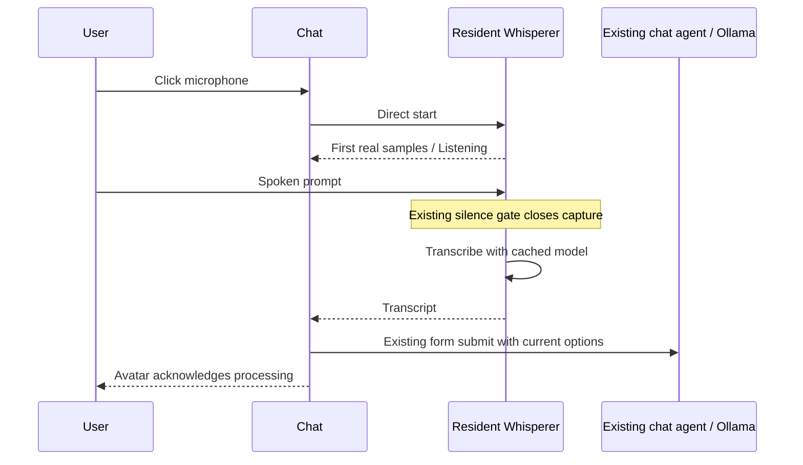

<!-- Tlamatini — Created by Angela López Mendoza · @angelahack1
Tlamatini Author Banner — do not remove -->

# Direct voice prompts

## Use the microphone button

1. Open the chat and wait for voice preparation to finish. The microphone is off
   during preparation; the button is unavailable while chat is disconnected or busy.
2. Click the microphone immediately left of **Send**. Wait for **Listening**:
   **Opening microphone** is only the startup state.
3. Speak into the microphone configured on the **Tlamatini host computer**.
   The composer shows live input level, elapsed time and the silence countdown.
4. Stop speaking. The configured gate closes capture, recognition runs, and the
   transcript is appended to any existing draft and **sent automatically**.
   There is no edit/review/confirmation screen before this send.
5. To abandon the prompt, click the microphone again or press **Escape**.
   Once the prompt has been sent, use the normal chat cancellation controls.

The button preserves the current chat options. It does not turn on Multi-Turn,
ACPX or any other mode. A browser on another computer still controls the
Tlamatini host's microphone; this is not browser-local audio upload. The default
recognizer runs locally; explicitly configured cloud speech engines send the
capture to that provider. The resulting text follows the normal chat/model path.

The **VOICE COMMANDS** catalog cards use the model-mediated wrapped agent and
their own instructions. Their rehearsal/read-back behavior must not be promised
for this direct, automatically submitting button.

## Existing system and the delay

The chat form in `agent_page_init.js` sends text and the current Multi-Turn,
Exec report, ACPX, Ask Execs and Step-by-Step flags over `/ws/agent/`.
The normal model-mediated voice-command catalog asks the LLM to invoke
`chat_agent_whisperer`. The wrapped-agent launcher prepares a pool, starts a
Python process and monitors its result. Whisperer opens the microphone, gates
20 ms blocks, loads faster-whisper and emits its transcript. That route remains
useful inside workflows, but it puts model reasoning, process startup and model
loading in front of an interactive dictation experience.

Whisperer's existing `SilenceGate` has an adaptive noise floor, hysteresis,
immediate first-syllable detection and a bounded recording duration. Its shipped
silence window is 3.5 seconds and its ceiling is 300 seconds. Those settings are
read from the existing Whisperer template. The microphone button always uses
gated dictation, even if a workflow template specifies a fixed recording length.

The avatar's `TLM_VOICE` uses browser speech synthesis and the installed voice
settings. It does not need Talker, Ollama speech synthesis or another agent job.
Normal chat acknowledgments must continue to use this avatar path.

## Design

A compact jewel-like microphone sits immediately left of Send: a luminous
cyan/violet rim, dark glass center and crisp vector microphone. Listening changes
the rim to rose, shows a live input meter and an explicit Listening label.
A separate status strip shows elapsed time and the actual silence countdown.
Status always uses text as well as color. Keyboard focus is visible; Escape and
a second click cancel. Decorative motion respects reduced-motion settings.

Main state sequence:
`preparing → ready → starting → recording → transcribing → submitting → ready`.
Cancellation uses `cancelling`; `empty` and `error` are recoverable visible states.
Starting never claims to be recording. Recording begins only after real samples.
Errors and empty audio restore controls and preserve the draft. Cancellation,
disconnect and duplicate clicks cannot submit late transcripts.

## Runtime

An authenticated, same-origin `/ws/chat-voice/` connection talks directly to a
resident Whisperer worker. No planner, tool binding, Ollama call or pool launch
is needed for each click. One worker per web process owns one microphone job.
It uses the existing source Python or the carried Python in a packaged
installation, without opening a separate console or changing foreground focus.
Diagnostics are forwarded to the main application console and Tlamatini log.
The Django process stays free of the speech ML stack. Startup failure and app
shutdown reap the direct child; no persistent shell is launched.

The worker loads capture libraries before declaring itself ready, but does not
open the microphone until a click. The first real recording event starts model
warmup concurrently. A bounded model cache reuses the selected model and its
GPU/CPU variants across subsequent prompts. Config is resolved afresh per job;
Config → Models and explicit Whisperer template overrides remain authoritative.

The existing capture function gains optional progress and cancellation hooks.
Progress is sent outside the audio callback. Interactive capture refuses the
legacy fixed-duration fallback because it cannot provide the promised silence
gate or reliable cancellation. Standalone Whisperer keeps its legacy behavior.

After capture closes, the worker transcribes the raw 16 kHz mono array locally
(or a temporary WAV for an explicitly configured cloud engine). No optional
Ollama cleanup is inserted. Silence-only input is not sent to ASR. Completed
text joins any existing draft and goes through the normal chat form exactly once.
The avatar acknowledges successful dispatch immediately, honoring Silent mode;
the matching server acknowledgment is deduplicated.

## Boundaries and latency

This uses the microphone configured on the Tlamatini host, consistent with
Whisperer's existing device selection. A remote browser does not supply its own
microphone. No browser audio permission is needed for the host microphone.
The button and its tooltip make that location explicit.

The UI responds on the click frame; warm capture is limited by IPC and audio
hardware startup. Cold worker startup and first model download cannot honestly
be called instantaneous. The UI reports them. Latency measurements separate
click-to-first-sample, captured duration and transcription duration.

Cancellation stops capture promptly. An already-running native ASR call cannot
be interrupted safely, so its result is discarded and the worker remains busy
until it finishes; no new recording or late automatic submission is allowed.

## Configuration and artifacts

The worker reloads `agents/whisperer/config.yaml` through Whisperer's existing
loader for every job. Central Config → Models → Speech selections apply through
`@config`; explicit template values remain overrides. The resident model cache
reuses compatible selections and is replaced as selections change. No database
schema or new model setting was added for dictation.

| Setting | Direct-button behavior |
| --- | --- |
| `engine`, `model`, `cloud_model` | Existing Whisperer selection: faster-whisper, cloud-groq or cloud-openai |
| `device_index`, `device_name`, `input_gain_percent` | Existing host input-device selection and gain |
| `language`, `task`, recognition options | Existing Whisperer recognition settings |
| `silence_timeout_seconds` | Existing value; shipped default 3.5 seconds |
| `silence_threshold_db`, `max_record_seconds` | Existing gate threshold and bounded recording ceiling; shipped ceiling 300 seconds |
| `input_source`, `record_seconds`, `silence_gate` | Forced to `mic`, `0`, `on` for this interactive job |
| `ollama_cleanup`, `target_agents` | Forced to `False` and `[]`; no second model cleanup or workflow chaining |

Local recognition receives the in-memory mono 16 kHz array. An explicit cloud
engine uses a WAV in the application Temp area; the worker attempts to remove
that temporary file in its `finally` cleanup. The direct route does not write
the standalone agent's transcript TXT/captured-WAV deliverables or
`INI_SECTION_WHISPERER` workflow output. Submitted text uses normal chat
history and logging rules. It is not itself a wrapped-agent Exec Report row.

## Transport and ownership

The public entry point is `/ws/chat-voice/` on the existing web server and port.
Django session authentication and an exact same-origin scheme/host check gate
access before preparation. Anonymous connections close with 4401; rejected
origins close with 4403. This adds no separately exposed public service.

| Direction | Frame or event |
| --- | --- |
| Browser → server | `{"action":"start","run_id":"unique-id"}` |
| Browser → server | `{"action":"cancel","run_id":"unique-id"}` |
| Server → browser, connection | `preparing`, then `ready`, or `error` |
| Server → browser, active run | `starting`, `recording`, `transcribing`; cancellation acknowledgment `cancelling` |
| Terminal events | `result` with `text`, `timings`, `stop_reason`; or `empty`, `error`, `cancelled` |
| Invalid/overlapping command | `rejected` |

The browser sends JSON controls, not audio. Commands are limited to 1,024
characters; run IDs contain 1–64 letters, digits, underscores or hyphens.
Recording telemetry contains `level`, `elapsed`, `silence` and
`silence_timeout`. Successful worker timings are `capture_start_ms`,
`transcription_ms` and `audio_seconds`. Recognized text is limited to 24,000
characters. A result's run ID must still match before it can update or submit
the composer.

The broker starts one resident source/carried-Python child per web process and
uses a private ephemeral `127.0.0.1` socket. A random per-launch environment
token authenticates the child; newline-delimited JSON frames are bounded at
131,072 bytes. The listener closes after startup. No model, shell command
interpreter, agent pool or browser microphone stream is involved.

One active dictation is allowed per web process. A second tab's competing run
gets a busy error; this is not a host-wide lock across separate server processes.
Disconnect/page exit cancels only the owned run. Parent EOF cancels the worker.
Startup failure and application shutdown reap the child, with bounded
terminate/kill fallback if normal exit stalls.

## Packaging and diagnostics

`build.py` requires the compiled `agent.chat_voice_consumer` and
`agent.chat_voice_runtime` modules. `build_runtime_assets.py` verifies
`agents/whisperer/chat_worker.py`, `agent/js/chat_dictation.js` and
`agent/css/chat_dictation.css` in the payload. The template, routing, composer
layout, form handoff and avatar hooks must travel with them. Packaged workers use
the carried Python; the frozen Django executable must not import the speech ML
stack. Recognition/capture dependencies belong in that interpreter as well.

`agent.chat_voice_runtime` is an INFO logger on the application's existing
console handler. Worker stdout/stderr is drained there with a `[Whisperer]`
prefix and follows the main `tlamatini.log` path. The initial development
prototype's separate `chat-whisperer.log`/PowerShell window is historical, not
the current product diagnostic path.

Restart the source application and refresh chat after updating the launcher.
A previously built installation requires a normal rebuild/update; editing
source alone does not replace its executable. No new migration is needed for
this button. Dependency declarations and private SDK boundaries are documented
in [the dependency audit](dependency-coverage-audit.md).

## Troubleshooting

| Symptom | Check or recovery |
| --- | --- |
| Preparing stays visible | Main log, carried/source Python and required capture libraries; preparation does not open the microphone |
| Button disabled | Normal chat connection, busy/context-loading state and Send availability |
| Wrong device or no audio | The host's Whisperer device configuration and OS microphone access; remote browser permissions do not choose the host device |
| Empty audio/recognition | No prompt is sent; retain the draft and try again |
| Turning voice into a prompt takes time | First model download/load, configured model/device and provider latency; inspect the main log |
| Cancelling stays visible during ASR | Native recognition/warmup may need to finish; late results are discarded and no new recording is allowed until cleanup |
| Other tab reports busy | Finish/cancel the current dictation owned by that web process |
| Chat becomes unavailable after recognition | Transcript remains in the draft for a later manual Send |
| Another Whisperer terminal opens | Old launcher/build is running; restart updated source or use a rebuilt package |
| Transcript sent but no audible acknowledgment | Silent mode, Config → Voice, installed browser voices and playback availability; acknowledgment is not proof the model job completed |

## Developer visibility and product UX

Angela's visible-execution rule governs development and verification. It must
not become an end-user requirement. The internal Whisperer worker has no console
visibility checks, activation calls or console window. Recording status stays
in the chat. On Windows the direct child uses CREATE_NO_WINDOW with captured
output, forwarded to the application's main logger. Verify this from a visible
development console; do not add a production debug window.

## Visible verification

Run every command and test in a verified visible foreground PowerShell console
with `-NoExit`. Browser checks explicitly use `headless=False` and leave Chrome
open for inspection. Use Shoter with `all_screens: true` for desktop evidence.
Read live logs every 5–15 seconds. Verify real microphone capture separately
from deterministic audio/transport fixtures; neither proves the other.

## Source map

| Responsibility | Source |
| --- | --- |
| Button, status, exact-once handoff | `agent/static/agent/js/chat_dictation.js` |
| Appearance and responsive controls | `agent/static/agent/css/chat_dictation.css` |
| Composer sizing | `agent/static/agent/js/agent_page_layout.js` |
| Authenticated direct voice transport | `agent/chat_voice_consumer.py` |
| Resident process and exclusive job ownership | `agent/chat_voice_runtime.py` |
| Capture, warmup and transcription lifecycle | `agent/agents/whisperer/chat_worker.py` |
| Existing sound gate and recognition engine | `agent/agents/whisperer/whisperer.py` |
| Normal dispatch and avatar voice | `agent_page_init.js`, `avatar.js` |

## Measured verification — 2026-09-27

All checks ran in verified visible foreground consoles and explicitly headed
Chrome. No audio was played during verification.

| Measurement on this machine | Observed |
| --- | --- |
| Resident worker startup, microphone still closed | about 1.0 s |
| First capture, direct start to actual samples | 265–266 ms |
| Second capture in the same worker | 94 ms |
| Actual gate, configured silence window | 3.5 s |
| Actual capture stopped on silence | 3.72 s of audio |
| Actual gate-to-empty completion, total from start | 4.36 s |
| Real recognition of a 5.768 s synthetic speech WAV, first decode | 11.094 s |
| Same WAV, same cached base model on CUDA | 0.203 s |

These are separate observations, not an end-to-end response-time guarantee.
The real microphone tests proved device opening, cancellation and automatic
silence termination. A synthetic speech file proved real recognition and cache
reuse. The browser used controlled voice/chat transport to verify automatic
submission, flags, draft preservation, recording UI, avatar acknowledgment,
keyboard access, reduced motion, narrow layout, duplicate/late frames and both
voice/chat disconnect recovery.

Validation: 93 Python tests passed (21 direct-voice plus 72 existing Whisperer);
33 visible browser checks passed. Python lint passed. JavaScript lint finished
with zero errors (621 warnings), all 49 JavaScript files parsed, static collection
completed successfully, and the diff whitespace check passed. Evidence is under
`Temp/voice-development`, `Temp/chat-microphone-checks` and
`Temp/chat-whisperer.log`.

The live Ollama task execution path was preserved and exercised through its
existing form with controlled transport; a live model request was not submitted.
The Windows installer was not rebuilt. Restart the source application and
refresh the chat to load the new WebSocket route and static assets.

## Product-console correction — 2026-09-27

The direct worker now starts without PowerShell/conhost or a new console.
It does not activate windows or require foreground/console visibility. Output
is drained into `agent.chat_voice_runtime`, configured for the main application
console and log; the chat remains the recording indicator. Failed startup and
application shutdown reap the direct child.

Visible verification: 98 Python tests passed (26 direct-voice and 72 existing
Whisperer), including launch flags, diagnostic forwarding and bounded shutdown.
The real worker became ready in 0.562 s, opened the configured microphone in
297 ms, cancelled, and exited normally. No additional visible window appeared
during that hardware probe. Desktop-wide foreground activity occurred during
the longer probe, so it is not evidence that the entire desktop stayed focused. A focused startup/shutdown/restart check then
passed twice: zero new visible windows, unchanged foreground focus, distinct
worker PIDs and normal exit code 0 in both cycles.
No frontend code changed in this correction; the prior browser verification
above remains historical evidence. A frozen installer was not rebuilt.

Evidence: `Temp/voice-development/86-voice-regressions-minimal-app-config.log`
and `87-real-windowless-microphone-probe.log`; the successful restart/window
check is recorded in `89-real-worker-window-and-restart-check.log` and
`windowless-startup-results.json`. The source application must be
restarted to replace an already loaded launcher; already built installations
need the normal rebuild/update to receive this source change.

