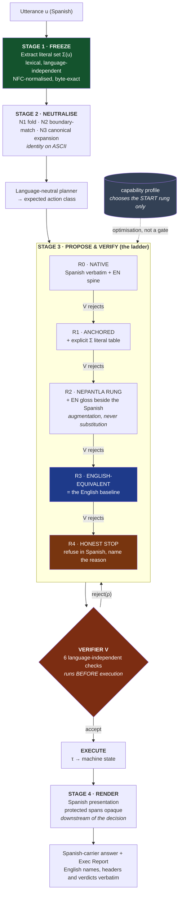

# NEPANTLA

## Guaranteed Non-Inferior Execution for a Spanish-Language LLM Operator System under Arbitrary Backend-Model Capability

**System under study:** Tlamatini — 86 workflow agents, 44 direct tools, a Multi-Turn operator loop, a visual flow designer
**Creator of the system:** Angela López Mendoza (XAIHT)
**Analysis:** Claude Opus 5 — forensic multi-agent study of the codebase at commit `3e6d514f` (v1.47.0)
**Date:** 2026-07-27
**Status:** Research paper. No Tlamatini source code was modified in its production.

---

> ### The name
>
> **Nepantla** is Nahuatl for *"in the middle"* — the space between two worlds, neither one nor the other, where something new is made. Tlamatini (*"the one who knows"*) is named in the same language. A Spanish-speaking operator commanding an English-built machine lives in nepantla, and this paper is about making that middle place **safe** rather than lossy.

---

## Abstract

We address a problem that arises whenever a locally-deployed AI *operator* system — one that selects tools, extracts byte-exact arguments and mutates real machine state — must serve a user in a language other than the one it was built in, while the user retains the freedom to bind **any** backend model, including models with weak or absent competence in that language.

The naive formulations both fail. Translating the user's request into English before processing injects a *conjunctive* failure mode: an operator task fails completely if any single file path, flag or identifier is damaged, so fidelity decays as $p^{k}$ in the number of literals and reaches ~11% absolute failure at realistic density even at a generous per-literal preservation rate of $p=0.98$. Conversely, simply passing Spanish through and hoping the model copes makes correctness a *function of an unknown, user-chosen model* — which is precisely the dependency a product cannot accept.

We propose **NEPANTLA** — *Non-inferior Execution via Progressive Augmentation, Native-Token Locking and Arbitration* — an algorithm that removes the dependency entirely. Its central move is to stop treating cross-lingual operation as a language problem and treat it as a **verification** problem. Three results make this possible.

**First**, in an operator system the observable outcome factorizes into an *execution outcome* (the state of the machine) and a *presentation outcome* (the text the user reads), and these are conditionally independent given the emitted action trace (**Proposition 1**). Execution correctness can therefore be guaranteed independently of the answer language — *provided* the action vocabulary itself is language-invariant.

**Second**, every correctness-bearing literal can be extracted from the raw utterance before any transformation and re-verified byte-exactly in the emitted action, converting the $p^{k}$ decay to $p^{k}=1$ (**Proposition 2**). This yields **argument provenance** — the requirement that every literal in an emitted action be derivable from the user's own words, a prior tool result, or a declared default — which is a *language-independent correctness certificate* and the sharpest cross-lingual signal available.

**Third**, and decisively: if failures are *detected* rather than accepted, an escalation ladder whose terminal rung is operationally identical to the English baseline **cannot perform worse than that baseline** (**Theorem 1, Ladder Dominance**). The guarantee therefore reduces entirely to the strength of a verifier — and in an operator system the verifier can be made strong, because actions are structured objects rather than prose.

Two corollaries follow that materially change the engineering. **Probe Safety** (**Corollary 1**): a model-capability probe influences only the *expected number of rungs*, never the terminal correctness, so probe miscalibration costs latency and never correctness. **Naming Necessity** (**Corollary 2**): Proposition 1 holds only while the action vocabulary is language-invariant — therefore keeping every agent name, tool name, flag, configuration key, protocol sentinel and internal identifier **byte-identical in English across all locales is not a stylistic preference but a precondition of the guarantee.** Translate `Emailer` and the proof fails.

We also report a measurement that reframes the engineering priority. Executing the system's real capability scorer over its real 64-agent registry with twelve matched prompt pairs yields **English top-1 tool selection 10/12 and Spanish 0/12**, with the semantically correct agent scoring *exactly zero* in 7 of 12 Spanish cases — not because the models are weak in Spanish (for Spanish the model-side gap is 1–4 points on reasoning and approximately zero on tool selection) but because the system's own deterministic control plane is monolingual at the tokenizer level. We give three language-neutralization operators that repair this with a proven identity guarantee on ASCII input, so English behaviour is provably unchanged.

Finally we specify how the claim is to be *falsified* rather than asserted: a pre-registered non-inferiority protocol ($\delta = 0.05$ on programmatic task success, Tango score intervals on paired proportions, 250 paired items, deliberately-degraded positive controls establishing assay sensitivity).

The scope of translation is stated once and held throughout: **Spanish becomes the *carrier* language of the interface — its grammar, its connectives, its generic verbs, its instructional prose — while the technical lexicon and everything the machine consumes stay English.**

The register this produces is the one Mexican engineers already speak and write: a Spanish matrix sentence with English content terms embedded verbatim — *"Haciendo un Pod en Dockerer y creando un Container en Kubernetes y haciendo el deployment en la LPAR"* — so `Emailer`, `Multi-Turn`, `Exec Report`, `deployment`, `Container` and `path` are not untranslated remnants but the correct words. Naming it matters beyond style: the fewer terms that shift between locales, the smaller the surface on which a Spanish request and an English one can diverge, so the correctness guarantee gets *stronger*, not weaker.

---

## 1. Introduction

### 1.1 The requirement

Tlamatini must become fully usable by a Spanish-speaking operator. Concretely, three things are required simultaneously, and the third is what makes the problem hard.

1. **The interface must be Spanish.** Every menu, button, dialog, tooltip, placeholder, status message, error, instruction and explanatory sentence the user reads is *carried* in Spanish. Not partially. Not "the important parts". But carried is the operative word, and it is a narrower claim than "translated": Spanish supplies the grammar, the connectives and the generic verbs — *Guardar*, *Cancelar*, *Cerrar*, *Buscar*, *Continuar*, *Eliminar* — while English supplies the technical lexicon — *Prompt*, *Log*, *Build*, *Commit*, *Context*, *Exec Report*, *Multi-Turn*, *Wizard*. A localized developer product changes the **minimum necessary**; changing more than that is not thoroughness, it is damage.
2. **The interaction must be Spanish.** The user writes in Spanish, thinks in Spanish, and receives answers whose carrier language is Spanish — with the technical terms staying English in both directions, exactly as they already do in the way Mexican engineers write to each other.
3. **The result must be at least as correct as the English build — for any backend model the user chooses to bind.**

Requirement 3 is not a quality aspiration; it is a hard constraint, and it is unusual. Tlamatini lets its operator select the model: a local Ollama build, an Anthropic endpoint, a cloud alias such as `glm-5.2:cloud`, a small quantized model on a modest GPU, a vision model. Some of those models are excellent in Spanish. Some are mediocre. Some are effectively English-only. **The product cannot know in advance, and must not require the user to know.**

A system that says *"Spanish works, as long as you pick a good model"* has not solved the problem. It has moved it onto the user, who by construction is the person least equipped to evaluate a model's Spanish competence — and who will discover the deficiency only through a silently wrong file deletion.

### 1.2 Why this is not a translation problem

The instinct is to reach for machine translation, and the instinct is wrong here for a reason specific to this class of system.

Tlamatini is not a chat assistant that produces prose. It is an **operator**. Its output is not a paragraph; it is a *sequence of actions on real state*: create this file at this exact absolute path, flash this firmware to this board over this port at this baud rate, delete these files matching this glob, send this message to this recipient. The correctness of the answer is not "does the sentence read well" but **"did the machine do the right thing"**.

That distinction has a mathematical consequence. Prose quality is *additive* and degrades gracefully — a translation that damages one word in twenty loses roughly five percent of its value. An action is *conjunctive* and degrades catastrophically — a tool call that damages one path in twenty **fails entirely**. There is no partial credit at the filesystem. §4 makes this precise.

So the design question is not *"how do we translate well?"* but:

> **Where in the pipeline is it safe for a lossy transformation to sit?**

The answer, developed in §3.4, is sharp: a lossy transformation may sit **downstream of a verified decision** and may never sit **upstream of one**. This single placement rule dissolves most of the apparent tension in the problem, because it makes translation a *presentation* technique rather than a *comprehension* technique.

### 1.3 What "at least as correct" must mean

Informal parity claims are unfalsifiable. We fix the meaning now and hold it throughout.

Let $\mathcal{T}$ be a task drawn from the operational distribution, rendered as an English utterance $u_{en}$ and a semantically equivalent Spanish utterance $u_{es}$ carrying **byte-identical literals**. Let $\mathrm{succ}(\cdot)$ be a machine-checkable success predicate evaluated against the state of the machine after execution — file present at the exact path with the exact hash, process exit code, log regex, database row, generated flow compiles.

Write $\theta_{EN} = \Pr[\mathrm{succ}(B(u_{en}))]$ for the English baseline pipeline $B$, and $\theta_{ES} = \Pr[\mathrm{succ}(A(u_{es}))]$ for the Spanish pipeline $A$.

**The requirement is $\theta_{ES} \ge \theta_{EN}$**, established two ways:

- **By construction** (§6.7): an architectural argument that $A$ dominates $B$, from which the inequality follows without measurement.
- **By experiment** (§8): a pre-registered non-inferiority test at margin $\delta$, because an architectural argument that has never been measured is a hypothesis wearing a proof's clothing.

Both are required. The first tells us the design cannot be *structurally* inferior; the second tells us the implementation is not.

### 1.4 Contributions

1. **A translation boundary** (§2) that partitions every string in the system into *presentation* and *machine* classes, with an explicit, exhaustive, non-negotiable invariant on the machine class — including the naming rule that agent identities such as `Emailer`, `Asker`, `Apirer` and `STM32er` remain byte-identical in every locale, forever — and the **register rule** that even *inside* the presentation class Spanish supplies only the carrier (grammar, connectives, generic verbs) while the technical lexicon stays English.
2. **A formal framework** (§3) with two propositions — Execution/Presentation Separation and Literal Anchoring — and the **Translation Placement Principle**.
3. **A measured characterization of substrate monolingualism** (§5): a real 700-file operator codebase whose deterministic control plane collapses under Spanish input, with executed measurements rather than inspection, and three repair operators carrying an identity guarantee on English input.
4. **NEPANTLA** (§6): the algorithm. Literal freezing, a six-check language-independent verifier including **argument provenance**, a five-rung escalation ladder, an independent presentation renderer, full pseudocode, the **Ladder Dominance** theorem and its two corollaries, complexity analysis and failure-mode analysis.
5. **A treatment of the not-Spanish-capable model** (§7) that makes model competence an *optimization* rather than a *dependency*, with three worked execution traces.
6. **A falsifiable evaluation protocol** (§8) with assay sensitivity, so the guarantee can be disproved.

### 1.5 Method

Every claim about the codebase was produced by fourteen parallel analysis agents reading the repository directly (684 tool invocations), each required to attach `file:line` evidence it had actually observed, and every empirical result reported in §5 was obtained by *executing* the real functions against the real registries rather than by reading them.

Every external scientific claim was then subjected to an independent adversarial verification pass which re-fetched each cited work to confirm title, authors, year and identifier, and re-checked each numeric value against the source table. That pass identified one misattributed reference, which was removed. Two further adversarial agents attempted to refute the architecture; their surviving objections were incorporated into the design rather than rebutted, and are visible in the final shape of §6 and §7 — the read-only guard, the per-path routing, the provenance check and the conversation-level hysteresis all exist because an attack landed.

---

## 2. The Translation Boundary

Before any algorithm, the scope must be exact. This section is the contract.

It is worth recording that this contract was written twice. The first attempt drew the boundary where almost every localization pipeline draws it — *translate everything a human reads; stop at what a program parses* — and that place is wrong for a developer tool. It produces *Comando*, *Estado*, *ÉXITO*, *patrón*, *registro*, *contenedor*, *despliegue*: a Spanish that no Mexican engineer writes, speaks, or wants to read back. The correct boundary is **narrower**, and §2.5 shows that being narrower is precisely what makes the correctness guarantee **stronger**.

### 2.1 The register: Spanish is the matrix, English is the embedded lexicon

The canonical data point is a sentence written by the system's author, Angela López Mendoza, describing an ordinary afternoon of work:

> *"Haciendo un Pod en Dockerer y creando un Container en Kubernetes y haciendo el deployment en la LPAR"*

Read what each language contributes to it.

| | Contributed by **Spanish** | Contributed by **English** |
|---|---|---|
| Tokens | *haciendo, creando, un, el, la, en, y* | *Pod, Dockerer, Container, Kubernetes, deployment, LPAR* |
| Function | Gerunds, articles, prepositions, the coordinator — the entire morphosyntactic skeleton | Every content noun that carries domain meaning |
| Morpheme class | System morphemes | Content morphemes |

Two details are diagnostic rather than incidental. *"la LPAR"* applies Spanish gender assignment to an English acronym — the acronym is not being quoted, it is being **inflected as Spanish grammar requires**. And it is *"el deployment"*, not *"el despliegue"*: the Spanish word exists, is well formed, and is not chosen.

This is not slang, and it is not laziness. It is the configuration the code-switching literature calls the **Matrix Language Frame** (Myers-Scotton, *Duelling Languages: Grammatical Structure in Codeswitching*, Oxford: Clarendon Press, 1993): one language — the *matrix* — supplies the morphosyntactic frame and the system morphemes, while the other — the *embedded* language — supplies content morphemes and multi-word "embedded-language islands". Angela's sentence is a textbook realization: Spanish is the matrix, English is embedded, and a multi-word feature name such as **Exec Report** or **Access Keys Wizard** enters whole, as an island, rather than being decomposed and calqued. The empirical direction is confirmed for exactly this language pair: analysing real English/Spanish code-switched speech, Iakovenko and Hain (2024, arXiv:2410.02521) find that *non-English languages (Mandarin and Spanish) are preferred over the English language as the matrix language.* Spanish is the carrier; English is the cargo.

The Spanish technical register has behaved this way for a century, and it is documented. Garriga Escribano ("Anglicismos en la ciencia y en la técnica", in Rodríguez González, ed., *Anglicismos en el español contemporáneo*, Peter Lang, 2022, ISBN 978-3-631-88575-8, pp. 117–138) records that *"en el ámbito del tecnicismo, el préstamo siempre fue mejor tolerado que en otros ámbitos del vocabulario"*, and supplies the density: **informática is the single largest anglicism domain** in the *Gran diccionario de anglicismos* with 167 entries, ahead of *telecomunicación* (111) and *cinematografía* (73); and **18.42 %** of the *DLE*'s informática entries are of English origin, a share second only to biochemistry. The RAE's own dictionary admits, unadapted, *byte, cracker, gigabyte, hacker, hardware, input, kilobyte, megabyte, output, router, software, spam, terabyte*.

Crucially, the same source already contains **the correctness argument this paper needs**, stated in linguistics decades before it was needed in software. Garriga cites Lázaro Carreter (1998: 587) endorsing *unadapted* technical anglicisms precisely because doing so *"facilita internacionalmente la biunivocidad que conviene a la terminología científica"* — it preserves the one-term-to-one-concept mapping that technical vocabulary depends on. **Biunivocidad is Corollary 2 written in Spanish, forty years early.** Every term that is left in English is a term whose referent cannot drift between locales.

Industry practice converges on the same rule from the opposite direction. Microsoft's localization terminology guidance instructs that a term *"might have to be marked as Do Not Translate (DNT)"*, that *"the name of the product or its key features might remain in English"*, and — the decisive sentence — that *"sometimes the market might prefer the 'English' term even if an equivalent term exists in the target language."* The mechanism it prescribes is a termbase with an explicit exclusions field and a terminology freeze; ISO 17100:2015 makes terminology and style specifications a binding part of a translation project's requirements rather than a translator's discretion [iso17100]. The register defended here is therefore implementable with standard localization machinery: it is a DNT list, not an exception to process.

Finally, the target locale matters. Garriga documents the long-standing split whereby Peninsular Spanish calques and Latin American Spanish borrows English directly — *ordenador* (from French *ordinateur*) against *computadora* (from English *computer*); Terradas's 1946 note that Spain says *"entrar en pérdida"* where Spanish-speaking America had already taken *estol* from English *stall*. Tlamatini's operator is Mexican, writing for a neutral Latin American audience: **the variety most receptive to the embedded English lexicon, not least so.**

One tension must be stated rather than hidden. The normative bodies push the other way: FundéuRAE recommends *pantalla* over *display* and *minería de datos* over *data mining*, and the RAE's director asked in 2021 for *"tecnolenguaje lo menos posible"*. But the RAE's own orthography supplies the escape hatch it needs: an *extranjerismo crudo* is set in italics and is **never marked incorrect**. The register is therefore normatively defensible as well as empirically attested. Angela is not being asked to choose between how practitioners speak and what the academy permits.

### 2.2 Three strata, not two channels

The earlier draft's two-channel model was too coarse. It had only *presentation* and *machine*, so every visible string was forced into "presentation", and therefore into Spanish. The corrected model has **three strata**, and the middle one is the whole point: it is visible, it is read by a human, and it stays in English anyway.

| | **(a) Spanish carrier** | **(b) English technical lexicon** | **(c) English machine layer** |
|---|---|---|---|
| Visible to the operator | Yes | Yes | Mostly not |
| Language | **Spanish** | **English, unchanged** | **English, byte-identical, forever** |
| Read back by a program | No | No | **Yes** |
| Why | It is grammar and generic action | It is the term practitioners actually use | Changing it changes behaviour |
| On error | Cosmetic — a clumsy sentence | Register failure — reads as a bad translation, and the operator must re-translate it back to act | Catastrophic — wrong tool, wrong path, silent corruption |

**(a) The Spanish carrier.** Grammar and everything generic: articles, prepositions, conjunctions, verb morphology; the generic interface verbs — *Guardar, Cancelar, Continuar, Cerrar, Eliminar, Buscar, Importar, Exportar, Actualizar, Reintentar, Iniciar, Detener, Pausar, Reanudar*; instructional prose and wizard narration; questions asked of the user; confirmations; explanations of what went wrong; empty-state copy; the connective tissue of every status line, tooltip and answer. This stratum is where the localization actually happens, and it is genuinely the bulk of the word count.

**(b) The English technical lexicon.** Every domain term and every topic or feature name, rendered in English **inside the Spanish sentence**, uninflected except as Spanish grammar demands an article or a plural. Non-exhaustively: *MCP, MCPs, Wizard, Exec Report, Multi-Turn, Ask Execs, ACPX, Skill, Skills, Flow, Prompt, Prompt Catalog, Step-by-Step, Token, Log, Commit, Build, Deploy, Deployment, Container, Pod, Cluster, Screenshot, Backup, Context, Agent, Tool, Debug, Release, Path, Timeout, Endpoint, API, API key, Webhook, Firmware, Board, Serial, Port, Query, Schema, Pipeline, Pattern, Session, Transcript, Canvas, Node, Runtime, Watchdog.* The test is not "does a Spanish word exist?" — one nearly always does. The test is "**is this the word a Mexican engineer would use out loud?**"

**(c) The English machine layer.** Anything a program consumes, compares, routes on, persists or parses. This stratum is exhaustive by *class* and absolute; §6.9 proves that a violation here does not merely look wrong, it invalidates the correctness guarantee.

| Class | Examples (illustrative, not exhaustive) |
|---|---|
| **Agent display names** | `Emailer`, `Asker`, `Apirer`, `Executer`, `Pythonxer`, `STM32er`, `Kyber-KeyGen`, `File-Creator`, `De-Compresser`, `Monitor-Log`, `Node Manager`, `TeleTlamatini`, `RecMailer`, `FlowCreator` |
| **Tool names** | `chat_agent_send_email`, `chat_agent_apirer`, `execute_command`, `acp_spawn`, `invoke_skill`, `ext__<server>__<tool>` |
| **Agent directory / pool names** | `agents/emailer/`, `emailer_1`, `apirer_2` |
| **Configuration keys** | `unified_agent_model`, `django_port`, `binary_context_detection`, `pio_executable` |
| **Configuration field names inside `config.yaml`** | `target_agents`, `source_agents`, `pattern_a`, `outcome_word`, `capture_mode` |
| **Protocol sentinels** | `END-RESPONSE`, `BEGIN-CODE<<<…>>>` / `END-CODE`, `INI_SECTION_<TYPE><<<` / `>>>END_SECTION_<TYPE>`, `TLM_VERDICT::PASS_OK`, `VERDICT: REQUEST_CHANGES` |
| **Machine verdict vocabularies** | `APPROVE`, `REQUEST_CHANGES`, `COMMENT`, `PASS_OK`, `FAIL_NO_MOTION`, `UNCLEAR`, `completed`, `failed`, `stopped` |
| **Source code** | Every identifier, function name, class name, module name, comment, docstring |
| **Internal variable nomenclature** | `_score_capability`, `exec_report_entries`, `answer_language`, `cancel_run_epoch` |
| **CLI flags and switches** | `--noreload`, `--self-modify`, `-sT`, `--collect-all` |
| **File and directory names** | `prompt.pmt`, `tlamatini.log`, `Temp`, `Templates`, `config.json`, `.flw` |
| **CSS classes, element ids, `data-*` attribute values** | `.canvas-item.stm32er-agent`, `#prompts-catalog`, `data-content="Emailer"` |
| **Log-line prefixes** | `--- [BINARY-GUARD]`, `--- [I18N-GUARD]`, `AGENT STARTED` |
| **Environment variables** | `TLAMATINI_TEMP`, `AGENT_REANIMATED`, `PDCP_API_KEY` |
| **`.flw` schema keys** | `agentName`, `configData`, `connections`, `schemaVersion` |
| **Brand and authorship** | `Tlamatini`, `XAIHT`, `Angela López Mendoza`, `ACPX`, `Multi-Turn`, `Exec report`, `Ask Execs`, `System-Metrics`, `Files-Search` |
| **User-supplied literals** | Absolute paths, filenames, hostnames, ports, board identifiers, git refs, regular expressions, glob patterns |

Note that stratum (b) and stratum (c) **overlap by design**, and the overlap is the mechanism that carries the guarantee. `Multi-Turn` is simultaneously a topic name the operator says aloud and a brand string the code compares; `Exec Report` is a feature the user asks for and a report the parser assembles; `Emailer` is a word in a Spanish sentence and the key of the enable gate `agent_<display>_status`. The register does not merely tolerate that overlap — §2.5 shows it deliberately **maximizes** it.

### 2.3 The boundary in worked strings

The register is easier to apply from examples than from definitions. Each row below gives the **correct** Spanish rendering beside the **over-translated** one the earlier draft would have produced. The right-hand column is not a strawman: every entry in it is a real, grammatical, dictionary-defensible Spanish sentence. That is exactly why the rule has to be written down — over-translation does not announce itself as an error.

This table is the **rendering specification** the presentation renderer of §6 implements, and it is the invariance inventory of §2.2(c) exercised on real surfaces: every asset name in the ✅ column is pinned byte-identical, and the ❌ column is what breaking that pin looks like in production.

| Surface | ✅ Correct — Spanish carrier, English lexicon | ❌ Wrong — over-translated |
|---|---|---|
| Sidebar tooltip (`Emailer`) | *"Envía un email por SMTP cuando se detecta un pattern en el log."* | *"Envía correos electrónicos por SMTP cuando se detecta un patrón en el registro."* |
| Confirm dialog (`Deleter`) | *"¿Seguro que quieres borrar estos archivos? Esta acción no se puede deshacer."* | *"¿Confirma la supresión de los ficheros del Borrador? La operación es irreversible."* |
| Navbar menu item | **Catálogo de Prompts** | *Catálogo de Indicaciones* |
| Navbar menu item | **Access Keys Wizard** | *Asistente de Claves de Acceso* |
| Toolbar toggle | **Multi-Turn** · **Exec report** · **Ask Execs** · **ACPX** · **Step-by-Step** | *Multi-Turno* · *Informe de Ejecución* · *Preguntar Ejecuciones* · *Paso a Paso* |
| Status line | *"Ejecutando el Build del firmware…"* | *"Ejecutando la compilación del microprograma…"* |
| Status line | *"Creando el Container y lanzando el deployment en el Cluster."* | *"Creando el contenedor y lanzando el despliegue en el clúster."* |
| Error message | *"No se pudo conectar con el endpoint; revisa el timeout en `config.json`."* | *"No se pudo conectar con el punto final; revise el tiempo de espera en la configuración."* |
| Exec Report caption | *Lista de operaciones de* **Emailer** | *Lista de operaciones de* **Correero** |
| Exec Report column headers | **Command** · **Status** | *Comando* · *Estado* |
| Exec Report verdict cell | **SUCCESS** / **FAILURE** | *ÉXITO* / *FALLO* |
| Wizard step | *"Paso 2 de 4 — pega aquí tu API key de Anthropic."* | *"Paso 2 de 4 — pegue aquí su clave de interfaz de programación de aplicaciones."* |
| Permission prompt (Ask Execs) | *"¿Permitir que se ejecute* **Apirer** *contra este endpoint?"* | *"¿Permitir que se ejecute* **Apificador** *contra este punto final?"* |
| Context menu item | *"Usar directorio como Context"* | *"Usar directorio como Contexto"* |
| Notification | *"Se guardó el Screenshot en `Temp`."* | *"Se guardó la Instantánea en la carpeta Temporal."* |
| Answer prose | *"Ya lancé* **Asker** *y está esperando tu elección; el Log quedó en `tlamatini.log`."* | *"Ya lancé el Preguntador y está esperando su elección; el registro quedó en el archivo de bitácora."* |

Three of these rows **reverse** the earlier draft explicitly, and the reversal is the substance of the correction:

- The Exec Report's **column headers stay English** (`Command`, `Status`). They were *Comando* and *Estado*.
- The Exec Report's **verdict words stay English** (`SUCCESS`, `FAILURE`). They were *ÉXITO* and *FALLO*. They are also the same tokens the parser and the reader of `tlamatini.log` see, which is the point.
- Only the report's **caption** is Spanish — *Lista de operaciones de* — because a caption is carrier prose, while a header is a field name the operator reads as a term.

Read the ✅ column as a whole and the pattern is uniform: **a Spanish sentence with English content nouns embedded verbatim.** Read the ❌ column and a second failure mode appears, one that is worse than ugliness. An operator who wants to act on *"revise el tiempo de espera"* must first translate it back into `timeout` before they can find the key in `config.json`. The over-translated build does not save the user a translation step; it **adds** one, and moves it to the least reliable place — the user's head, under time pressure, in front of a failing system.

### 2.4 The rule, stated so it needs no judgement

Two rules, applied in order. The first decides *whether a token moves*; the second is the special case that the rest of the paper proves is load-bearing.

> **RULE R (Register).** Write the sentence in Spanish. Then take each noun in it and ask, in this order:
> **(1)** *Is it read back by a program?* — compared, routed on, parsed, persisted, or passed as an argument. If yes → **English, byte-identical** (stratum c). Stop.
> **(2)** *Is it a domain term or the name of a feature, mode, artifact or topic?* — the word a Mexican engineer would say out loud rather than look up. If yes → **English, unchanged, inside the Spanish sentence** (stratum b). Stop.
> **(3)** Otherwise → **Spanish** (stratum a).
>
> First match wins. When (2) is genuinely uncertain, the tiebreak is: *would the operator have to translate it back before they could act on it?* If yes, it is stratum (b).

> **RULE N (Naming invariance).** An agent's display name is an **identifier**, not a label. It is byte-identical in every locale and every surface, forever — including its exact capitalization, its hyphens and its spaces. What is translated is the agent's *description*, never its *name*. `Emailer` is `Emailer` in `agentDescription`, in the sidebar, on the canvas node, in the dialog title, inside the Spanish sentence of a tooltip, in `data-content="Emailer"`, in `"agentName": "Emailer"`, and in `EMAILER AGENT STARTED`.

The **rendering table these two rules produce is §2.3**; the presentation renderer of §6 implements that table, and the stratum-(c) inventory of §2.2 is the list it must never touch.

Rule R has a useful property: it can be **checked mechanically**. Stratum (c) is an explicit inventory (§2.2), so a locale file containing a translated member of it is a test failure, not a review comment — which is what makes the invariant enforceable by CI rather than by discipline. Stratum (b) is a Do-Not-Translate termbase in exactly the sense Microsoft's terminology guidance and ISO 17100:2015 already define [iso17100], so it too is a list, subject to freeze and diff, rather than a matter of taste.

**The log file stays English.** `tlamatini.log` is not localized, and it is not expected to be internally consistent in language either: it is an engineering artifact, written for whoever is debugging, and a run in the Spanish build will legitimately contain English prefixes and structure around Spanish fragments quoted from user input. Mixed English/Spanish in the log is **correct output, not a defect**. Its grep-able prefixes (`--- [BINARY-GUARD]`, `--- [I18N-GUARD]`, `AGENT STARTED`) are stratum (c) and never move; the same holds for every `INI_SECTION_<TYPE><<<` block, every machine verdict token, and every path the log echoes back.

The result reads the way Spanish-speaking engineers already write and speak about tooling — *"corre el linter"*, *"revisa el commit"*, *"el flag `--noreload`"*, *"haciendo el deployment en la LPAR"* — so the English is not an untranslated remnant. It is the vocabulary.

### 2.5 A narrower boundary makes the guarantee *stronger*, not weaker

It would be easy to read §2.2(c) as a limitation accepted for expediency, and §2.2(b) as a further retreat from it. Both readings are backwards. The boundary is what *creates* the guarantee, and moving it inward strengthens it monotonically.

**The formal necessity.** The argument is developed in §3.2 and discharged in §6.9, but the intuition is short: the guarantee works by proving that the *execution channel* is unaffected by the user's language. That proof requires the execution vocabulary $\mathcal{N}$ — tool names, agent identities, argument keys, enumerated values, sentinels — to be **the same set of symbols regardless of locale**. If `Emailer` becomes *Correero* in Spanish, the action space itself becomes locale-indexed, the English baseline and the Spanish pipeline stop being comparable objects, and there is nothing left to prove non-inferiority *against*. That is **Corollary 2**, and stratum (c) is exactly its hypothesis written out longhand.

**The new argument, from stratum (b).** Corollary 2 only forbids localizing $\mathcal{N}$. The register does something further and stronger: it keeps the *user's own vocabulary* overlapping $\mathcal{N}$ as much as the language will bear. Define the **shift surface** $\Delta$ as the set of tokens whose surface form differs between the English and Spanish builds for the same concept. Then:

| Boundary | What lands in $\Delta$ | Consequence |
|---|---|---|
| Earlier draft (two channels) | Every visible content noun — *patrón, registro, contenedor, despliegue, punto final, tiempo de espera, instantánea, Comando, Estado, ÉXITO* | A Spanish request and its English twin share almost no content words |
| Corrected register (three strata) | Generic verbs, articles, prepositions, connectives, instructional prose | A Spanish request and its English twin **share every content word** |

Nothing in $\Delta$ under the corrected boundary is correctness-bearing. Generic verbs and function words never name a tool, never key an argument, never appear in a literal. So the reduction is free: it removes divergence without removing meaning.

**The consequence for the pipeline is concrete.** A Spanish request such as *"haz un Pod en Dockerer, arma el Container y lanza el deployment"* already contains `Pod`, `Dockerer`, `Container`, `deployment` — in English, in the user's own typing, with no translation stage anywhere. Those tokens hit the capability scorer's English hints **directly**. The lexical literal extractor of Definition 2 recognizes shapes, not meanings, and here the shapes it must recognize are already the shapes it was built for. The mapping $u \mapsto \tau$ therefore has strictly less work to do in Spanish under this register than under the previous one, and the cheapest rung of the escalation ladder (§6) succeeds more often — which shows up as latency saved, not as correctness bought, precisely because Proposition 1 already guaranteed the correctness.

Stated as the load-bearing sentence:

> **Every term the register leaves in English is a term that cannot diverge between locales. The register does not weaken the invariant set; it enlarges it.**

This is also, exactly, the *biunivocidad* argument of §2.1 — Lázaro Carreter's defence of unadapted technical anglicisms as preserving one-term-to-one-concept mapping. Linguistics reached the conclusion first, on the grounds of terminological hygiene; §3.2 and §6.10 reach the same conclusion on the grounds of a correctness proof. That the two arguments converge on the same rule from unrelated premises is the strongest evidence available that the rule is the right one.

**And the codebase already makes it load-bearing today.** Independently of any proof, agent display names are simultaneously the sidebar label, the value of `data-content` attributes matched by **56 case-sensitive CSS attribute selectors**, the operand of roughly **512 lowercased string comparisons** in the canvas connection handlers, the key of the per-agent enable gate `agent_<display>_status`, and the discriminant in **138 `case` labels** in the flow loader. The project's own engineering notes already record that changing a single hyphen to a space in one of these names *silently stops canvas connections from being persisted, with no error anywhere.* The naming convention is not decoration. It is an ABI — and the register is the discipline that keeps the ABI and the operator's own speech in the same alphabet.

---

## 3. Formal Framework

### 3.1 Definitions

**Definition 1 (Utterance).** $u$ is the raw user input, a Unicode string, in language $\ell(u)$.

**Definition 2 (Literal set).** $\Sigma(u) \subset \mathrm{Substr}(u)$ is the set of **correctness-bearing literals** in $u$: absolute and relative paths, filenames, file extensions, glob and regular-expression patterns, command-line flags, numeric quantities with their units, ports, hostnames, URLs, e-mail addresses, git refs, board identifiers, environment-variable names, and any token matching a known machine identifier (a tool name, an agent display name, a configuration key). $\Sigma$ is computed by a **lexical, language-independent** extractor: it recognizes shapes, not meanings.

**Definition 3 (Action).** $a = \langle \mathrm{name}, \mathrm{args} \rangle$ where $\mathrm{name} \in \mathcal{N}$, the fixed ASCII tool vocabulary, and $\mathrm{args}$ is a mapping from ASCII argument keys to values.

**Definition 4 (Trace).** $\tau = (a_1, \dots, a_m)$, the ordered sequence of actions actually executed in one request.

**Definition 5 (Machine state).** $s \in \mathcal{S}$: the filesystem, the process table, the database, attached hardware, the network. $\mathrm{exec}: \mathcal{S} \times \tau \to \mathcal{S}$ is the (deterministic, given the environment) state transition.

**Definition 6 (Presentation).** $r$ is the rendered text the operator reads: the answer prose, the Exec Report, the banners.

**Definition 7 (Success predicate).** $\mathrm{succ}: \mathcal{S} \to \{0,1\}$, a machine-checkable predicate authored from the task specification *before* any run and evaluated against $s' = \mathrm{exec}(s_0, \tau)$.

**Definition 8 (Verifier).** $V: (\Sigma, \mathcal{H}, a) \to \{\textsf{accept}, \textsf{reject}(\rho)\}$, a total, language-independent function over a candidate action, the frozen literal set, and the history $\mathcal{H}$ of prior results, returning a machine-readable rejection reason $\rho$.

### 3.2 Proposition 1 — Execution/Presentation Separation

> **Proposition 1.** For an operator system whose action vocabulary $\mathcal{N}$ and argument-key space are language-invariant, the terminal machine state depends on the request only through the trace $\tau$, and is conditionally independent of the presentation $r$ and of the language of the utterance:
> $$s' \perp\!\!\!\perp \big(\ell(u),\, r\big) \;\middle|\; \tau$$

*Proof.* $s' = \mathrm{exec}(s_0, \tau)$ by Definition 5. The function $\mathrm{exec}$ takes no argument other than $s_0$ and $\tau$; in particular it does not read $r$, and it does not read $\ell(u)$. Every symbol it consumes — the tool name, the argument keys, the enumerated values, the literal argument values — is drawn from a language-invariant vocabulary by hypothesis. Hence conditioning on $\tau$ renders $s'$ independent of both. $\square$

Two consequences do the work of the whole paper.

**(a)** $\mathrm{succ}$ is a function of $\tau$ alone. Therefore **correctness can be guaranteed without ever guaranteeing anything about the answer's language**, and conversely the answer's language can be freely chosen without touching correctness.

**(b)** The hypothesis is *load-bearing*. If any element of the action vocabulary were localized — a translated agent name, a translated enumerated value, a translated argument key — then $\mathcal{N}$ would be indexed by locale, $\mathrm{exec}$ would implicitly depend on $\ell(u)$, and the independence fails. This is the formal content of §2.5, and it is discharged as **Corollary 2** in §6.9.

### 3.3 Proposition 2 — Literal Anchoring

> **Proposition 2.** Let $\Sigma(u)$ be extracted from the raw utterance before any transformation, and let the verifier require that every literal appearing in an emitted action's arguments be an element of $\Sigma(u) \cup \mathcal{R}(\mathcal{H}) \cup \mathcal{D}$, where $\mathcal{R}(\mathcal{H})$ are literals returned by prior verified tool results and $\mathcal{D}$ are declared configuration defaults. Then the probability that an accepted action carries a corrupted user literal is zero, independently of $\ell(u)$ and independently of the model's competence in $\ell(u)$.

*Proof.* Suppose an accepted action contains a literal $\sigma'$ intended to denote a user literal $\sigma \in \Sigma(u)$ with $\sigma' \neq \sigma$. Byte-inequality with every element of $\Sigma(u)$ is decidable and is decided by the verifier. $\sigma' \notin \mathcal{R}(\mathcal{H})$ because $\mathcal{H}$ contains only literals emitted by prior *verified* results, and $\sigma' \notin \mathcal{D}$ because $\mathcal{D}$ is a finite declared set. Hence $V$ rejects, contradicting acceptance. $\square$

This is the mechanism that turns the $p^{k}$ decay of §4.1 into $p^{k} = 1$. We name its enforcement **argument provenance**, and we claim it as the paper's sharpest practical instrument: it is a *correctness certificate that requires no knowledge of either language*, and it catches precisely the failure class that cross-lingual operation introduces — a path silently normalized, an accent stripped from a filename, a flag "helpfully" translated, a number re-formatted from `1.5` to `1,5`.

A subtlety worth stating, because it is where a naive implementation fails: provenance must be checked with **NFC normalization only** — never case-folding, never accent-stripping. `informe_año.pdf` may arrive composed (U+00F1) or decomposed (n + U+0303) depending on the keyboard and operating system that produced it, and those are the same intended path; but a path differing by an accent is a *genuinely different path*, and hiding that difference would destroy the very property being certified.

### 3.4 The Translation Placement Principle

Propositions 1 and 2 jointly license a rule that resolves the apparent conflict between "translation is dangerous" and "the user must read Spanish".

> **Principle T.** A lossy language transformation may occupy a position **downstream** of a verified decision. It may never occupy a position **upstream** of one.

Upstream placement puts the transformation *inside* the causal path to $\tau$: its errors propagate into the action, are multiplied by the conjunctive structure of §4.1, and become state changes. Downstream placement puts it strictly *after* $\tau$ has been fixed and verified: by Proposition 1 it cannot alter $s'$, so its errors are bounded to prose.

Principle T is what makes a Spanish-carrier interface compatible with a hard correctness guarantee. It also yields an immediate corollary about protected spans: since downstream rendering still passes over text that may *quote* machine identifiers — a path in an explanation, an agent name in a sentence, a code block in an answer — the renderer must treat those spans as **opaque and untranslatable**, which is exactly the §2.3 invariant applied to the presentation channel. The register rule widens that protection by one class: the English *technical lexicon* (`deployment`, `Container`, `Pod`, `Commit`, `Build`, `Log`, `Prompt`, `Token`, `Endpoint`) is opaque to the renderer too — not because a program reads it, but because translating it would move the sentence out of the register the operator actually uses.

### 3.5 The goal, formally

> **Goal (Non-inferiority by construction).** Construct $A$ such that for every task $\mathcal{T}$ in the operational distribution,
> $$\Pr\big[\mathrm{succ}(A(u_{es}))\big] \;\ge\; \Pr\big[\mathrm{succ}(B(u_{en}))\big]$$
> where $u_{es}$ and $u_{en}$ are semantically equivalent renderings of $\mathcal{T}$ with byte-identical literals, and $B$ is the current English pipeline.

Note carefully what this does *not* say. It does not say the Spanish pipeline uses a better model, nor that it understands Spanish better, nor that the model is Spanish-capable at all. It is a statement about *pipelines*, and §6.7 establishes it by making the Spanish pipeline's terminal behaviour coincide with $B$ while giving it earlier, cheaper opportunities to succeed.

---

## 4. Why an Upstream Translation Stage Cannot Deliver the Guarantee

This section quantifies the cost of the placement Principle T forbids. It is not an argument against machine translation as a technology; it is an argument about *where* it may be installed.

### 4.1 Operator success is conjunctive in the literals

Let a request carry $k$ literals that must reach the action byte-exactly, and let $p$ be the per-literal probability that one translation hop preserves a literal. Because the task succeeds only if all survive,

$$\Pr[\text{args intact}] = p^{k}$$

Tlamatini's real requests are literal-dense. A single ordinary firmware instruction — *"crea el proyecto en `C:\Tlamatini\Templates\leg_ctrl`, con board `bluepill_f103c8`, compílalo y flashéalo por el ST-LINK a 115200"* — carries $k \approx 6$.

| $p$ | $k=2$ | $k=4$ | $k=6$ | $k=10$ |
|---|---|---|---|---|
| 0.99 | 0.980 | 0.961 | 0.941 | 0.904 |
| 0.98 | 0.960 | 0.922 | **0.886** | 0.817 |
| 0.95 | 0.903 | 0.815 | 0.735 | 0.599 |

At $k=6$ and a generous $p = 0.98$, an upstream stage injects **11.4 absolute percentage points of failure**. For calibration: the model-side Spanish deficit that such a stage would be introduced to recover is 1–4 points on reasoning [xuan2025mmluprox; thellmann2024european] and approximately zero on tool selection — GPT‑5 scores pass^3 of 0.93 in Spanish against 0.92 in English, making Spanish its *best* language of six [almeida2025ticketbench]. **The intervention is roughly an order of magnitude more harmful than the deficit it targets.**

Nor is $p$ close to 1 for these particular tokens. Translation systems are trained to *translate*, and a Windows path containing Spanish words (`C:\Usuarios\angela\Documentos\informe_año.pdf`) is precisely the input most likely to be normalized, transliterated or stripped of diacritics. The multilingual tool-calling literature independently identifies this as the dominant non-English failure mode: models "select correct tools and understand intent but generate parameter values in non-English languages, violating the English-only execution interface" [luo2026lostinexecution], corroborated by schema-violation and language-matching findings across 29 languages [zhang2026itc].

### 4.2 Fluency restoration destroys the operator's error-detection channel

There is a second cost, less obvious and arguably worse, and it is informational rather than statistical.

A final translation stage is, by design, a **fluency-restoring operator**: it accepts text of arbitrary correctness and emits grammatical, idiomatic prose. Consider the mutual information $I(\text{surface form}; \text{correctness})$ available to the reader. In direct generation, a model that misunderstood a request typically produces text that reads subtly wrong — an odd paraphrase, a mismatched register, an unnecessary hedge. Those artifacts are the channel through which a competent operator detects the error before approving a destructive action.

A fluency-restoring stage applied to the same wrong content drives that mutual information toward zero. The output becomes fluent, confident and wrong.

> **An upstream translation architecture does not merely add errors; it removes the user's ability to notice them.**

For a system that gates destructive operations behind a permission dialog whose text the operator is expected to read and judge, this is a **safety** property, not an aesthetic one. It is also why NEPANTLA's presentation renderer (§6.5) is constrained to operate only on content whose *decisions* have already been verified: at that point there is nothing left for fluency to mask.

### 4.3 The multiplier

Tlamatini's Multi-Turn executor is configured for up to 4,096 iterations and wraps every model step in a self-healing invoker with an 80-second watchdog. An upstream translation stage adds round-trips **per turn**, not per request. A ten-tool operator run pays them twenty times, each one an additional opportunity for a literal to be re-transformed, and each one an additional surface for the self-healing ladder to absorb. The project's stated performance north star is per-request latency; this is directly opposed to it.

### 4.4 The asymmetry that makes the problem solvable

Everything above concerns the upstream position. The downstream position has none of these properties:

| | Upstream (before the decision) | Downstream (after a verified decision) |
|---|---|---|
| Can corrupt a file path | **Yes** — $p^k$ | No — the action is already fixed and verified |
| Can change which tool runs | **Yes** | No |
| Can mask an error from the user | **Yes** | No — the error, if any, is already in the verified action |
| Worst case | wrong irreversible state change | an awkward sentence |
| Protected spans | must survive a semantic transformation | can be *mechanically excluded* from the transformation |

This asymmetry is the whole reason a Spanish-carrier interface is compatible with a hard guarantee, and it is why §6 places every language transformation on the right-hand side of that table. The register rule shrinks the left-hand column further still: a request that already reads *"haz el deployment del Container"* carries its technical content in English before any transformation is even contemplated, so there is that much less for an upstream stage to damage.

### 4.5 What the evidence supports

The historical case for translating into English before processing is real but **narrowly scoped to low-resource, non-Latin-script languages**: MEGA reports gains "even more substantial" on IndicXNLI and XStoryCloze and above 30% relative improvement for Burmese, Tamil and Telugu, while "performing similarly to monolingual approaches for high-resource languages" [ahuja2023mega]. For real user queries in high-resource languages, prompting in the original language *wins* — explicitly for Japanese, Chinese and Spanish [liu2024translationall].

The mechanistic account agrees. A stage-wise attribution study finds that the residual multilingual gap is an *understanding-stage* failure, and that for Spanish that stage is already nearly saturated: a perfect understanding intervention moves Spanish from 93.9% to 94.7% (+0.8), while it moves Swahili from 29.3% to 88.0% (+58.7) [kang2026whygaps]. There is, quite literally, almost nothing for an upstream stage to recover in Spanish.

We report the counter-evidence honestly. Self-translation — asking the model to render its own input into English before solving — beat direct inference on five benchmarks, with gains *larger* for high-resource languages [etxaniz2024selftranslate]. Those measurements, however, are on XGLM‑7.5B, LLaMA‑1‑30B, BLOOM and PolyLM: 2023-era base models whose Spanish was far weaker than anything this system would bind. NEPANTLA nonetheless *retains* the technique — not as a default, but as rung R2 of the ladder (§6.4), reached only when the verifier has already demonstrated that the cheaper rungs failed. That is the correct place for a technique whose benefit is model-dependent: behind a measurement, not in front of one.

---

## 5. The Substrate: What Actually Breaks, Measured

A correctness ladder cannot be built on a foundation that is itself language-dependent. Before NEPANTLA can be stated, the deterministic control plane must be made language-*neutral* — and the first step is to establish, by measurement rather than assertion, exactly how it currently behaves.

Every result in this section was obtained by executing the real functions against the real registries.

### 5.1 The tokenizer destroys Spanish before any logic runs

The single tokenizer used by every scoring path is

```python
_TOKEN_RE = re.compile(r"[a-z0-9_]+")     # capability_registry.py:20
```

Applied after lowercasing, every non-ASCII byte is a **delimiter**, and single-character fragments are discarded:

| Input | Tokens produced today |
|---|---|
| `código` | `['digo']` |
| `análisis` | `['lisis']` |
| `ejecución` | `['ejecuci']` |
| `contraseña` | `['contrase']` |
| `años` | `['os']` |
| `envía` | `['env']` |
| `configuración` | `['configuraci']` |

Three consequences. The token-overlap term of the capability scorer (worth up to +10) is **structurally zero** for accented Spanish, because a fragment can never equal an English hint token. Behaviour becomes **non-deterministic across keyboards** — `ejecucion` tokenizes to `['ejecucion']` but `ejecución` to `['ejecuci']`, so identical intent scores differently depending on whether the accent was typed. And the defect propagates: the execution planner and the Multi-Turn tool-budget selector both import this tokenizer, so one line compromises three independent consumers.

### 5.2 Tool selection collapses, then inverts

Running the real scorer over the real 64-specification registry with twelve matched prompt pairs:

| | English | Spanish |
|---|---|---|
| Top-1 correct tool | **10 / 12** | **0 / 12** |
| Correct tool scored exactly 0 | 0 / 12 | **7 / 12** |

The English scores are healthy (`send_email` 44, `shoter` 34, `summarize` 32, `grepper` 32). The Spanish behaviour is worse than weak — it is **adversarial**, because phrase matching is unbounded substring containment rather than word-boundary matching, and 107 registry alias/hint phrases are four characters or shorter.

The canonical demonstration: for *"envía un correo de prueba a soporte"* ("send a test email to support"), `chat_agent_unrealer` scores **24 and ranks first**, because its alias `ue` and its hint `ue` both match inside **prue**ba (+12, +10). The semantically correct `chat_agent_send_email` scores **0** and does not appear in the positive list at all. The substring `ue` occurs in *que, puede, fue, aunque, muestra, respuesta, nuevo, bueno* — a large fraction of all Spanish sentences — making Unrealer a permanent phantom top hit; it took top-1 in 4 of the 12 Spanish cases.

Other verified collisions: `uno`/`ino` (Arduiner) inside *uno, camino, destino, término*; `pio` (ESP32er) inside *limpio, propio, principio*; `pod` (Kuberneter) inside *poder, podemos*; `pid` and `api` (PSer, Apirer) both inside *rápido*; `ls` (Globber) inside *falso, pulsar*; `git` (Gitter) inside *digital, legítimo*; `spa` (Playwrighter) inside *espacio, España*. And a subtler one: the Spanish word *imagen* **contains** the English `image`, a hint for both Image-Interpreter and Dockerer; they tie at 10, and because the tie-break is *registry index*, **Dockerer outranks Image-Interpreter on "interpreta la imagen"**.

Compounding this, the 37-word stopword list is English-only, so Spanish function words survive into the token set. Since `chat_agent_de_compresser` splits into tokens `('chat','agent','de','compresser')`, the Spanish preposition **`de` awards +2 to De-Compresser on essentially every Spanish sentence.**

### 5.3 The planner then fails closed

The two consumers of the score disagree on polarity. The standalone selector fails **open** (returns the full tool list when nothing scores). The execution planner fails **closed**: when nothing crosses threshold it emits empty tuples plus the note *"No tool or agent capability crossed the planner threshold"*, sets `execution_mode='direct_model'`, and injects the summary line **"Selected tools/agents: none"** into the system prompt.

Verified: the Spanish prompt *"Borra los archivos temporales de esa carpeta"* produces zero positive-scoring capabilities, so the planner explicitly informs the model that no tool stage is needed — **for a destructive file operation.**

A second-order effect follows. When the full tool surface exceeds the context budget, bind order is decided by the same scorer; under Spanish input the planner set is empty and virtually every score is zero, so the sort key degenerates to `(0, 0, name)` and the surviving non-core tools are selected **alphabetically**.

### 5.4 The prompt-shape gate rejects Spanish outright

`is_valid_prompt` admits a prompt if it ends in `?`, or begins with one of 119 English question-words, or matches one of 36 English multiword patterns, or if an **English** part-of-speech tagger labels the first token a verb. Executed live:

| Spanish prompt | Verdict |
|---|---|
| `Toma una captura de pantalla del escritorio` | **rejected** |
| `Crea un archivo llamado notas.txt` | **rejected** |
| `Ejecuta el comando dir` | **rejected** |
| `Envía un correo a soporte` | **rejected** |
| `Muéstrame los archivos del proyecto` | **rejected** |
| `Por favor analiza este documento` | **rejected** |
| `Necesito que borres los archivos temporales` | **rejected** |
| `¿Qué hora es?` | accepted — *only because of the `?`* |
| `Resume este texto` | accepted — *only because `resume` is an English homograph* |

Seven of eight well-formed Spanish commands are refused, in English. Both acceptances are accidents.

### 5.5 A Spanish conjunction corrupts file paths today

The wrapped-agent argument parser recognizes exactly two natural-language separators:

```python
_CONJUNCTION_ASSIGNMENT_RE = re.compile(
    r'(and|with)\s+[A-Za-z_][A-Za-z0-9_.\-]*\s*=', re.IGNORECASE)   # tools.py:431
```

Executed against the real parser:

```
Input : Crea un archivo con filepath='C:/Temp/a.txt' y content='hola'
Parsed: {'requested_key': 'filepath',
         'value': "C:/Temp/a.txt' y content='hola"}
```

This is not a routing miss; it is **data corruption**. File-Creator would create a file literally named `C:/Temp/a.txt' y content='hola`, and every subsequent parameter is silently lost. The irony is exact: `con` is the Spanish translation of the `with` the parser already handles.

### 5.6 A Spanish failure is recorded as a success

The failure classifier reads structured JSON status fields correctly, but for plain-text results it tests eleven English prefixes (`error:`, `unable to`, `cannot`, `permission denied`, …). Spanish and OS-localized equivalents — *No se puede*, *No se pudo*, *Acceso denegado*, *Excepción:*, *El sistema no puede encontrar la ruta especificada* — match nothing, so the call is scored **SUCCESS**.

This single classifier feeds the Exec Report verdict, the corrective-feedback loop, the repetition breaker, **and the Create-Flow button**, which builds a downloadable workflow from only the successfully-executed calls. A failed Spanish-locale step is therefore silently baked into a saved workflow as a working node.

### 5.7 Two failures with no Spanish prompt involved

Monitor-Netstat runs `netstat -an` with no codepage forcing and greps for `LISTENING`; a Spanish Windows prints **`ESCUCHANDO`**. And Forker, Raiser and Stopper perform case-sensitive substring matching of user-authored patterns against logs with no "pattern never matched" warning, so a mismatched pattern causes the flow to hang silently in its polling loop. Both are **operating-system locale** bugs, independent of the user's language.

### 5.8 What already survives — and why it matters

The safety, audit and deduplication layer is **language-neutral by construction**, verified explicitly: the Ask-Execs permission allowlist, the Exec-Report map, shell inference, the deduplication signature and the wrapped-run status are all keyed on *tool names*, JSON argument keys and exit codes, never on prose. The Parametrizer's `INI_SECTION` grammar is ASCII-structural, reads logs as UTF‑8 with `errors='replace'`, and writes YAML with `allow_unicode=True`.

This bounds the blast radius precisely, and it is the most important positive finding in the study:

> **A Spanish operator already keeps the permission gate and the audit trail. What they lose is having the correct tool selected in the first place.**

The failure is one of *routing and parsing*, not of *safety* — which is exactly why a verification-based algorithm can repair it.

### 5.9 Three neutralization operators, with an identity guarantee

The intuitive repair — "add Spanish keywords everywhere" — produces a **bilingual** core: roughly 2,389 lexical items multiplied by every future language, every new agent requiring translated hints, and the tuned English behaviour perturbed on every edit. We reject it in favour of a **language-neutral** core built from three operators, each of which is provably the identity on ASCII English input.

**N1 — Folding.** NFKD-normalize, drop combining marks, lowercase, then apply the *existing* token rule. `código → codigo`, `análisis → analisis`. On pure ASCII, NFKD is the identity and ASCII carries no combining marks, so the output is byte-identical to today's. This restores the token-overlap term and eliminates the accent-dependent nondeterminism of §5.1.

**N2 — Boundary-aware phrase matching.** Replace substring containment with boundary-anchored matching, falling back to plain containment when the phrase's own edges are non-alphanumeric (so multi-word and punctuated hints such as `--noreload` are unaffected). This eliminates the entire class of §5.2 collisions. **It is independently an English fix**: `api` inside *rapid* and `ls` inside *false* are English collisions that exist today.

**N3 — Canonical-key expansion.** A data-only lexicon maps non-English intent terms to hint tokens **that already exist in the registry**, enforced by a closure test, and appends them to the scored text. Because no new hint is ever invented, the scorer's tuned English behaviour remains the only behaviour; the Spanish request is simply *lifted into the canonical key space* before scoring.

The corrected interface register makes N3's job substantially smaller than it first appears. Because the Spanish build keeps the technical lexicon in English, a real operator request — *"haz el deployment del Container en Kubernetes"*, *"corre el Build y luego el Commit"* — **already contains the canonical hint tokens verbatim**, and hits the scorer's English hints directly with no translation of any kind. What is left for N3 to lift is the carrier: the generic verbs and the connectives. That is a small, closed, slowly-changing set, which is precisely why a data-only lexicon suffices where a bilingual registry would not.

> **Identity Lemma.** For any pure-ASCII input, N1 ∘ N2 ∘ N3 is the identity transformation on the scoring result.
>
> *Proof sketch.* N1 is the identity on ASCII by the argument above. N2 can only ever *remove* a match — it never introduces one — and every English hint that matched at a word boundary continues to match; the removals it performs on English are exactly the accidental collisions listed above, which must therefore be re-baselined explicitly rather than silently. N3 short-circuits to the identity when $\ell = \textsf{en}$. $\square$

The lemma is enforced empirically by a golden corpus of ~200 English prompts asserting byte-identical scores before and after — and the N2 exception is handled honestly: the small number of English scores that *change* are the collisions being repaired, and each is reviewed individually rather than waved through.

Alongside these, three further repairs belong to the same pass and are all **language-independent bug fixes**: the failure classifier gains a localized *positive* branch without altering its "unknown ⇒ success" default (§5.6); the argument parser gains a quote-masking pre-pass before any conjunction widening (§5.5); and locale-sensitive child processes are spawned with an invariant environment and decoded explicitly (§5.7).

> **Sequencing constraint (non-negotiable).** `tlamatini.log` and every pool agent's own output stay **English by policy** — the log is an engineering artifact, not user-facing prose, and mixed English/Spanish in it is expected rather than a defect. That is not a reprieve, because the Spanish reaching the classifier is *OS-localized* rather than authored (*Acceso denegado*, *El sistema no puede encontrar la ruta especificada*): while the eleven English failure prefixes still decide success, such an error scores SUCCESS and places a failing agent into a saved workflow. The classifier fix and any change that can put a localized string in front of it must land in the **same commit**, or neither.

### 5.10 Why this section precedes the algorithm

NEPANTLA's guarantee rests on a verifier and a ladder. Both assume the deterministic core is a *function of intent*, not a function of *the language intent happens to be expressed in*. §5 establishes that this assumption does not currently hold, and §5.9 establishes how to make it hold without perturbing English. Only then is the ladder well-defined.

---

## 6. NEPANTLA

*Non-inferior Execution via Progressive Augmentation, Native-Token Locking and Arbitration.*

### 6.1 The idea in one paragraph

Stop asking *"is this model good at Spanish?"* and start asking *"is this proposed action correct?"* The first question is unanswerable in advance for a model the user chose and we have never seen. The second is largely **decidable**, because an operator system's decisions are structured objects — a tool name from a fixed vocabulary, argument keys from a fixed schema, argument values that must trace back to something the user actually wrote. NEPANTLA therefore freezes the user's literals before anything can touch them, proposes an action at the cheapest rung of an escalation ladder, submits that proposal to a language-independent verifier **before it executes**, and climbs the ladder on rejection. The ladder's last rung is operationally the English pipeline. Since every earlier rung is *attempted, verified and discarded* without side effects, the ladder cannot end below its own last rung — and the answer the user reads is rendered into Spanish afterwards, by a channel that Proposition 1 proves cannot touch correctness at all.

### 6.2 Architecture



### 6.3 Stage 1 — Native-Token Locking

Before the utterance touches a model, a prompt template, a scorer or a transformation of any kind, a **lexical extractor** walks it and produces the frozen set $\Sigma(u)$.

The extractor is deliberately *shape-based, not meaning-based* — it recognizes the syntactic silhouette of a literal, never its semantics — which is exactly why it is language-independent:

| Class | Recognizer (sketch) | Example |
|---|---|---|
| Windows path | drive letter, colon, backslash run | `C:\Tlamatini\Templates\leg_ctrl` |
| POSIX path | ≥2 slash-separated segments | `/usr/local/bin/pio` |
| Filename | stem + known or generic extension | `informe_año.pdf` |
| Glob / regex | wildcard or metacharacter density | `*.log`, `^ERROR:.*$` |
| Flag | leading `-` / `--` + identifier | `--noreload`, `-sT` |
| Quantity | digits with optional unit/separator | `115200`, `1.5`, `8 GB` |
| Endpoint | host:port, URL, e-mail | `127.0.0.1:5000` |
| Machine identifier | exact match against the termbase | `Emailer`, `chat_agent_apirer`, `bluepill_f103c8` |
| Quoted span | balanced quotes | `'hola'` |

Three properties matter.

1. **It runs first.** Nothing precedes it. Whatever the rest of the pipeline does, $\Sigma$ is already the ground truth.
2. **It over-extracts deliberately.** A false positive costs one unnecessary provenance entry; a false negative removes a literal from protection. The asymmetry dictates the tuning.
3. **NFC only.** Composed and decomposed forms of the same character are unified; case and accents are *never* folded, because a path differing by an accent is a different path (§3.3).

$\Sigma$ then travels with the request as immutable metadata, and it is used three times: in the anchor table at R1, in the gloss's protected-span mask at R2, and in the verifier's provenance check at every rung.

### 6.4 Stage 3 — The verifier $V$

$V$ is the heart of the guarantee. It inspects a **proposed** action before execution and returns accept or reject-with-reason. It knows nothing about Spanish, nothing about English, and nothing about the model.

| # | Check | Decidable? | Catches |
|---|---|---|---|
| **V1** | **Tool existence** — `name ∈ 𝒩`, the bound surface, byte-exact ASCII | **Yes** | Hallucinated tools; a model inventing `enviar_correo` |
| **V2** | **Schema conformance** — required keys present, types valid, enums from the declared set | **Yes** | Missing arguments; a translated enum value |
| **V3** | **Argument provenance** — every literal in `args` ∈ Σ(u) ∪ ℛ(ℋ) ∪ 𝒟 | **Yes** | *The cross-lingual failure class*: normalized paths, stripped accents, translated flags, re-formatted numbers, invented filenames |
| **V4** | **Precondition satisfaction** — the target exists / does not exist as required; the board is attached; the port is open | **Yes** (via the existing fail-safe preflights) | Actions that cannot succeed |
| **V5** | **Gating parity** — the Ask-Execs tier of the chosen tool matches the tier implied by the planner's expected action class | **Yes** | *Safety regression*: a Spanish request routed to an ungated near-synonym |
| **V6** | **Sentinel integrity** — every protocol token emitted is byte-exact | **Yes** | A mangled `INI_SECTION_…` or `VERDICT:` corrupting downstream routing |
| **V7** | **Action expectancy** — if the planner expected an action class and the model returned only prose, reject | **Yes** | The §5.3 failure: a destructive request answered with advice |

Every check is decidable. That is not an accident of this system; it is a property of *operator* systems generally, and it is what makes the guarantee reachable here and not in a pure-prose product.

**V3 deserves its own remark**, because it is the paper's most transferable idea. Both the Spanish and English renderings of a task contain the *same frozen literals* by construction. Therefore a check of the form *"can this emitted value be traced to something the user actually wrote, or to a prior verified result, or to a declared default?"* is simultaneously (a) completely language-agnostic, (b) cheap, and (c) precisely aimed at the damage cross-lingual operation causes. A value with no provenance is either a hallucination or a translation artifact — and in an operator system those are the same emergency.

**What $V$ does not check.** It cannot decide whether the *semantically most appropriate* tool was chosen among several valid ones. That residue is exactly the part NEPANTLA inherits from the English baseline rather than improving on, and §6.7 is careful to claim only that.

**Rejection is cheap and side-effect-free** because $V$ runs *pre-execution*. A rejected proposal has changed nothing; escalation replays planning, never state. This is the property that makes the ladder sound.

### 6.5 Stage 3 — The escalation ladder

Each rung differs from the previous only by **adding information**, never by removing or replacing it.

---

**R0 — NATIVE.** English system spine (byte-stable, prompt-cache-friendly), Spanish user content verbatim, Spanish answer directive, low temperature. Cheapest and highest-fidelity: zero transformations, so $p^k = 1$ trivially.

*Reached first when the capability profile says the model is Spanish-competent.*

---

**R1 — ANCHORED NATIVE.** R0 plus an explicit, machine-readable anchor table appended to the prompt:

```
LITERALS — reproduce these byte-for-byte; never translate, never normalise:
  L1 = C:\Tlamatini\Templates\leg_ctrl
  L2 = bluepill_f103c8
  L3 = 115200
```

This converts an implicit expectation into an explicit one and repairs the most common V3 rejection at negligible cost. Empirically this is where most Spanish-competent-but-careless models are recovered.

---

**R2 — THE NEPANTLA RUNG (bilingual augmentation).** R1 plus an **English gloss of the intent placed beside the Spanish original**, never instead of it. The gloss is produced with $\Sigma$ masked out and re-injected verbatim, so it is structurally incapable of damaging a literal.

The model now sees both renderings simultaneously. A Spanish-competent model ignores the gloss as redundant; a Spanish-weak model reads the gloss and recovers the intent. This is the rung the system's name refers to: the middle place, where both languages are present and neither is authoritative over the literals.

*Note the placement.* The gloss is a translation, and it sits **upstream** of a decision — which Principle T forbids. The contradiction is only apparent: Principle T forbids upstream translation *on the causal path to the literals*. Here the literals bypass the gloss entirely (they are masked, then re-injected, then verified by V3), so the only thing the translation can influence is *which tool* is chosen — and that influence is additive evidence, subject to the same verifier.

---

**R3 — ENGLISH-EQUIVALENT EXECUTION.** The execution decision is driven by the English rendering under exactly the baseline's system prompt, tool schemas and parameters. This rung is, operationally, $B$.

Crucially, **the user still receives Spanish**, because the answer is produced by Stage 4, which by Proposition 1 is causally downstream of $\tau$. Reaching R3 is invisible to the operator except as a small latency cost and a status note.

---

**R4 — HONEST STOP.** If even R3's proposal fails verification, NEPANTLA does not guess. It refuses, in Spanish, naming the verifier's rejection reason and the literal or tool involved, and it suggests the concrete remedy (rephrase, supply the missing path, or switch model). No action is executed.

This rung exists because the only thing worse than an English answer to a Spanish operator is a **confident wrong action**. Refusal is a correct outcome; fabrication is not.

---

### 6.6 Stage 4 — The presentation renderer

Independent channel, no authority over $\tau$, three ordered strategies:

1. **Native.** The model already answered in Spanish (the usual case, including at R3 when the model is competent). Nothing to do.
2. **Delegated verbalization.** The decisions and results are fixed and verified; a *separate*, known-Spanish-capable renderer (a small local model, or the static catalog for structured content) turns them into Spanish prose. This is downstream translation, licensed by Principle T, and it cannot alter a single byte of what was executed.
3. **Structured fallback.** If no verbalizer is available, the answer is composed from the **Spanish message catalog** plus the verified structured results — a Spanish-carrier, slightly terser answer assembled by template rather than generated. The Exec Report already provides most of what the operator needs, and only its *prose* is catalog-driven: the caption is Spanish (*Lista de operaciones de* **Emailer**), while the column headers `Command` and `Status` and the verdict words `SUCCESS` and `FAILURE` stay **English in both locales**. That is deliberate on two counts — those strings are the report's machine-readable chrome, and they are the words the operator already uses — so the report is byte-comparable across arms and the §8.4 endpoints can diff it directly.

In all three, **protected spans are opaque**: agent names, tool names, paths, flags, code blocks, sentinels and the brand pass through byte-identical. The register rule adds one further opaque class — the English technical lexicon (*Prompt*, *Token*, *Log*, *Commit*, *Build*, *Deployment*, *Container*, *Pod*, *Screenshot*, *Backup*, *Context*, *Endpoint*, *Timeout*, *Firmware*, *Board*, *Port*, *Query*, *Pipeline*) — which the renderer carries as termbase entries rather than as words to translate. §2.4's rendering table is the specification.

A **read-only guard** runs over the raw model output, before any stripping, and reports two things to the log (`--- [I18N-GUARD]`) without ever mutating the answer: sentinel integrity, and answer-language line-pass-rate over *masked prose only* — where the mask covers the **whole termbase**, English technical lexicon included, and not merely the asset names. That widening is not a detail. A perfectly correct answer in the house register (*"Ya corrí el Build y el Commit; el deployment del Container quedó listo"*) is dense with English content words, so a detector run over unmasked text would score the system's own target register as language drift and drive the guard's numbers straight into the failure band. It is read-only by policy: an answer-rewriting pass driven by an uncalibrated language detector is a corruption engine, and because the response pipeline persists the answer, a false repair would be replayed on every chat reload forever. Repair is unlocked only by a measured false-positive rate.

### 6.7 The algorithm

```python
def NEPANTLA(u, session, model, profile):
    # ---- STAGE 1: freeze. Nothing has touched u yet. -----------------------
    Sigma  = extract_literals(u)                 # lexical, language-independent
    lang   = resolve_language(u, session)        # conversation-sticky, hysteretic
    H      = session.verified_results            # provenance from prior turns

    # ---- STAGE 2: neutralise the deterministic core ------------------------
    key    = N3(N1(u), lang)                     # fold + canonical expansion
    plan   = planner(key, phrase_match=N2)       # expected action class, tools
    # identity on ASCII: an English u yields today's exact plan

    # ---- STAGE 3: propose -> verify -> escalate ----------------------------
    start  = profile.start_rung(model, lang)     # OPTIMISATION ONLY (Cor. 1)
    trace, notes = [], []

    for rung in LADDER[start:]:                  # R0, R1, R2, R3, R4
        if rung is R4:
            return honest_stop(lang, notes, Sigma)      # refuse, in Spanish

        prompt   = build_prompt(rung, u, Sigma, plan, lang, model)
        proposal = model.propose(prompt)         # actions are NOT executed yet

        verdicts = [V(Sigma, H, a) for a in proposal.actions]
        if all(v.accepted for v in verdicts):
            trace = proposal.actions
            break

        notes.append(rejection_summary(verdicts))
        # no side effects occurred: escalation replays planning, never state

    # ---- EXECUTE the verified trace ---------------------------------------
    results = []
    for a in trace:
        r = execute(a)                           # existing permission gate applies
        if failed(r):                            # post-hoc failure (preconditions
            notes.append(r)                      # can change between check and run)
            corrective_loop(a, r)                # the system's existing machinery
        else:
            H.record(a, r)                       # literals enter provenance
            results.append(r)

    # ---- STAGE 4: render, downstream of the decision -----------------------
    answer = render(results, lang, protected=Sigma | TERMBASE, notes=notes)
    guard_report = inspect_readonly(model.raw_output, lang)   # never mutates
    log(guard_report)
    return answer
```

Two lines carry most of the weight. `proposal = model.propose(prompt)` **does not execute**, and the verification loop sits between proposal and execution. Everything else is bookkeeping around that separation.

### 6.8 Theorem 1 — Ladder Dominance

> **Theorem 1.** Let the ladder be $R_0, \dots, R_{m}$ with terminal executable rung $R_{m-1}$ and honest stop $R_m$. Let $\mathrm{FA}_i$ be the probability that $V$ **falsely accepts** an incorrect proposal at rung $i$. Then
> $$\theta_{A} \;\ge\; \theta_{R_{m-1}} \;-\; \sum_{i<m-1}\mathrm{FA}_i$$
> If additionally $\theta_{R_{m-1}} \ge \theta_{EN}$, then
> $$\theta_{A} \;\ge\; \theta_{EN} \;-\; \mathrm{FA}_{\text{total}}$$

*Proof.* Consider any task on which the terminal rung would succeed. NEPANTLA fails on that task only if it terminated *before* reaching $R_{m-1}$ with an incorrect trace. Termination before $R_{m-1}$ occurs only on acceptance by $V$. Therefore the event "$A$ fails while $R_{m-1}$ would have succeeded" is contained in the union over earlier rungs of "$V$ falsely accepted an incorrect proposal", whose probability is at most $\sum_{i<m-1}\mathrm{FA}_i$ by a union bound. Rejection at an earlier rung is side-effect-free by the pre-execution property of §6.4, so it cannot itself cause failure — it can only cost latency. Hence the first inequality; the second follows by substitution. $\square$

**Why $\mathrm{FA}$ is zero on the failure classes that matter.** Checks V1, V2, V3, V6 and V7 are *decidable predicates over the proposal*, so their false-accept probability is exactly $0$: a nonexistent tool, a schema violation, a literal with no provenance, a damaged sentinel and a missing-but-expected action are each detected with certainty. By Proposition 2, literal corruption in particular has $\mathrm{FA}=0$. The residual $\mathrm{FA}$ is confined to V4 (preconditions can change between check and execution — a genuine time-of-check/time-of-use window) and to the *undecidable* residue $V$ deliberately does not attempt: choosing the semantically best tool among several schema-valid candidates.

That residue is the honest boundary of the claim, and it is worth stating in plain language:

> **NEPANTLA is non-inferior to the English pipeline on every failure class that operating in Spanish actually introduces. On the residual class — which tool is the wisest choice — it inherits the English pipeline's behaviour rather than improving on it.**

**Discharging the condition $\theta_{R_{m-1}} \ge \theta_{EN}$.** Three arguments support it and one caveat bounds it.
(i) The literals reaching $R_3$ are byte-identical to the user's own, by Proposition 2 — so on the argument axis $R_3$ equals the baseline exactly.
(ii) $R_3$'s system spine, tool schemas and generation parameters are the baseline's, unmodified.
(iii) $R_3$ presents *both* the English rendering and the Spanish original, so the model's evidence is a superset of what a gloss alone would give.
*Caveat:* additional context is not provably monotone for a language model — more text can distract as well as inform. The condition is therefore an **empirical** one, and §8 exists to test precisely it. A paper that claimed otherwise would be overselling; the architecture guarantees the *ladder* property unconditionally, and measurement establishes the *terminal* property.

**False rejections.** If $V$ wrongly rejects a correct proposal, the cost is an unnecessary escalation — latency — and in the worst case an honest refusal at R4. The failure direction is toward *not acting*, which for a system that deletes files and flashes firmware is the correct direction to fail in.

### 6.9 Corollary 1 — Probe Safety

> **Corollary 1.** The model-capability profile affects only the expected number of rungs evaluated. It cannot affect the correctness of the terminal outcome.

*Proof.* The profile appears in the algorithm exactly once, as `start` — an index into the ladder. Theorem 1's bound is over the suffix beginning at any start index, since every rung after `start` remains reachable and the terminal rung is always the same. $\square$

This has a strong practical consequence, and it is the answer to the obvious objection *"what if you mis-measure the model?"*:

> **A miscalibrated capability probe costs latency, never correctness.**

The profile is therefore permitted to be a cheap, imperfect heuristic. It is an accelerator, not a gate — which in turn means it does not need the elaborate calibration machinery a *gating* probe would demand, and it can never silently deny a user their language because a cache file was unreadable.

### 6.10 Corollary 2 — Naming Necessity

> **Corollary 2.** If any element of the action vocabulary $\mathcal{N}$ — a tool name, an agent display name, an argument key, an enumerated value, a protocol sentinel — is localized, then Proposition 1 fails, $V$'s checks V1, V2 and V6 become locale-relative, and Theorem 1 no longer applies.

*Proof.* V1 tests `name ∈ 𝒩`. If $\mathcal{N}$ is indexed by locale, the test is $\mathrm{name} \in \mathcal{N}_\ell$, and the English baseline's action space $\mathcal{N}_{en}$ and the Spanish pipeline's $\mathcal{N}_{es}$ are different sets. The comparison $\theta_{ES} \ge \theta_{EN}$ then ranges over incomparable outcome spaces, and $\mathrm{exec}$ acquires a dependence on $\ell(u)$, contradicting Proposition 1. $\square$

In engineering terms, and this is the sentence to remember:

> **`Emailer` must stay `Emailer` in the Spanish build not because translating it would be untidy, but because translating it deletes the proof.**

The same holds for `Asker`, `Apirer`, `STM32er`, `Kyber-KeyGen`, `File-Creator`, every tool name, every flag, every configuration key, every sentinel, and every identifier in the source. The §2.3 table is not a style guide; it is the hypothesis of Proposition 1 written out longhand.

### 6.11 Complexity and cost

Let $q_i$ be the probability that the proposal at rung $i$ is rejected. Expected model calls per request:

$$\mathbb{E}[\text{calls}] = 1 + q_{0} + q_{0}q_{1} + q_{0}q_{1}q_{2}$$

bounded above by 4 and, for a Spanish-competent model where $q_0$ is small, approximately $1 + q_0$. With the profile starting a competent model at R0 and an unknown model at R1, the measured cost target is **under 1.15 model calls per request** — that is, the Spanish path costs essentially what English costs, and pays extra only exactly when it was about to be wrong.

The non-model costs are all $O(n)$ in the utterance length and negligible against a model call:

| Stage | Cost | Budget |
|---|---|---|
| Literal extraction | one linear pass, compiled patterns | < 1 ms |
| N1/N2/N3 | one fold, cached boundary patterns, dict lookups | < 1 ms |
| Verifier per action | set membership + schema walk + preflight | < 2 ms (preflight dominates) |
| Renderer protected-span masking | linear, short-circuits entirely when the answer is already Spanish | < 1 ms |

Two design rules keep this true. The English path short-circuits the entire language layer at the first comparison, so an English user pays a single branch. And the capability profile is computed **out of band** — never on the request path, one global worker, refusing to run while a generation is in flight, because on a single local GPU "off the call stack" is not the same as "off the resource".

### 6.12 Termination, cancellation and side-effect safety

**Termination** is structural: the ladder is a finite list and each iteration advances the index unconditionally. There is no retry-in-place.

**Cancellation** is checked at every rung boundary and again after every model call returns, not merely at entry. The renderer and the guard have a hard wall-clock cap; they are polish on an answer the user has already earned, and they must never be the reason a cancel does not take effect.

**Side-effect safety** rests on the pre-execution property: escalation happens only over *proposals*. Once execution begins, the ladder is finished, and post-execution failures are handled by the system's existing corrective-feedback machinery rather than by re-entering the ladder — which prevents the pathological case of an action being executed twice under two different rungs.

**Idempotence at the boundary** deserves an explicit note. V4's preconditions are checked before execution, but the world can change in between. NEPANTLA does not attempt to close that window (doing so would require transactional semantics over the filesystem and attached hardware); it bounds it by checking as late as possible and by preserving the existing permission gate, which puts a human in the loop for exactly the tier of actions where the window matters.

### 6.13 What is new here

The individual materials are known. The arrangement is what we claim.

- **Verification-first cross-lingual operation.** The cross-lingual literature is dominated by *making the model better* at the target language — translation, scaffolds, fine-tuning, prompt engineering. NEPANTLA instead treats target-language competence as an unreliable input and moves the correctness burden onto a verifier that does not read either language. This reframing is what removes the dependency on a user-chosen model.
- **Argument provenance as a language-independent correctness certificate.** Checking that every emitted literal traces back to the user's own words is cheap, decidable, and exactly aligned with the damage cross-lingual operation causes.
- **The ladder-dominance argument.** A structured escalation whose terminal rung is the incumbent baseline converts a hard question ("is Spanish as good?") into a much easier one ("is the verifier's false-accept rate small on the decidable classes?").
- **Probe demotion.** Making capability measurement an accelerator rather than a gate removes an entire class of calibration risk, and is only possible *because* of the ladder.
- **Naming invariance derived, not asserted.** The rule that assets stay English falls out of Proposition 1 as a necessary condition rather than being imposed as a convention — which makes it enforceable by test rather than by discipline.

---

## 7. The Model May Not Speak Spanish

This section answers the question the whole design exists for: **the operator can bind any model, including one with no useful Spanish at all. How is correctness still guaranteed?**

### 7.1 A taxonomy of model deficiency

"Not Spanish-capable" is not one condition. It is four, and they fail in different places.

| Class | Description | Where it shows up |
|---|---|---|
| **C1 — Weak generation** | Understands Spanish; writes it awkwardly or drifts into English mid-answer. *Drift* means whole clauses abandoning Spanish — never the embedded English technical terms, which are the register working correctly | Presentation channel only |
| **C2 — Weak comprehension** | Misreads the Spanish request; chooses a plausible-but-wrong tool | Execution channel — tool selection |
| **C3 — Literal infidelity** | Understands the request but "helpfully" normalizes a path, strips an accent, translates a flag, re-formats a number | Execution channel — arguments |
| **C4 — Protocol damage** | Emits a malformed sentinel under a non-English instruction (`VEREDICTO:` instead of `VERDICT:`) | Downstream routing — silently |

C3 and C4 are the dangerous ones precisely because they are *silent*: the action looks well-formed and executes successfully against the wrong target.

### 7.2 How each class is neutralized

| Class | Caught by | Recovered by | Residual risk |
|---|---|---|---|
| **C1** | Read-only guard (line-pass-rate on masked prose) | Stage 4 renderer — delegated verbalization or catalog fallback | None to correctness; Proposition 1 |
| **C2** | **V7** (prose where an action was expected) and **V1/V2** (invalid or hallucinated tool) | Escalation to R2 — the English gloss carries the intent; then R3 = baseline | Inherited from the baseline |
| **C3** | **V3 argument provenance** — the emitted literal is not in $\Sigma$ | R1's explicit anchor table; then R2/R3 | **Zero** by Proposition 2 |
| **C4** | **V6 sentinel integrity** — byte comparison | Escalation; and the operator route is pinned to English for that model | Zero on the checked families |

Note what is *not* in the recovery column: nowhere does the system rely on the model becoming better at Spanish. **Spanish competence is an accelerant, not a dependency.** A model that has none simply spends more rungs, and the operator notices only a slightly slower answer.

### 7.3 The capability profile

Because Corollary 1 makes the profile safe, it can be cheap. It exists solely to answer *"which rung should we start at?"*, and a wrong answer costs one extra model call.

- **Out of band, always.** A single global worker, never on the request path, refusing to run while a generation is in flight, hard wall-clock capped, with a partial result treated as "start conservatively" rather than as a verdict.
- **Cheap and few.** A handful of items exercising the four deficiency classes under the *production* condition (English spine, Spanish answer required) at *production* generation parameters — because probing at temperature 0 systematically measures the best case.
- **Per-path, not scalar.** A model may write excellent Spanish prose and still mangle a `chat_agent_stm32er` argument list, so the profile emits a starting rung for the conversational path and another for the operator path.
- **Short TTL on the permissive side.** A stale "competent" verdict costs escalations that were already going to be caught; a stale "incompetent" verdict costs only unnecessary English glossing. For cloud aliases and providers that expose no content digest, a daily single-call canary whose response hash acts as a poor-man's fingerprint detects a silent model swap that a version string cannot.
- **Never a denial.** A missing, unreadable or expired profile means *start at R1*, not *refuse Spanish*. There is no path by which an infrastructure failure removes the user's language.

### 7.4 Three worked traces

**Trace A — a Spanish-competent model.**

> *u* = "Crea un archivo en `C:\Tlamatini\Temp\notas.txt` con el texto 'hola mundo' y luego muéstrame las últimas 5 líneas del log"

| Step | What happens |
|---|---|
| Freeze | Σ = { `C:\Tlamatini\Temp\notas.txt`, `hola mundo`, `5` } |
| Profile | competent → start at **R0** |
| R0 proposal | `chat_agent_file_creator(file_path='C:\Tlamatini\Temp\notas.txt', content='hola mundo')`, then a read of the log tail |
| Verify | V1 ✓ V2 ✓ V3 ✓ (both literals trace to Σ) V4 ✓ V5 ✓ V6 ✓ V7 ✓ |
| Execute | file created at the exact path |
| Render | model already answered in Spanish — *"Listo, creé el file en el path que me diste y aquí van las últimas 5 líneas del log"*; **File-Creator** appears verbatim in the Exec Report caption, whose headers stay `Command` / `Status` |
| **Cost** | **1 model call — identical to English** |

**Trace B — a Spanish-blind model, and the provenance check earning its place.**

Same utterance, a small English-centric local model.

| Step | What happens |
|---|---|
| Freeze | Σ = { `C:\Tlamatini\Temp\notas.txt`, `hola mundo`, `5` } |
| Profile | unknown/weak → start at **R1** |
| R1 proposal | `chat_agent_file_creator(file_path='C:\Tlamatini\Temp\`**`notes`**`.txt', content='hello world')` |
| Verify | **V3 REJECTS.** `…\notes.txt` ∉ Σ ∪ ℛ ∪ 𝒟, and `hello world` ∉ Σ. The model translated a *filename* and a *content literal* |
| — | *Without NEPANTLA this executes successfully and creates the wrong file with the wrong contents, reporting success.* |
| Escalate | **R2** — Spanish original + English gloss (literals masked and re-injected) + anchor table |
| R2 proposal | correct path, correct content |
| Verify | all checks pass |
| Execute | correct file created |
| Render | model cannot write Spanish → **delegated verbalization**; the Exec Report *caption* comes from the Spanish catalog while `Command`, `Status` and `SUCCESS` stay English; **File-Creator** verbatim |
| **Cost** | **2 model calls; correct outcome; user reads Spanish** |

**Trace C — a destructive request with no path, which today fails silently.**

> *u* = "Borra los archivos temporales de esa carpeta"

| Step | What happens |
|---|---|
| Freeze | Σ = ∅ — **there is no path literal**; "esa carpeta" is anaphoric |
| Neutralize | N1/N2/N3 lift the request into canonical keys → planner expects a **destructive file operation** |
| — | *Today: the scorer returns zero positives, the planner emits "Selected tools/agents: none", and the model is told no tool stage is needed — for a delete.* |
| R1 proposal | `chat_agent_deleter(target_path='C:\Tlamatini\Temp')` — a path the model **invented** |
| Verify | **V3 REJECTS.** The path has no provenance: not in Σ, not in ℋ, not a declared default |
| Escalate | R2, R3 — each proposal that fabricates a target is rejected for the same reason |
| **R4** | **Honest stop, in Spanish:** *"No puedo ejecutar el delete: no me diste el path de la carpeta y no hay ninguno en el history de esta conversación. Dame el path exacto y lo hago."* |
| Execute | **nothing** |

Trace C is the strongest argument for the architecture. The alternative behaviours are all worse: today's system tells the user no tool is needed; a naive Spanish port would let a model guess a directory and delete it. NEPANTLA refuses, explains, and asks — because a literal with no provenance is treated as an emergency rather than as a detail.

Note also that if the folder *had* been established in a prior turn, it would be in ℋ, provenance would pass, and V5 would route the action through the Ask-Execs permission prompt — rendered in Spanish, naming **Deleter** in English.

### 7.5 The guarantee, restated for a hostile model

Take the worst admissible case: a model with no Spanish comprehension, no Spanish generation, and a tendency to normalize literals. NEPANTLA's behaviour is then:

- Execution: escalates to R3, which *is* the English pipeline, with byte-exact literals. **θ ≈ θ_EN.**
- Arguments: protected absolutely by V3. **Zero corruption.**
- Protocol: protected by V6; operator route pinned English for that model. **Zero silent routing damage.**
- Presentation: Spanish via the renderer, or Spanish-by-template as a floor. **The user never gets an English *sentence*** — the English they do see is the technical lexicon their own register already uses, plus the asset names §2.3 pins.
- Cost: 2–4 model calls instead of 1.

The user pays latency. They do not pay correctness, and they do not pay language.

---

## 8. Falsifying the Guarantee

An architectural argument that has never been measured is a hypothesis in a proof's clothing. §6.8 leaves exactly one condition to be established empirically ($\theta_{R_{m-1}} \ge \theta_{EN}$) and one quantity to be bounded ($\mathrm{FA}$ on the undecidable residue). This section specifies how.

### 8.1 Non-inferiority, pre-registered

Parity is a one-sided claim about a margin, not a failure to reject equality:

$$H_0:\ \Delta \le -\delta \qquad\text{vs}\qquad H_1:\ \Delta > -\delta, \qquad \Delta = \theta_{ES} - \theta_{EN}$$

at one-sided $\alpha = 0.05$, claimed only if the lower bound of the one-sided 95% interval exceeds $-\delta$. The naive alternative — report $p > 0.05$ and call it parity — is *perversely incentivized*, because a smaller and noisier study is more likely to produce it. Under this framing a weak study yields a wide interval and correctly **fails**.

$\delta$ is the minimum of three independently justified bounds: operational relevance (at $\theta_{EN}=0.85$, five points raises the failure rate by a third), fraction-of-effect retention against a tools-unbound baseline, and the harness's own reproducibility floor $\sigma_{\text{run}}$ — you cannot certify a margin finer than your own noise. Primary $\delta = 0.05$ absolute; sensitivity reported at $\{0.03, 0.05, 0.10\}$.

### 8.2 Assay sensitivity — the part usually omitted

A non-inferiority design in which the harness *cannot detect a real deficit* is unfalsifiable. Three deliberately degraded positive controls are therefore mandatory, and **the parity conclusion is void unless the pipeline rejects non-inferiority for all three**:

1. a Spanish arm with the tool-usage rules stripped from the system spine;
2. an arm in which 10% of Spanish prompts have their literal arguments corrupted *after* freezing (so V3 cannot rescue them);
3. an arm running a deliberately weaker model.

### 8.3 Paired analysis and power

The same task runs in both languages, so outcomes are paired. Note the category error to avoid: **McNemar's test measures equality and cannot test a margin** — it is reported as a companion, never as the decision. The margin test is Tango's efficient-score interval for the paired difference.

Sample size is driven by the discordance rate $p_d$, not the base rate: $n = 2473\,p_d$ at $\delta = 0.05$.

| $\rho$ | $p_d$ | $n_{\text{pairs}}$ | expected discordant |
|---|---|---|---|
| 0.00 | 0.255 | 631 | 161 |
| 0.60 | 0.102 | 253 | 26 |
| 0.70 | 0.077 | 190 | 15 |
| 0.80 | 0.051 | 127 | 6 |

The $\rho = 0$ row reproduces the unpaired 631-per-arm answer, the correct sanity check. Plan: a 50-item pilot to estimate $p_d$ and $\sigma_{\text{run}}$, then **250 paired items per model**, with a floor of ~25 expected discordant pairs.

### 8.4 Endpoints

The primary endpoint is **programmatic** — an executable success predicate evaluated against the machine in a fresh sandbox. **The disk does not speak Spanish or English**, which is exactly why this endpoint is immune to language-similarity confounds. Incomplete, crashed or timed-out runs count as failures; dropping them biases toward parity.

| Endpoint | Judge? | Purpose |
|---|---|---|
| **Task Success Rate** (primary) | No | The claim |
| **Literal Drift Rate** — any literal differs between the ES and EN runs of one item | No, **and gold-free** | Direct measurement of the C3 failure class |
| Tool-Selection Accuracy — exact multiset / sequence match | No | The C2 class |
| Argument Exactness — byte-identical after **NFC only** | No | Proposition 2 in practice |
| **Ask-Execs Gating Parity** — identical gated-tool set in both arms | No | *Safety*, not quality |
| Answer-Language Correctness — LPR/WPR on **termbase-masked** prose (asset names *and* the English technical lexicon) | No | The C1 class |
| Plan-Length Parity | No | Efficiency regression |
| Refusal justification, prose adequacy | Yes | Minority of the surface |

**NEPANTLA-specific instrumentation**, which is what makes the theorem auditable rather than decorative:

- **Rung distribution** — the histogram of terminating rung per model. This *is* the cost model of §6.11, measured.
- **Verifier rejection histogram by reason** (V1…V7). A design that never rejects is not verifying; a design that rejects constantly has a broken extractor.
- **False-accept estimate** — human adjudication of a stratified sample of *accepted* proposals, giving the $\mathrm{FA}$ that Theorem 1's bound needs.
- **False-reject rate** — how often escalation was unnecessary. This is the pure latency tax.
- **R4 rate** — how often the system honestly stopped, and whether those stops were justified.

### 8.5 Instruments and hygiene

**No new dependency.** Cross-lingual similarity is computed through the already-present embedding endpoint; character-level metrics are ~50 lines of standard library; the language identifier is a closed-set stopword-plus-trigram classifier. Two traps are avoided explicitly: BLEU across the language pair is *inadmissible* (the two answers are supposed to differ in surface form, so overlap carries no parity information), and the default embedding model is English-only, so an ES↔EN cosine computed with it is meaningless noise that *looks plausible* — a multilingual encoder is required for evaluation.

**The judge is measured before it is trusted.** Language bias is the decisive one here: judges score non-English higher and agree with humans less [hada2024], so a biased judge would *manufacture* parity. Protocol: pointwise rubric-anchored discrete scores, blinded language labels, an odd panel from different model families, no judge scoring its own family — and a gate on the *differential* bias $b_{ES} - b_{EN}$ with a bootstrap interval, measured against a native Mexican-Spanish reviewer who is also an operator. Report Cohen's κ **and** Gwet's AC1 per language, because at an 85% base rate skewed marginals collapse κ even at high raw agreement.

**Determinism is measured, not configured.** Temperature 0 does not make a model deterministic on shared infrastructure — the forward pass is not batch-invariant, so output depends on the batch a request lands in [he2025_nondeterminism]. Set seeds where accepted, *document which arms could not be seeded*, run $k=5$ repeats, report variance components, and separately prove the scoring harness is byte-deterministic with a record-replay fixture. Pin the state hazards before each batch: assert identical enabled tool/agent sets across arms (the agent table is rebuilt on every server start), freeze the clock, reset the sandbox between items, re-assert the toolbar flags at every send, and read all subprocess output as UTF-8 with replacement — a legacy-codepage read corrupts Spanish *before* scoring and manufactures failures that are pure harness artifacts.

### 8.6 Corpus

250 paired items over seven risk-weighted strata (pure QA 40 as a *negative control*; single-tool 50; multi-tool ≥3 calls 45; literal-heavy 40; hardware in dry-run 25; messaging with sandbox recipients only 20; flow authoring 30).

The source of truth is a **language-neutral task specification** — intent, required tools, required literals, executable predicate — of which the English and Spanish prompts are two *renderings* with byte-identical literals enforced by automated diff. That construction is what makes Argument Exactness and Literal Drift Rate valid measurements rather than translation scores.

Translation follows a professional workflow (translate → independent revision → in-country review by a native Mexican-Spanish operator). Machine translation and back-translation QA are rejected: MT errors would be confounded with product errors, and MT systematically *simplifies* syntax, which would make the Spanish arm artificially easy. Roughly **half the items are authored Spanish-first**, because a set built entirely as translations of English inherits English discourse structure and systematically overestimates parity. Around 15% of items carry deliberate locale traps: decimal comma, es‑MX date order, accented and ñ filenames, 24-hour times, the *billón* false friend, mixed encodings, and tú/usted register variation.

Code-switching (*"hazle un git push al repo"*, *"haz el deployment del Container"*) is deliberately **not** one of those traps. It is the corpus's *default register*, present throughout both the Spanish-first and the translated halves, because it is how the operator actually writes — and the interface is being built to speak the same way. It is also load-bearing rather than decorative: a request that already contains `git push`, `Pod`, `Container` or `deployment` hits the scorer's English hint tokens directly, with no translation of any kind, which is exactly the mechanism §5.9's N3 relies on. A corpus that scrubbed code-switching into "pure" Spanish would be measuring a register nobody uses, and would understate the system's real routing accuracy.

One operational warning: the messaging agents are deliberately ungated by the permission broker, so a messaging stratum run without sandbox recipients will contact real people.

---

## 9. Threats to Validity

**Construct.** The primary endpoint measures machine outcomes — right for an operator, blind to qualities a user cares about such as tone and clarity. The judge covers that residue only after passing the language-bias gate; if the gate fails, that part of the construct is unmeasured and must be reported as such rather than replaced by a similarity proxy.

**The monotonicity caveat.** Theorem 1 guarantees the *ladder* property unconditionally but assumes the terminal rung is at least as good as the baseline. Additional context is not provably monotone for a language model. This is stated as a condition, not smuggled in as a lemma, and §8 measures it directly.

**The undecidable residue.** $V$ cannot adjudicate which of several schema-valid tools is wisest. NEPANTLA inherits the baseline there. If a future failure analysis shows that Spanish specifically degrades *that* choice, the remedy is a stronger planner, not a stronger verifier — and the ladder would need a new rung.

**Extraction coverage.** Proposition 2's guarantee is exactly as good as $\Sigma$. A literal the extractor fails to recognize is unprotected. This is why the extractor over-extracts by design, and why extraction recall is itself an evaluation target rather than an assumption.

**External validity.** The operator is in Mexico; most published Spanish benchmarks measure Peninsular Spanish, and localization is not translation. "Spanish" is not one language. The in-country review is a mitigation, not a solution.

**Internal validity.** Public multilingual suites carry contamination risk — MEGAVERSE explicitly warns that several evaluated models are likely contaminated with multilingual benchmarks [ahuja2024megaverse] — which is one reason the primary endpoint is a private, specification-derived corpus. Translated benchmarks also confound translationese with capability: a 13-point HellaSwag EN→ES gap sits beside a 3-point MMLU gap for the same model in the same evaluation [thellmann2024european], a pattern far better explained by translation artifacts than by a commonsense deficit.

**Scope of the §5 measurement.** The 0/12 result characterizes the *scorer*. Because Multi-Turn binds the full tool surface when it fits, a Spanish prompt may still succeed on the model's own choice. The deterministic damage is confined to the planner's graph, the system-prompt summary and the bind ranking under overflow — which is why the claim is *"the correct tool is not reliably selected"* and not *"Spanish does not work at all"*.

**Security transfer.** Agent-security attack success is measured at 60.2% in Spanish against 53.4% in English [hofman2025maps]. English-tuned injection defenses under-protect Spanish users, which is why Ask-Execs Gating Parity is its own hypothesis in §8 rather than a footnote.

**Bibliographic integrity.** Every reference below was independently re-fetched to confirm title, authors, year and identifier, and every numeric claim was checked against its source table. One reference was removed during that pass for misattribution — a real paper cited for figures it does not contain. We record this because a paper claiming rigor should show how its own errors were caught.

---

## 10. Conclusion

The problem looked like a translation problem and was not. For Spanish the model-side deficit is 1–4 points on reasoning and approximately zero on tool selection; the real obstacle was that the system's own deterministic control plane was monolingual at the tokenizer level, and that no amount of model quality could compensate for a user-chosen model whose Spanish nobody had measured.

NEPANTLA resolves both by refusing to depend on the answer to the unanswerable question. It **freezes** the user's literals before anything can touch them, **neutralizes** the deterministic core so that intent — not the language intent arrived in — drives routing, **proposes and verifies before it executes**, and **escalates** through a ladder whose last rung is the English pipeline itself. Because rejected proposals have no side effects, the ladder cannot end below its own terminal rung; because the verifier's checks are decidable on exactly the failure classes cross-lingual operation introduces, the false-accept rate on those classes is zero; and because presentation is causally downstream of the verified action, the operator reads Spanish without any of that reaching the machine.

Three consequences deserve to be carried away from this paper.

**Spanish competence became an optimization rather than a dependency.** A model with no Spanish at all still produces correct execution and a Spanish answer; it merely costs one or two extra calls. That is the direct answer to "the user can pick any model".

**The naming rule is a theorem, not a preference.** `Emailer` stays `Emailer`, `Asker` stays `Asker`, `Apirer` stays `Apirer`, every tool name, flag, configuration key, sentinel and identifier stays exactly as it is — because Proposition 1's independence, and therefore the entire guarantee, holds only while the action vocabulary is the same set of symbols in every locale. The Spanish build translates the *carrier* of what the operator reads — its grammar, its connectives, its generic verbs — and neither the technical lexicon nor anything the machine reads. That line is drawn in §2.3 and enforced by Corollary 2.

**And the register that follows is not a concession — it is the point.** A localized developer product changes the minimum necessary: Spanish supplies the morphosyntax, English supplies the content terms, and the result is the sentence a Mexican engineer would have written unprompted — *"Haciendo un Pod en Dockerer y creando un Container en Kubernetes y haciendo el deployment en la LPAR"*. Every term that does **not** shift between locales is one fewer place where the Spanish arm and the English arm can diverge, so the honest reading of the register rule is not that it dilutes the localization but that it *tightens the guarantee*: `Emailer`, `Exec Report`, `Multi-Turn`, `deployment` and `path` mean the same thing, byte for byte, to the operator, to the scorer and to the machine.

**And the Spanish build may end up better than today's English one.** Three of the required repairs — boundary-aware phrase matching, the failure-classifier polarity, and locale-invariant child processes — fix defects that damage the English path right now. Argument provenance protects an English user's paths exactly as well as a Spanish user's. The honest stop at R4 prevents a fabricated deletion in either language.

Localization, done this way, is not a translation project attached to the side of a product. It is a **correctness project that happened to be discovered by asking the system to speak Spanish** — and the discipline it forces, verify before you act and never let a decision rest on a literal nobody said, is worth having regardless of the language anyone is speaking.

---

## References

Every entry was independently re-verified (title, authors, year, identifier) during the adversarial pass described in §1.5 and §9.

**Multilingual capability and evaluation**

- [ahuja2023mega] Ahuja K. et al. *MEGA: Multilingual Evaluation of Generative AI.* EMNLP 2023, pp. 4232–4267. arXiv:2303.12528.
- [ahuja2024megaverse] Ahuja S. et al. *MEGAVERSE: Benchmarking LLMs Across Languages, Modalities, Models and Tasks.* NAACL 2024, pp. 2598–2637. arXiv:2311.07463.
- [xuan2025mmluprox] Xuan W. et al. *MMLU-ProX: A Multilingual Benchmark for Advanced LLM Evaluation.* arXiv:2503.10497.
- [thellmann2024european] Thellmann K. et al. *Towards Multilingual LLM Evaluation for European Languages.* arXiv:2410.08928.
- [singh2024globalmmlu] Singh S., Romanou A., Fourrier C. et al. *Global MMLU: Understanding and Addressing Cultural and Linguistic Biases in Multilingual Evaluation.* arXiv:2412.03304.
- [he2024multiif] He Y., Jin D., Wang C. et al. *Multi-IF: Benchmarking LLMs on Multi-Turn and Multilingual Instructions Following.* arXiv:2410.15553.
- [bandarkar2024belebele] Bandarkar L. et al. *The Belebele Benchmark.* ACL 2024, pp. 749–775. arXiv:2308.16884.
- [artetxe2020xquad] Artetxe M., Ruder S., Yogatama D. *On the Cross-lingual Transferability of Monolingual Representations.* ACL 2020. arXiv:1910.11856.
- [lewis2020mlqa] Lewis P. et al. *MLQA: Evaluating Cross-lingual Extractive Question Answering.* ACL 2020. arXiv:1910.07475.
- [baucells2025iberobench] Baucells I. et al. *IberoBench: A Benchmark for LLM Evaluation in Iberian Languages.* COLING 2025, pp. 10491–10519.
- [grandury2025laleaderboard] Grandury M. et al. *La Leaderboard: … Spanish Varieties and Languages of Spain and Latin America.* ACL 2025, pp. 32482–32524.

**Translation placement, latent language, language fidelity**

- [liu2024translationall] Liu C., Zhang W., Zhao Y., Luu A.T., Bing L. *Is Translation All You Need?* NAACL 2025. arXiv:2403.10258.
- [artetxe2023revisiting] Artetxe M., Goswami V., Bhosale S., Fan A., Zettlemoyer L. *Revisiting Machine Translation for Cross-lingual Classification.* EMNLP 2023. arXiv:2305.14240.
- [etxaniz2024selftranslate] Etxaniz J., Azkune G., Soroa A., Lopez de Lacalle O., Artetxe M. *Do Multilingual Language Models Think Better in English?* NAACL 2024 (Short), pp. 550–564. arXiv:2308.01223.
- [wendler2024dollamas] Wendler C., Veselovsky V., Monea G., West R. *Do Llamas Work in English? On the Latent Language of Multilingual Transformers.* ACL 2024. arXiv:2402.10588.
- [schut2025thinkenglish] Schut L., Gal Y., Farquhar S. *Do Multilingual LLMs Think In English?* arXiv:2502.15603.
- [zhao2024mwork] Zhao Y., Zhang W., Chen G., Kawaguchi K., Bing L. *How do Large Language Models Handle Multilingualism?* NeurIPS 2024. arXiv:2402.18815.
- [qi2025thinkinglanguage] Qi J., Chen S., Xiong Z., Fernández R., Bitterman D.S., Bisazza A. *When Models Reason in Your Language: Controlling Thinking Language Comes at the Cost of Accuracy.* Findings of EMNLP 2025. arXiv:2505.22888.
- [marchisio2024langconfusion] Marchisio K., Ko W.-Y., Bérard A., Dehaze T., Ruder S. *Understanding and Mitigating Language Confusion in LLMs.* EMNLP 2024, pp. 6653–6677. arXiv:2406.20052.
- [huang2023xlt] Huang H. et al. *Cross-Lingual-Thought Prompting.* Findings of EMNLP 2023, pp. 12365–12394. arXiv:2305.07004.
- [kmainasi2024nativevsnonnative] Kmainasi M.B. et al. *Native vs Non-Native Language Prompting: A Comparative Analysis.* arXiv:2409.07054.

**Tokenization cost**

- [nayeem2025strr] Nayeem M.T., Alqahtani S., Laskar M.T.R., Mohiuddin T., Bari M.S. *Beyond Fertility: Analyzing STRR as a Metric for Multilingual Tokenization Evaluation.* NeurIPS 2025 Workshop. arXiv:2510.09947.
- [petrov2023tokenizerunfairness] Petrov A., La Malfa E., Torr P., Bibi A. *Language Model Tokenizers Introduce Unfairness Between Languages.* NeurIPS 2023. arXiv:2305.15425.

**Tool calling and agentic behaviour in non-English**

- [almeida2025ticketbench] Sales Almeida T., Alves Santos J.G., Laitz T., Kerche Bonás G. *Ticket-Bench: A Kickoff for Multilingual and Regionalized Agent Evaluation.* arXiv:2509.14477.
- [hofman2025maps] Hofman O. et al. *MAPS: A Multilingual Benchmark for Agent Performance and Security.* Findings of EACL 2026. arXiv:2505.15935.
- [luo2026lostinexecution] Luo Z., Kutralingam T.P., Okoani O.N., Xu W., Wei H., Hu X. *Lost in Execution: On the Multilingual Robustness of Tool Calling in LLMs.* ACL 2026. arXiv:2601.05366.
- [zhang2026itc] Zhang Z., Zhu Y. *Enhancing Tool Calling in LLMs with the International Tool Calling Dataset.* arXiv:2603.05515.
- [kang2026whygaps] Kang D., Hwang S., Kim D., Kim H., Lee G.G. *Why Do Multilingual Reasoning Gaps Emerge in Reasoning Language Models?* Findings of ACL 2026. arXiv:2510.27269.

**Evaluation methodology**

- [piaggio2012] Piaggio G., Elbourne D.R., Pocock S.J., Evans S.J.W., Altman D.G. *Reporting of Noninferiority and Equivalence Randomized Trials: CONSORT 2010 Extension.* JAMA 2012;308(24):2594–2604.
- [tango1998] Tango T. *Equivalence test and confidence interval for the difference in proportions for the paired-sample design.* Statistics in Medicine 1998;17(8):891–908.
- [yang2013] Yang Z., Sun X., Hardin J.W. *A non-iterative implementation of Tango's score confidence interval.* Statistics in Medicine 2013;32(8):1336–1342.
- [fagerland2013] Fagerland M.W., Lydersen S., Laake P. *The McNemar test for binary matched-pairs data: mid-p and asymptotic are better than exact conditional.* BMC Med Res Methodol 2013;13:91.
- [benjamini1995] Benjamini Y., Hochberg Y. *Controlling the False Discovery Rate.* JRSS‑B 1995;57(1):289–300.
- [efron1987] Efron B. *Better Bootstrap Confidence Intervals.* JASA 1987;82(397):171–185.
- [ich_e9_e10] ICH E9 (Statistical Principles for Clinical Trials) and ICH E10 (Choice of Control Group; assay sensitivity).
- [iso17100] ISO 17100:2015 — *Translation services: Requirements for translation services.*
- [hada2024] Hada R. et al. *Are LLM-based Evaluators the Solution to Scaling Up Multilingual Evaluation?* Findings of EACL 2024, pp. 1051–1070. arXiv:2309.07462.
- [zheng2023] Zheng L. et al. *Judging LLM-as-a-Judge with MT-Bench and Chatbot Arena.* NeurIPS 2023 D&B. arXiv:2306.05685.
- [panickssery2024] Panickssery A., Bowman S.R., Feng S. *LLM Evaluators Recognize and Favor Their Own Generations.* NeurIPS 2024.
- [gwet2008] Gwet K.L. *Computing inter-rater reliability and its variance in the presence of high agreement.* Br J Math Stat Psychol 2008;61(1):29–48.
- [callisonburch2006] Callison-Burch C., Osborne M., Koehn P. *Re-evaluating the Role of BLEU in Machine Translation Research.* EACL 2006, pp. 249–256.
- [feng2022] Feng F., Yang Y., Cer D., Arivazhagan N., Wang W. *Language-agnostic BERT Sentence Embedding (LaBSE).* ACL 2022, pp. 878–891.
- [he2025_nondeterminism] He H. et al. *Defeating Nondeterminism in LLM Inference.* Thinking Machines Lab, 10 Sept 2025.

---

*Companion documents: `DESIGN.md` — the implementable architecture, module map, integration points, phased rollout and test plan. `reference_impl/` — executable reference modules for the neutralization operators, the closed-set detector, the routing policy and the non-inferiority statistics.*


